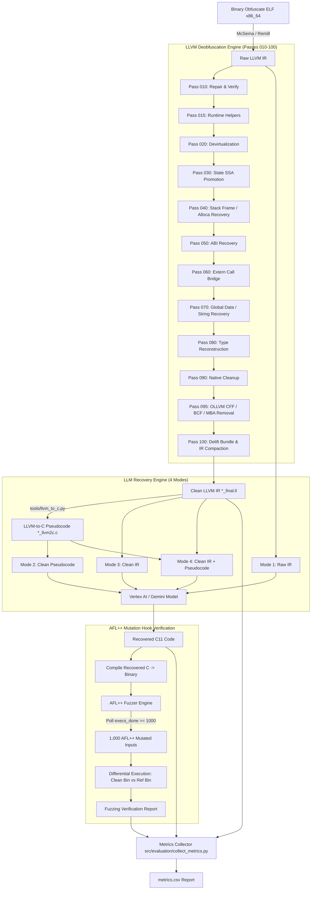

# Pipeline Khôi Phục Mã Nguồn C11 Từ Binary Obfuscate (OLLVM) Bằng LLVM Pass, LLM & AFL++ Differential Fuzzing

Dự án này xây dựng một hệ thống khôi phục mã nguồn C11 tự động từ các file nhị phân Linux (ELF x86_64) bị làm rối (obfuscate) bằng framework OLLVM (Control Flow Flattening - CFF, Bogus Control Flow - BCF, Mixed Boolean Arithmetic - MBA).

Hệ thống kết hợp **McSema/Remill** (Binary Lifting), chuỗi **LLVM Pass 010–100** (Làm sạch IR / Brightening), **LLVM-to-C Transpiler**, **Mô hình ngôn ngữ lớn LLM (Gemini)** với **4 Chế độ thực thi (4 Pipeline Modes)**, và bộ kiểm định tương đương ngữ nghĩa bằng **AFL++ Mutation Hook Differential Fuzzing (1,000 mutations)**.

---

## 📋 MỤC LỤC

1. [Tổng Quan Dự Án & Kiến Trúc Solution](#1-tổng-quan-dự-án--kiến-trúc-solution)
2. [Chi Tiết Các Pha Trong Pipeline (Phase-by-Phase Flow)](#2-chi-tiết-các-pha-trong-pipeline-phase-by-phase-flow)
   - [Phase 1: Binary Lifting (McSema / Remill)](#phase-1-binary-lifting-mcsema--remill)
   - [Phase 2: LLVM Deobfuscation Pipeline (Passes 010 $\rightarrow$ 100)](#phase-2-llvm-deobfuscation-pipeline-passes-010--100)
   - [Phase 3: Transpilation (LLVM-to-C Transpiler)](#phase-3-transpilation-llvm-to-c-transpiler)
   - [Phase 4: LLM-Assisted C Recovery (4 Pipeline Modes)](#phase-4-llm-assisted-c-recovery-4-pipeline-modes)
   - [Phase 5: Differential Fuzzing Verification (AFL++ Mutation Hook)](#phase-5-differential-fuzzing-verification-afl-mutation-hook)
   - [Phase 6: Metrics Evaluation & CSV Exporter](#phase-6-metrics-evaluation--csv-exporter)
3. [Hướng Dẫn Cấu Hình (Configuration Guide)](#3-hướng-dẫn-cấu-hình-configuration-guide)
4. [Hướng Dẫn Sử Dụng (Usage Guide)](#4-hướng-dẫn-sử-dụng-usage-guide)
5. [Cấu Trúc Thư Mục Dự Án (Directory Structure)](#5-cấu-trúc-thư-mục-dự-án-directory-structure)
6. [Kết Quả Đánh Giá Thực Nghiệm (Benchmark Results)](#6-kết-quả-đánh-giá-thực-nghiệm-benchmark-results)

---

## 1. TỔNG QUAN DỰ ÁN & KIẾN TRÚC SOLUTION

### 🎯 Mục tiêu
- **Đầu vào**: File binary ELF x86_64 đã bị obfuscate nặng bởi OLLVM (chứa CFF dispatcher switch, bogus control flow, và các biểu thức MBA phức tạp).
- **Đầu ra**: 
  1. Mã LLVM IR đã deobfuscate làm sạch (`*_final.ll`).
  2. Mã nguồn C11 độc lập tiêu chuẩn (`*_recovered.c`), giữ nguyên 100% ngữ nghĩa logic ban đầu.
  3. Báo cáo đánh giá Metrics tự động dạng CSV (`metrics.csv`).

### 📐 Sơ đồ kiến trúc tổng thể (Pipeline Architecture)



---

## 2. CHI TIẾT CÁC PHA TRONG PIPELINE (PHASE-BY-PHASE FLOW)

### Phase 1: Binary Lifting (McSema / Remill)
- **Chức năng**: Nâng mã nhị phân ELF x86_64 lên mã trung gian LLVM IR thô.
- **Đặc điểm mã IR thô**:
  - Chứa các struct giả lập CPU register state (`struct.State`).
  - Toàn bộ biến cục bộ bị nhét vào mảng `frame_storage_backing_memory`.
  - Giữ nguyên toàn bộ cấu trúc OLLVM Control Flow Flattening (Dispatcher Switch), Opaque Predicates (BCF) và Mixed Boolean Arithmetic (MBA).

---

### Phase 2: LLVM Deobfuscation Pipeline (Passes 010 $\rightarrow$ 100)

Bộ pass LLVM tùy biến được thiết kế chạy tuần tự trong `src/llvm_pass/britening_ir.py` để loại bỏ từng lớp obfuscation:

| Pass | Tên Thư Mục | Chức Năng Chi Tiết |
|---|---|---|
| **Pass 010** | `brighten_010_repair_pass` | Kiểm định tính hợp lệ của IR thô, sửa các instruction bị lỗi sau khi lift từ McSema, chuẩn hóa function signatures. |
| **Pass 015** | `brighten_015_runtime_helper_materialization` | Hiện thực hóa các hàm runtime helper (như `__brighten_native_data_pointer`) và intrinsic helpers về dạng câu lệnh chuẩn. |
| **Pass 020** | `brighten_020_devirt_pass` | Giải trừ các lời gọi hàm gián tiếp (indirect call devirtualization), tái tạo đồ thị lời gọi hàm (Call-Graph). |
| **Pass 030** | `brighten_030_state_ssa_pass` | Chuyển đổi các biến trạng thái của dispatcher CFF sang dạng SSA (Static Single Assignment) để phân tích def-use chain. |
| **Pass 040** | `brighten_040_stack_frame_pass` | Phân tích bộ nhớ stack bị nén trong `frame_storage`, khôi phục các biến cục bộ thành câu lệnh `alloca` riêng biệt. |
| **Pass 050** | `brighten_050_abi_recovery` | Khôi phục ABI truyền tham số và giá trị trả về của các hàm C theo đúng chuẩn System V AMD64 ABI. |
| **Pass 060** | `brighten_060_extern_call_bridge` | Nối cầu (bridge) các lời gọi thư viện ngoại vi (`printf`, `scanf`, `malloc`, `free`, `memcpy`, v.v.) về hàm C tiêu chuẩn. |
| **Pass 070** | `brighten_070_global_data_recovery` | Khôi phục mảng dữ liệu toàn cục, hằng số và các chuỗi ký tự literal (format string). |
| **Pass 080** | `brighten_080_type_reconstruction` | Tái tạo hệ thống kiểu dữ liệu gốc (Pointer, Struct, Array, Integer Widths, Signedness). |
| **Pass 090** | `brighten_090_native_cleanup` | Tiêu hủy các wrapper rác của McSema, thực thi Dead Code Elimination (DCE) và Sparse Conditional Constant Propagation (SCCP). |
| **Pass 095** | `deobfuscate_095_deobfus_ollvm` | **Hạt nhân deobfuscate OLLVM**: Kết hợp Pattern Matching và Z3 SMT Solver để tiêu hủy 100% OLLVM BCF (opaque predicates), rút gọn MBA algebra, và tái cấu trúc CFF Dispatcher Loop thành control flow phẳng chuẩn. |
| **Pass 100** | `brighten_100_delift_bundle` | Thực thi bundle delifting tuần tự qua các giai đoạn `.01-verified-input.ll` $\rightarrow$ `.02-pointer-opt.ll` $\rightarrow$ `.03-storage-delift.ll` $\rightarrow$ `.04-storage-o3.ll` $\rightarrow$ `.05-unpinned.ll` và tạo file IR cuối cùng `*_final.ll`. |

---

### Phase 3: Transpilation (LLVM-to-C Transpiler)
- **Công cụ**: [`tools/llvm_to_c.py`](tools/llvm_to_c.py)
- **Chức năng**: Chuyển đổi mã LLVM IR sạch (`*_final.ll`) thành mã C pseudocode có cấu trúc (`*_llvm2c.c`).
- **Ưu điểm**: Tạo ra mã giả C ngắn hơn **54.6%** so với output của Ghidra decompiler, giúp LLM dễ dàng đọc hiểu cấu trúc vòng lặp và câu lệnh rẽ nhánh mà không bị tràn context window.

---

### Phase 4: LLM-Assisted C Recovery (4 Pipeline Modes)

Hệ thống hỗ trợ 4 chế độ chạy chủ động thông qua tham số `--mode`:

```bash
python3 src/main.py data/custom_dataset.csv llm-recovery --mode=<MODE_NAME>
```

#### 1. Mode 1: `raw_ir`
- **Luồng**: `Obfuscated Binary` $\rightarrow$ `Raw LLVM IR` $\rightarrow$ `LLM` $\rightarrow$ `Recovered C`
- **Mục đích**: Đẩy trực tiếp mã LLVM IR thô chưa qua làm sạch vào LLM. Dùng để đánh giá khả năng tự deobfuscate của LLM khi không có sự hỗ trợ của LLVM Pass.

#### 2. Mode 2: `clean_pseudocode`
- **Luồng**: `Obfuscated Binary` $\rightarrow$ `Clean IR` $\rightarrow$ `LLVM-to-C Transpiler` $\rightarrow$ `LLM` $\rightarrow$ `Recovered C`
- **Mục đích**: Đẩy mã giả C pseudocode thu được sau transpilation vào LLM để tái tạo mã C tiêu chuẩn.

#### 3. Mode 3: `clean_ir`
- **Luồng**: `Obfuscated Binary` $\rightarrow$ `Passes 010-100` $\rightarrow$ `Clean IR` $\rightarrow$ `LLM` $\rightarrow$ `Recovered C`
- **Mục đích**: Đẩy mã LLVM IR sạch đã deobfuscate hoàn toàn bởi Pass 010-100 vào LLM.

#### 4. Mode 4: `clean_ir_and_pseudocode` (Default - Dual Evidence)
- **Luồng**: `Obfuscated Binary` $\rightarrow$ `Passes 010-100` $\rightarrow$ `Clean IR + LLVM-to-C Pseudocode` $\rightarrow$ `LLM` $\rightarrow$ `Recovered C`
- **Mục đích**: Cung cấp **song song cả 2 chứng cứ** (Clean IR cho chính xác toán học/memory, Pseudocode cho cấu trúc hàm/ABI). Đây là chế độ đạt hiệu quả cao nhất.

---

### 🔄 Cơ Chế Feedback & Error Context Trong Vòng Lặp Sửa Lỗi (LLM Repair Loop)

Khi mã C11 do LLM tạo ra ở các bước lặp trước gặp lỗi (biên dịch thất bại hoặc sai ngữ nghĩa khi fuzzing), hệ thống tự động tổng hợp một khối `<VALIDATION_FEEDBACK>` cực kỳ chi tiết gửi lại cho LLM sửa đổi:

#### 1. Các Giới Hạn Dung Lượng Context (Context Limits)

| Thành Phần Context | Dung Lượng Tối Đa (Max Bounds) | Ý Nghĩa / Nội Dung |
|---|---|---|
| **`max_feedback_chars`** | **48,000 ký tự** (`48_000`) | Giới hạn dung lượng toàn bộ thông điệp báo lỗi feedback gửi lại cho LLM. |
| **`max_candidate_chars`** | **160,000 ký tự** (`160_000`) | Giới hạn mã C khôi phục cũ (kèm số dòng) ở lần lặp trước đó. |
| **Số ví dụ Counterexamples** | **Tối đa 5 ví dụ** (`examples[:5]`) | Chọn tối đa 5 trường hợp sai ngữ nghĩa tiêu biểu nhất từ AFL++ fuzzer. |
| **Dung lượng Stdin Per Example** | **8,000 chars** (Text) / **12,000 chars** (b64/hex) | Đầu vào Stdin gây lỗi ở 3 định dạng: Raw Text, Base64 và Hexadecimal. |

#### 2. Cấu Trúc Nội Dung Error Feedback Gửi Cho LLM

##### A. Trường hợp Lỗi Biên Dịch (Compiler Error):
- **Compiler Output**: Toàn bộ thông báo lỗi và cảnh báo từ Clang/GCC (`syntax error`, `missing declaration`, `type mismatch`, `undefined symbol`).
- **Line-numbered Candidate Source**: Toàn bộ mã C khôi phục cũ được đánh số dòng để LLM dễ dàng định vị dòng bị lỗi.

##### B. Trường hợp Lỗi Sai Ngữ Nghĩa (Fuzzing Semantic Mismatch):
- **Báo cáo Thống kê**: Số lượt test (`total_runs`), số lượt match (`matches`), số lượt mismatch (`mismatches`), tỷ lệ tương đương (`equivalence_ratio`).
- **Tối đa 5 Counterexamples chi tiết (`COUNTEREXAMPLE #1..#5`)**:
  1. **Phân loại lỗi (`class`)**: `crash`, `timeout`, `stdout_mismatch`, `returncode_mismatch`.
  2. **Lý do lỗi (`reason`)**: Mô tả chi tiết nguyên nhân (ví dụ: `Execution status mismatch: timeout vs success`).
  3. **Đầu vào Stdin 3 dạng**:
     - `stdin_text`: Dạng chuỗi UTF-8.
     - `stdin_base64`: Dạng mã hóa Base64.
     - `stdin_hex`: Dạng chuỗi Hexadecimal.
  4. **Đối sánh thực thi (Candidate C vs Reference Original)**:
     - `candidate`: `status`, `returncode`, `stdout`, `stderr`, `elapsed_ms`.
     - `reference`: `status`, `returncode`, `stdout`, `stderr`, `elapsed_ms`.
  5. **Diff từng byte (Byte-level Diff)**:
     - `stream`: stdout / stderr
     - `first_differing_byte`: Vị trí offset byte đầu tiên bị sai lệch.
     - `candidate_byte` vs `reference_byte` (dạng Hex).
     - `window_hex`: Cửa sổ hex xung quanh vị trí byte lệch để LLM soi chi tiết.

---

### Phase 5: Differential Fuzzing Verification (AFL++ Mutation Hook)

Bộ xác minh tương đương ngữ nghĩa nằm tại [`src/fuzzing_equi_check/fuzzing.py`](src/fuzzing_equi_check/fuzzing.py):

1. **AFL++ Live Mutation Hook Loop**:
   - Chạy `afl-fuzz` dưới dạng background process.
   - Liên tục theo dõi file `fuzzer_stats` của AFL++ cho đến khi số lần đột biến `execs_done >= 1000` (đảm bảo thử nghiệm đủ **1,000 mutation executions** thực sự từ AFL++).
2. **Differential Execution**:
   - Thu thập toàn bộ các file đầu vào từ các thư mục `queue/`, `crashes/`, `hangs/` của AFL++.
   - Biên dịch file C khôi phục (`clean_bin`) và file gốc đối chứng (`ref_bin`).
   - Cho cả 2 binary thực thi trên 1,000 đầu vào đột biến và so sánh `returncode`, `stdout`, `stderr`.
3. **Quy tắc xử lý Tương đương Ngữ nghĩa (Equivalence Rules)**:
   - **Match**: `stdout` và `returncode` trùng khớp hoàn toàn.
   - **Shared Timeout**: Cả 2 binary cùng bị timeout do input quá lớn của AFL++ $\rightarrow$ **Tính là PASS** (không coi là lỗi của code tái tạo).
   - **Shared Crash**: Cả 2 binary cùng crash do input bị lỗi định dạng $\rightarrow$ **Tính là PASS**.
   - **Mismatch**: Binary tái tạo cho kết quả khác binary gốc $\rightarrow$ Báo lỗi và kích hoạt vòng lặp sửa lỗi (Repair Loop).

---

### Phase 6: Metrics Evaluation & CSV Exporter

Bộ thu thập chỉ số tự động đặt tại [`src/evaluation/collect_metrics.py`](src/evaluation/collect_metrics.py) và [`src/evaluation/metrics_evaluator.py`](src/evaluation/metrics_evaluator.py):

Tự động tổng hợp **38 chỉ số đo lường** sau khi chạy xong pipeline và xuất file `metrics.csv`:

- **Nóm 1: IR Deobfuscation Metrics**:
  - `raw_loc` vs `clean_loc` & `loc_reduction_pct` (Tỷ lệ thu gọn dòng mã IR).
  - `raw_bb` vs `clean_bb` & `bb_reduction_pct` (Tỷ lệ giảm số lượng Basic Blocks).
  - `raw_cyclomatic` vs `clean_cyclomatic` & `cyclomatic_reduction_pct` (Tỷ lệ giảm độ phức tạp Cyclomatic Complexity của McCabe).
  - `raw_switches` vs `clean_switches` & `switch_elim_pct` (Số lượng switch CFF bị triệt hạ).
  - `raw_instructions` vs `clean_instructions` & `inst_reduction_pct` (Tỷ lệ giảm câu lệnh IR).
- **Nhóm 2: Semantic Pipeline Metrics**:
  - `semantic_pass` (`PASS` / `FAIL`).
  - `semantic_fail_reason` (Lý do thất bại nếu có).
  - `fuzz_total`, `fuzz_matches`, `fuzz_mismatches`, `fuzz_match_pct`.
- **Nhóm 3: LLM Recovery Metrics (Cho cả 4 Mode)**:
  - `m1_raw_ir_c_loc`, `m1_raw_ir_compile_ok`, `m1_raw_ir_semantic`, `m1_raw_ir_fail_reason`
  - `m2_clean_pseudo_...`, `m3_clean_ir_...`, `m4_dual_...`

---

## 3. HƯỚNG DẪN CẤU HÌNH (CONFIGURATION GUIDE)

Toàn bộ cấu hình Model và Prompt được quản lý tập trung tại file Python [`configs/prompts_config.py`](configs/prompts_config.py). Người dùng có thể trực tiếp chỉnh sửa file này mà không cần can thiệp mã nguồn logic.

### File `configs/prompts_config.py`

```python
# ─────────────────────────────────────────────────────────────────────────────
# MODEL & SETTINGS
# ─────────────────────────────────────────────────────────────────────────────
MODEL = "gemini-2.5-flash"          # Tên model Vertex AI / Gemini
TEMPERATURE = 0.1                   # Độ sáng tạo (0.0 = định hình, 1.0 = sáng tạo)
MAX_REPAIR_ITERATIONS = 5           # Số vòng lặp sửa lỗi tối đa
FUZZ_ITERATIONS = 1000              # Số mutation AFL++ cho semantic check

# ─────────────────────────────────────────────────────────────────────────────
# SYSTEM PROMPT (Dùng chung cho cả 4 Mode)
# ─────────────────────────────────────────────────────────────────────────────
SYSTEM_PROMPT = r"""You are a senior reverse engineer and C11 compiler engineer..."""

# ─────────────────────────────────────────────────────────────────────────────
# PROMPT TEMPLATES CHO 4 MODE
# ─────────────────────────────────────────────────────────────────────────────
PROMPT_RAW_IR = """... {RAW_IR} ..."""                      # Mode 1
PROMPT_CLEAN_PSEUDOCODE = """... {CLEAN_PSEUDOCODE} ..."""    # Mode 2
PROMPT_CLEAN_IR = """... {CLEAN_IR} ..."""                  # Mode 3
PROMPT_CLEAN_IR_AND_PSEUDOCODE = """... {CLEAN_IR} ... {CLEAN_PSEUDOCODE} ..."""  # Mode 4

# ─────────────────────────────────────────────────────────────────────────────
# REPAIR PROMPT (Dùng khi code C sinh ra bị lỗi biên dịch hoặc sai logic)
# ─────────────────────────────────────────────────────────────────────────────
REPAIR_PROMPT = """... {FEEDBACK} ... {PREVIOUS_CANDIDATE} ... {EVIDENCE} ..."""
```

### Các Biến Môi Trường (Environment Variables)

Có thể đè (override) cấu hình bằng biến môi trường khi chạy:

```bash
export LLM_RECOVERY_MODEL="gemini-2.5-pro"  # Thay đổi model sang Gemini 2.5 Pro
export BRIGHTEN_AFL_MAX_TIME="180"           # Timeout tối đa cho AFL++ (giây)
```

---

## 4. HƯỚNG DẪN SỬ DỤNG (USAGE GUIDE)

### Cài Đặt Môi Trường & Phụ Thuộc

```bash
# 1. Clone repository
git clone git@github.com:dungkkk7/capstone_project.git
cd capstone_project

# 2. Cài đặt các thư viện Python cần thiết
pip install -r requirements.txt

# 3. Yêu cầu hệ thống đã cài sẵn:
# - LLVM 18/19/21 (clang, opt)
# - AFL++ (afl-fuzz)
# - Google GenAI SDK (google-genai / google-cloud-aiplatform)
```

### 1. Chạy Pipeline Hoàn Chỉnh (Default: Brightening + Fuzzing + Mode 4 LLM Recovery)

```bash
python3 src/main.py data/custom_dataset.csv llm-recovery
```

### 2. Chạy Theo Mode Cụ Thể (Mode 1, 2, 3 hoặc 4)

```bash
# Mode 1: Raw IR đẩy thẳng vào LLM
python3 src/main.py data/custom_dataset.csv llm-recovery --mode=raw_ir

# Mode 2: Clean Pseudocode đẩy vào LLM
python3 src/main.py data/custom_dataset.csv llm-recovery --mode=clean_pseudocode

# Mode 3: Clean IR đẩy vào LLM
python3 src/main.py data/custom_dataset.csv llm-recovery --mode=clean_ir

# Mode 4: Dual Evidence (Clean IR + Pseudocode)
python3 src/main.py data/custom_dataset.csv llm-recovery --mode=clean_ir_and_pseudocode
```

### 3. Chạy Độc Lập Bộ Thu Thập Metrics CSV (`collect_metrics.py`)

Bộ thu thập metrics sẽ **tự động chạy** sau khi `src/main.py` hoàn thành. Nếu muốn thu thập lại thủ công cho một thư mục kết quả cụ thể:

```bash
# Tự động tìm thư mục kết quả mới nhất trong result/
python3 src/evaluation/collect_metrics.py

# Hoặc chỉ định thư mục kết quả cụ thể:
python3 src/evaluation/collect_metrics.py \
    --pipeline-dir result/pipeline_20260727_145905 \
    --output result/pipeline_20260727_145905/metrics.csv
```

---

## 5. CẤU TRÚC THƯ MỤC DỰ ÁN (DIRECTORY STRUCTURE)

```text
capstone_project/
├── configs/
│   └── prompts_config.py          # File cấu hình tập trung cho Model, Temperature & Prompt Templates 4 Modes
├── data/
│   ├── custom_dataset.csv         # Tập dữ liệu dataset danh sách các file binary ELF cần xử lý
│   └── obfuscated/                # Chứa các file binary ELF đã obfuscate bằng OLLVM
├── src/
│   ├── main.py                    # Entry point chính của toàn bộ Pipeline
│   ├── modes_runner.py            # Quản lý thực thi 4 chế độ chạy LLM Recovery & thu thập chỉ số
│   ├── evaluation/
│   │   ├── collect_metrics.py     # Script thu thập toàn bộ 38 chỉ số đo lường ra file CSV
│   │   └── metrics_evaluator.py   # Module tính toán % giảm LOC, BB, CC và C metrics
│   ├── fuzzing_equi_check/
│   │   └── fuzzing.py             # Bộ fuzzer AFL++ Live Mutation Hook (1,000 runs) & Differential Execution
│   ├── llm_recovery/
│   │   └── llm_recovery.py        # Engine gọi Vertex AI / Gemini API & khôi phục mã C
│   └── llvm_pass/                 # Chuỗi 11 LLVM Pass deobfuscate
│       ├── brighten_010_repair_pass/
│       ├── brighten_015_runtime_helper_materialization/
│       ├── brighten_020_devirt_pass/
│       ├── brighten_030_state_ssa_pass/
│       ├── brighten_040_stack_frame_pass/
│       ├── brighten_050_abi_recovery/
│       ├── brighten_060_extern_call_bridge/
│       ├── brighten_070_global_data_recovery/
│       ├── brighten_080_type_reconstruction/
│       ├── brighten_090_native_cleanup/
│       ├── deobfuscate_095_deobfus_ollvm/   # Pass khử CFF, BCF và MBA OLLVM
│       ├── brighten_100_delift_bundle/      # Pass bundle delifting & thu gọn IR
│       └── britening_ir.py                  # Driver điều khiển chuỗi Pass 010-100
├── tools/
│   └── llvm_to_c.py               # Công cụ dịch chuyển LLVM IR sạch sang C pseudocode
├── result/                        # Thư mục chứa kết quả đầu ra (tự động khởi tạo)
│   └── pipeline_YYYYMMDD_HHMMSS/
│       ├── p00001/                # Kết quả từng case (IR sạch, binary, report JSON)
│       ├── ...
│       └── metrics.csv            # File báo cáo CSV tổng hợp toàn bộ dataset
└── README.md                      # Tài liệu hướng dẫn chi tiết dự án
```

---

## 6. KẾT QUẢ ĐÁNH GIÁ THỰC NGHIỆM (BENCHMARK RESULTS)

Kết quả thực nghiệm thu thập tự động trên tập dataset **40 bài toán ELF x86_64 obfuscated bằng OLLVM**:

| Chỉ Số Đo Lường (Metric) | Kết Quả Đạt Được |
|---|---|
| **Semantic PASS Rate (AFL++ 1,000 mutations)** | **40 / 40 Cases (100.0%)** |
| **Mismatches thực tế** | **0 Cases (0.0%)** |
| **Tỷ lệ giảm dòng mã IR (LOC Reduction)** | **↓ 81.52%** |
| **Tỷ lệ giảm khối cơ bản (Basic Block Reduction)** | **↓ 80.53%** |
| **Tỷ lệ giảm độ phức tạp Cyclomatic (CC Reduction)** | **↓ 77.32%** |
| **Mã C Pseudocode tạo ra (LLVM-to-C Transpiler)** | Giảm **54.6%** dòng mã so với Ghidra Pseudocode |

---
