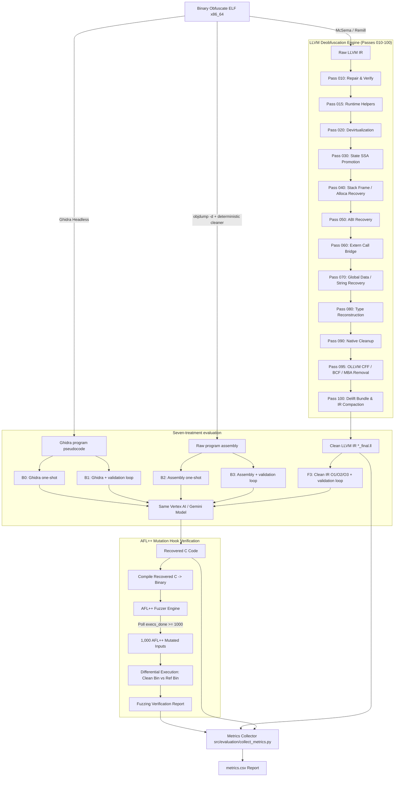

# Pipeline Khôi Phục Mã Nguồn C Từ Binary Obfuscate (OLLVM) Bằng LLVM Pass, LLM & AFL++ Differential Fuzzing

Dự án này xây dựng một hệ thống khôi phục mã nguồn C tự động từ các file nhị phân Linux (ELF x86_64) bị làm rối (obfuscate) bằng framework OLLVM (Control Flow Flattening - CFF, Bogus Control Flow - BCF, Mixed Boolean Arithmetic - MBA).

Hệ thống kết hợp **McSema/Remill** (Binary Lifting), chuỗi **LLVM Pass 010–100** (Làm sạch IR / Brightening), **Mô hình ngôn ngữ lớn LLM (Gemini)** và bộ kiểm định tương đương ngữ nghĩa bằng **AFL++ Mutation Hook Differential Fuzzing**. Protocol cuối gồm bảy treatment: Ghidra one-shot/iterative (`B0/B1`), raw-assembly one-shot/iterative (`B2/B3`) và Clean-IR iterative ở `O1/O2/O3` (`F3`).

---

## 📋 MỤC LỤC

1. [Tổng Quan Dự Án & Kiến Trúc Solution](#1-tổng-quan-dự-án--kiến-trúc-solution)
2. [Chi Tiết Các Pha Trong Pipeline (Phase-by-Phase Flow)](#2-chi-tiết-các-pha-trong-pipeline-phase-by-phase-flow)
   - [Phase 1: Binary Lifting (McSema / Remill)](#phase-1-binary-lifting-mcsema--remill)
   - [Phase 2: LLVM Deobfuscation Pipeline (Passes 010 $\rightarrow$ 100)](#phase-2-llvm-deobfuscation-pipeline-passes-010--100)
   - [Phase 3: Transpilation (LLVM-to-C Transpiler)](#phase-3-transpilation-llvm-to-c-transpiler)
   - [Phase 4: LLM-Assisted C Recovery (2 Primary Flows)](#phase-4-llm-assisted-c-recovery-2-primary-flows)
   - [Phase 5: Differential Fuzzing Verification (AFL++ Mutation Hook)](#phase-5-differential-fuzzing-verification-afl-mutation-hook)
   - [Phase 6: Metrics Evaluation & CSV Exporter](#phase-6-metrics-evaluation--csv-exporter)
3. [Hướng Dẫn Cấu Hình (Configuration Guide)](#3-hướng-dẫn-cấu-hình-configuration-guide)
4. [Hướng Dẫn Sử Dụng (Usage Guide)](#4-hướng-dẫn-sử-dụng-usage-guide)
5. [Cấu Trúc Thư Mục Dự Án (Directory Structure)](#5-cấu-trúc-thư-mục-dự-án-directory-structure)
6. [Kết Quả Đánh Giá Thực Nghiệm (Benchmark Results)](#6-kết-quả-đánh-giá-thực-nghiệm-benchmark-results)

---

## 1. TỔNG QUAN DỰ ÁN & KIẾN TRÚC SOLUTION

### 🎯 Mục tiêu
- **Đầu vào**: File binary ELF x86_64 đã bị obfuscate nặng bởi OLLVM (chứa CFF dispatcher switch, bogus control flow, và các biểu thức MBA phức tạp).
- **Đầu ra**: 
  1. Mã LLVM IR đã deobfuscate làm sạch (`*_final.ll`).
  2. Mã nguồn C độc lập tiêu chuẩn (`*_recovered.c`), giữ nguyên 100% ngữ nghĩa logic ban đầu.
  3. Báo cáo đánh giá Metrics tự động dạng CSV (`metrics.csv`).

### 📐 Sơ đồ kiến trúc tổng thể (Pipeline Architecture)



---

## 2. CHI TIẾT CÁC PHA TRONG PIPELINE (PHASE-BY-PHASE FLOW)

### Phase 1: Binary Lifting (McSema / Remill)
- **Chức năng**: Nâng mã nhị phân ELF x86_64 lên mã trung gian LLVM IR thô.
- **Đặc điểm mã IR thô**:
  - Chứa các struct giả lập CPU register state (`struct.State`).
  - Toàn bộ biến cục bộ bị nhét vào mảng `frame_storage_backing_memory`.
  - Giữ nguyên toàn bộ cấu trúc OLLVM Control Flow Flattening (Dispatcher Switch), Opaque Predicates (BCF) và Mixed Boolean Arithmetic (MBA).

---

### Phase 2: LLVM Deobfuscation Pipeline (Passes 010 $\rightarrow$ 100)

Bộ pass LLVM tùy biến được thiết kế chạy tuần tự trong `src/llvm_pass/britening_ir.py` để loại bỏ từng lớp obfuscation:

| Pass | Tên Thư Mục | Chức Năng Chi Tiết |
|---|---|---|
| **Pass 010** | `brighten_010_repair_pass` | Kiểm định tính hợp lệ của IR thô, sửa các instruction bị lỗi sau khi lift từ McSema, chuẩn hóa function signatures. |
| **Pass 015** | `brighten_015_runtime_helper_materialization` | Hiện thực hóa các hàm runtime helper (như `__brighten_native_data_pointer`) và intrinsic helpers về dạng câu lệnh chuẩn. |
| **Pass 020** | `brighten_020_devirt_pass` | Giải trừ các lời gọi hàm gián tiếp (indirect call devirtualization), tái tạo đồ thị lời gọi hàm (Call-Graph). |
| **Pass 030** | `brighten_030_state_ssa_pass` | Chuyển đổi các biến trạng thái của dispatcher CFF sang dạng SSA (Static Single Assignment) để phân tích def-use chain. |
| **Pass 040** | `brighten_040_stack_frame_pass` | Phân tích bộ nhớ stack bị nén trong `frame_storage`, khôi phục các biến cục bộ thành câu lệnh `alloca` riêng biệt. |
| **Pass 050** | `brighten_050_abi_recovery` | Khôi phục ABI truyền tham số và giá trị trả về của các hàm C theo đúng chuẩn System V AMD64 ABI. |
| **Pass 060** | `brighten_060_extern_call_bridge` | Nối cầu (bridge) các lời gọi thư viện ngoại vi (`printf`, `scanf`, `malloc`, `free`, `memcpy`, v.v.) về hàm C tiêu chuẩn. |
| **Pass 070** | `brighten_070_global_data_recovery` | Khôi phục mảng dữ liệu toàn cục, hằng số và các chuỗi ký tự literal (format string). |
| **Pass 080** | `brighten_080_type_reconstruction` | Tái tạo hệ thống kiểu dữ liệu gốc (Pointer, Struct, Array, Integer Widths, Signedness). |
| **Pass 090** | `brighten_090_native_cleanup` | Hạ State ABI và guest-frame đã được chứng minh an toàn, loại wrapper McSema dư thừa, rồi chạy các cleanup LLVM. Các carrier `undef`/`poison` chưa xác định được giữ nguyên thay vì tự suy diễn giá trị. |
| **Pass 095** | `deobfuscate_095_deobfus_ollvm` | **Hạt nhân deobfuscate OLLVM**: kết hợp Pattern Matching và Z3 để rút gọn MBA/opaque predicate và phục hồi dispatcher khi đủ điều kiện chứng minh. Function chứa PHI carrier `undef`/`poison` không bị deflatten; lượt 095 sau delift chạy MBA-only bằng `-095-disable-deflatten` để tránh biến đổi lại CFG đã được rewrite một phần. |
| **Pass 100** | `brighten_100_delift_bundle` | Thực thi bundle delifting tuần tự qua các giai đoạn `.01-verified-input.ll` $\rightarrow$ `.02-pointer-opt.ll` $\rightarrow$ `.03-storage-delift.ll` $\rightarrow$ `.04-storage-o3.ll` $\rightarrow$ `.05-unpinned.ll` và tạo file IR cuối cùng `*_final.ll`. |

### Tài liệu kỹ thuật từng pass

Mô tả kiến trúc phía trên chỉ là tổng quan. Tài liệu source-grounded theo từng
pass — gồm input/output IR, thứ tự rule, proof/refusal boundary, ví dụ và test
fixture — nằm tại [docs/llvm-passes/README.md](docs/llvm-passes/README.md).
Thiết kế claim, baseline, optimization study và contamination protocol nằm tại
[docs/research-evaluation-protocol.md](docs/research-evaluation-protocol.md).

---

### Phase 3: Transpilation (LLVM-to-C Transpiler)
- **Công cụ**: [`tools/llvm_to_c.py`](tools/llvm_to_c.py)
- **Chức năng**: Chuyển đổi mã LLVM IR sạch (`*_final.ll`) thành mã C pseudocode có cấu trúc (`*_llvm2c.c`).
- **Vai trò**: Cung cấp C-like structural evidence cho LLM mà không đưa
  Original C vào prompt. Giá trị của pseudocode được đo bằng paired ablation,
  không suy ra semantic correctness từ độ ngắn của source.

---

### Phase 4: LLM-Assisted C Recovery (2 Primary Flows + Ablations)

Thực nghiệm chính dùng cùng model, decoding configuration, dataset và
behavioral oracle cho đúng hai flow:

| Flow | Đường đi | Model input | Call/feedback | Vai trò |
|---|---|---|---|---|
| `B0` | Original obfuscated ELF → Ghidra Headless | Program-level Ghidra pseudocode | Đúng 1 provider call; không compiler/counterexample feedback | Baseline ngoài, theo Section 4.2.1 của LLM4Decompile |
| `B1` *(ablation)* | Cùng ELF và Ghidra export của B0 | Cùng program pseudocode; request đầu byte-identical B0 | Tối đa 5 calls; parser/compiler/counterexample feedback | Tách effect của iterative validation trên representation B0 |
| `B2` *(baseline)* | Original obfuscated ELF → `objdump -d` | Raw program assembly đã bỏ address/byte/comment | Đúng 1 provider call với exact assembly prompt của LLM4Decompile | Baseline End2End raw assembly paper-derived |
| `B3` *(ablation)* | Cùng ELF và byte-identical assembly của B2 | Request đầu byte-identical B2 | Tối đa 5 calls; parser/compiler/counterexample feedback | Tách effect của iterative validation trên representation B2 |
| **`F3`** | Original obfuscated ELF → McSema → pass 010–100 | **Clean LLVM IR** | Tối đa 5 calls; compiler feedback và reproducible counterexample feedback | **Phương pháp đề xuất** |

Prompt `B0` dùng paper-derived Ghidra instruction; `B2` dùng exact raw-assembly
wrapper công bố bởi LLM4Decompile. Wrapper serialization, hash và provenance
được đóng băng trong
[`two_flow_protocol.py`](src/evaluation/two_flow_protocol.py). Ghidra luôn nhận
original obfuscated ELF, không nhận IR/file được pipeline làm sạch. Sáu flow cũ
chỉ là exploratory ablation lịch sử và bị loại khỏi claim chính.

Nhóm không fine-tune LLM. Đóng góp code nằm ở chuỗi LLVM pass, deobfuscation
proof/refusal rules, orchestration và semantic validation/repair. Original C,
seed và expected output không bao giờ được đưa vào recovery prompt.

---

### Phase 5: Differential Fuzzing Verification (AFL++ Mutation Hook)

Bộ xác minh tương đương ngữ nghĩa nằm tại [`src/fuzzing_equi_check/fuzzing.py`](src/fuzzing_equi_check/fuzzing.py):

1. **AFL++ Live Mutation Hook Loop**:
   - Chạy `afl-fuzz` dưới dạng background process.
   - Liên tục theo dõi file `fuzzer_stats` của AFL++ cho đến khi số lần đột biến `execs_done >= 1000` (đảm bảo thử nghiệm đủ **1,000 mutation executions** thực sự từ AFL++).
2. **Differential Execution**:
   - Thu thập toàn bộ các file đầu vào từ các thư mục `queue/`, `crashes/`, `hangs/` của AFL++.
   - Biên dịch file C khôi phục (`clean_bin`) và file gốc đối chứng (`ref_bin`).
   - Cho cả 2 binary thực thi trên 1,000 đầu vào đột biến và so sánh `returncode`, `stdout`, `stderr`.
3. **Behavioral oracle**:
   - Reference là Obfuscated Binary; candidate là binary compile từ Candidate C.
   - Cả hai nhận đúng cùng một input.
   - Observation là `(stdout_bytes, stderr_bytes, exit_code,
     terminating_signal, timeout_status)`.
   - Chỉ match khi toàn bộ tuple giống nhau. Shared timeout hoặc shared crash
     không tự động match nếu các thành phần còn lại khác nhau.
   - Mismatch chỉ trở thành final behavioral failure sau khi counterexample
     replay tái hiện được.

#### Trạng thái semantic regression sau bản sửa 2026-08-01

Toàn bộ 40 artifact được rebuild từ IR của pipeline
`pipeline_20260801_123853` bằng code sau bản sửa và chạy differential execution
trên 1.000 valid-domain input cho mỗi case:

| Chỉ số | Kết quả |
|---|---:|
| Case semantic PASS | **40/40** |
| Tổng lượt differential execution | **40.000** |
| Output/status mismatch | **0** |
| Asymmetric crash | **0** |

Shared crash hoặc shared timeout chỉ được chấp nhận khi observation tuple của
hai binary khớp theo behavioral oracle ở trên. Kết quả native-contract là một
chỉ số cấu trúc riêng và không được dùng thay cho semantic equivalence.

---

### Phase 6: Evaluation Framework & Report Exporter

Framework trong `src/evaluation/` lưu raw record cho từng LLM attempt,
compilation attempt, fuzzing campaign, counterexample và repair case. Trước khi
aggregate, nó kiểm tra flow invariants, compile/fuzz relationships, status
semantics và xuất `data_validation_errors.csv`; dữ liệu sai không bị tự sửa.

Source Quality chỉ được chấm sau khi Candidate C đã vượt qua behavioral oracle
và được chấp nhận thành Recovered C Source. Evaluator mặc định dùng
`cx/gpt-5.5` qua cùng `API_BASE_URL` với recovery, chấm tuyệt đối theo thang 1–5
trên Variables, Loops, Conditions, Logic flow và Structural integrity. Kết quả
được cache kèm SHA-256 của source; cache sai source hash sẽ không được dùng.
Điểm này chỉ đo khả năng đọc/phân tích mã C-like, không được dùng để kết luận
correctness.

Runner chính B0–F3 xuất protocol manifest, per-sample CSV và summary JSON.
Artifact cũ vẫn được giữ để audit nhưng không được đưa vào bảng kết quả hoặc
claim của protocol mới.

---

## 3. HƯỚNG DẪN CẤU HÌNH (CONFIGURATION GUIDE)

Toàn bộ cấu hình Model và Prompt được quản lý tập trung tại file Python [`configs/prompts_config.py`](configs/prompts_config.py). Người dùng có thể trực tiếp chỉnh sửa file này mà không cần can thiệp mã nguồn logic.

### File `configs/prompts_config.py`

```python
# ─────────────────────────────────────────────────────────────────────────────
# MODEL & SETTINGS
# ─────────────────────────────────────────────────────────────────────────────
MODEL = "ag/gemini-3-flash-agent"  # Model phục hồi mã nguồn
READABILITY_MODEL = "cx/gpt-5.5"   # Model chấm Source Quality
TEMPERATURE = 0.1                   # Độ sáng tạo (0.0 = định hình, 1.0 = sáng tạo)
MAX_REPAIR_ITERATIONS = 5           # Số vòng lặp sửa lỗi tối đa
FUZZ_ITERATIONS = 1000              # Số mutation AFL++ cho semantic check

# ─────────────────────────────────────────────────────────────────────────────
# SYSTEM PROMPT (Dùng chung cho cả 4 Mode)
# ─────────────────────────────────────────────────────────────────────────────
SYSTEM_PROMPT = r"""You are a senior reverse engineer and C compiler engineer..."""

# ─────────────────────────────────────────────────────────────────────────────
# PROMPT TEMPLATES CHO 4 MODE
# ─────────────────────────────────────────────────────────────────────────────
PROMPT_RAW_IR = """... {RAW_IR} ..."""                      # Mode 1
PROMPT_CLEAN_PSEUDOCODE = """... {CLEAN_PSEUDOCODE} ..."""    # Mode 2
PROMPT_CLEAN_IR = """... {CLEAN_IR} ..."""                  # Mode 3
PROMPT_CLEAN_IR_AND_PSEUDOCODE = """... {CLEAN_IR} ... {CLEAN_PSEUDOCODE} ..."""  # Mode 4

# ─────────────────────────────────────────────────────────────────────────────
# REPAIR PROMPT (Dùng khi code C sinh ra bị lỗi biên dịch hoặc sai logic)
# ─────────────────────────────────────────────────────────────────────────────
REPAIR_PROMPT = """... {FEEDBACK} ... {PREVIOUS_CANDIDATE} ... {EVIDENCE} ..."""
```

### Các Biến Môi Trường (Environment Variables)

Có thể đè (override) cấu hình bằng biến môi trường khi chạy:

```bash
export LLM_RECOVERY_MODEL="gemini-2.5-pro"  # Thay đổi model sang Gemini 2.5 Pro
export BRIGHTEN_AFL_MAX_TIME="180"           # Timeout tối đa cho AFL++ (giây)
```

---

## 4. HƯỚNG DẪN SỬ DỤNG (USAGE GUIDE)

### Cài Đặt Môi Trường & Phụ Thuộc

```bash
# 1. Clone repository
git clone git@github.com:dungkkk7/capstone_project.git
cd capstone_project

# 2. Cài đặt các thư viện Python cần thiết
pip install -r requirements.txt

# 3. Yêu cầu hệ thống đã cài sẵn:
# - LLVM 18/19/21 (clang, opt)
# - AFL++ (afl-fuzz)
# - Google GenAI SDK (google-genai / google-cloud-aiplatform)
```

### 1. Chạy Pipeline Hoàn Chỉnh (Default: Brightening + Fuzzing + Mode 4 LLM Recovery)

```bash
python3 src/main.py data/custom_dataset.csv llm-recovery
```

### 2. Chạy Chiến Dịch Đánh Giá B0–B3 và F3

Runner lập lịch các flow đã đăng ký trong protocol. B0/F3 là comparison gốc;
B1 và B3 cô lập tác động của validation loop; B2 là raw-assembly baseline:

```bash
# Public-corpus set: báo cáo riêng, không dùng để bác bỏ contamination
python3 src/evaluation/run_two_flow_experiment.py data/custom_dataset.csv \
    --fuzz-iterations=1000 --opt-level=O3 --location=us-central1

# Repository-owned 40 case: chạy sau khi verify binary và freeze manifest
python3 src/evaluation/run_two_flow_experiment.py data/own_dataset.csv \
    --fuzz-iterations=1000 --opt-level=O3 --location=us-central1

# So sánh tác động của standard LLVM optimizer, giữ nguyên các biến khác
for level in O1 O2 O3; do
  python3 src/evaluation/run_two_flow_experiment.py data/own_dataset.csv \
      --fuzz-iterations=1000 --opt-level="$level" --location=us-central1
done
```

`B0` luôn chạy trước `F3`, nhưng hai request độc lập và không chia sẻ candidate,
diagnostic hay counterexample. Campaign manifest khóa model, region,
optimization level và fuzz budget; mỗi case ghi exact prompt/source ELF hash và
Ghidra version trong request/representation manifest. Không resume một campaign
sau khi code, prompt hoặc input đã đổi.

Chạy riêng các ablation B1/B2/B3 và tổng hợp đủ bảy treatment:

```bash
python3 src/evaluation/run_two_flow_experiment.py data/own_dataset.csv \
    --flows B1 --fuzz-iterations=1000 --location=us-central1

python3 src/evaluation/run_two_flow_experiment.py data/own_dataset.csv \
    --flows B2 B3 --fuzz-iterations=1000 --location=us-central1

python3 src/evaluation/analyze_optimization_campaigns.py \
    --baseline <B0_CAMPAIGN> --b1 <B1_CAMPAIGN> --b23 <B2_B3_CAMPAIGN> \
    --o1 <F3_O1_CAMPAIGN> --o2 <F3_O2_CAMPAIGN> --o3 <F3_O3_CAMPAIGN> \
    --output reports/final_seven_treatments
```

40 source mới nằm tại [`data/own_dataset`](data/own_dataset/README.md).
Kiểm tra SHA-256, compile và frozen seed oracle mà chưa tạo binary obfuscated:

```bash
python3 tools/build_own_dataset.py --plain-only
```

Để rebuild 40 publication binaries, builder tự build pass-plugin LLVM 21 của
repo rồi chạy `reg2mem → instsub → fla → bcf → verify`. Script fail-closed nếu
thiếu marker, LLVM verifier lỗi hoặc binary đổi hành vi:

```bash
python3 tools/build_own_dataset.py
```

`src/evaluation/run_experiment.py` chỉ được giữ để đọc lại artifact legacy;
không phải entry point hoặc kết quả chính của đề tài.

### 3. Chạy Pipeline Đơn Tuần Tự theo Mode (`src/main.py`)

Dùng khi muốn chạy tuần tự từng binary với một mode cụ thể (không có parallel workers, không sinh HTML report):

```bash
# Chạy toàn bộ dataset với mode mặc định (Clean IR + LLVM2C pseudocode)
python3 src/main.py data/custom_dataset.csv llm-recovery

# LLVM2C pseudocode (utility/debug mode; không phải primary B0)
python3 src/main.py data/custom_dataset.csv llm-recovery --mode=clean_pseudocode

# LLVM2C pseudocode + Clean IR (utility/debug mode)
python3 src/main.py data/custom_dataset.csv llm-recovery --mode=clean_ir_and_pseudocode

# Raw IR trực tiếp vào LLM (utility/debug mode)
python3 src/main.py data/custom_dataset.csv llm-recovery --mode=raw_ir

# Representation của primary F3 — Clean IR trực tiếp vào LLM
python3 src/main.py data/custom_dataset.csv llm-recovery --mode=clean_ir
```

`--mode` chỉ chọn representation; nó không tạo protocol B0–F3 với Ghidra,
one-shot invariant và paired provenance.

### 4. Chạy Độc Lập Bộ Thu Thập Metrics CSV (`collect_metrics.py`)

Bộ thu thập metrics sẽ **tự động chạy** sau khi `src/main.py` hoàn thành. Nếu muốn thu thập lại thủ công cho một thư mục kết quả cụ thể:

```bash
# Tự động tìm thư mục kết quả mới nhất trong result/
python3 src/evaluation/collect_metrics.py

# Hoặc chỉ định thư mục kết quả cụ thể:
python3 src/evaluation/collect_metrics.py \
    --pipeline-dir result/pipeline_20260727_145905 \
    --output result/pipeline_20260727_145905/metrics.csv
```

## 5. CẤU TRÚC THƯ MỤC DỰ ÁN (DIRECTORY STRUCTURE)

```text
capstone_project/
├── configs/
│   └── prompts_config.py          # File cấu hình tập trung cho Model, Temperature & Prompt Templates 4 Modes
├── data/
│   ├── custom_dataset.csv         # Tập dữ liệu dataset danh sách các file binary ELF cần xử lý
│   ├── obfuscated/                # Chứa các file binary ELF đã obfuscate bằng OLLVM
│   └── own_dataset/               # 40 source/seed/oracle + obfuscated ELF
├── src/
│   ├── main.py                    # Entry point chính của toàn bộ Pipeline
│   ├── modes_runner.py            # Quản lý thực thi 4 chế độ chạy LLM Recovery & thu thập chỉ số
│   ├── evaluation/
│   │   ├── run_two_flow_experiment.py # Primary B0 vs F3 runner
│   │   ├── ghidra_baseline.py     # Original ELF -> program-level Ghidra export
│   │   ├── two_flow_protocol.py   # Frozen flow and prompt provenance
│   │   ├── run_experiment.py      # Legacy artifact compatibility only
│   │   ├── readability.py         # Evaluator Source Quality 1–5 cho accepted source
│   │   ├── evaluate_source_quality.py # Chấm/reuse cache cho campaign đã có
│   │   ├── artifact_loader.py     # Nạp artifact và kiểm tra provenance/cache
│   │   └── reporting.py           # Xuất CSV, Markdown, LaTeX, HTML và figures
│   ├── fuzzing_equi_check/
│   │   └── fuzzing.py             # Bộ fuzzer AFL++ Live Mutation Hook (1,000 runs) & Differential Execution
│   ├── llm_recovery/
│   │   └── llm_recovery.py        # Engine gọi Vertex AI / Gemini API & khôi phục mã C
│   └── llvm_pass/                 # Chuỗi 11 LLVM Pass deobfuscate
│       ├── brighten_010_repair_pass/
│       ├── brighten_015_runtime_helper_materialization/
│       ├── brighten_020_devirt_pass/
│       ├── brighten_030_state_ssa_pass/
│       ├── brighten_040_stack_frame_pass/
│       ├── brighten_050_abi_recovery/
│       ├── brighten_060_extern_call_bridge/
│       ├── brighten_070_global_data_recovery/
│       ├── brighten_080_type_reconstruction/
│       ├── brighten_090_native_cleanup/
│       ├── deobfuscate_095_deobfus_ollvm/   # Pass khử CFF, BCF và MBA OLLVM
│       ├── brighten_100_delift_bundle/      # Pass bundle delifting & thu gọn IR
│       └── britening_ir.py                  # Driver điều khiển chuỗi Pass 010-100
├── tools/
│   ├── build_own_dataset.py        # Build/verify 40 repository-owned CLI cases
│   ├── own_obfuscator/             # LLVM 21 instsub/fla/bcf pass plugin
│   └── llvm_to_c.py               # Công cụ dịch chuyển LLVM IR sạch sang C pseudocode
├── result/                        # Thư mục chứa kết quả đầu ra (tự động khởi tạo)
│   └── eval_YYYYMMDD_HHMMSS/      # Artifact gốc theo sample/flow/attempt
├── reports/
│   └── twoflow_YYYYMMDD_HHMMSS/   # Primary per-sample CSV + summary JSON
└── README.md                      # Tài liệu hướng dẫn chi tiết dự án
```

---

## 6. KẾT QUẢ ĐÁNH GIÁ THỰC NGHIỆM (BENCHMARK RESULTS)

Kết quả frozen trên 40 `own_dataset` case: B0 10/40, B1 39/40, B2 6/40, B3
38/40, F3-O1 38/40, F3-O2 38/40 và F3-O3 37/40. Báo cáo bảy treatment, paired
statistics và attribution nằm ở
[`docs/seven-treatment-analysis.md`](docs/seven-treatment-analysis.md). Phân
tích O1/O2/O3 tại từng biên IR trên cả own và public dataset nằm ở
[`docs/optimization-ir-boundary-analysis.md`](docs/optimization-ir-boundary-analysis.md).

Campaign B0–F3 phải báo riêng public-corpus cases và 40 `own_dataset` cases.
Metric chính là Canonical E2E trên toàn bộ eligible cases; kết quả
`O1/O2/O3` phải paired theo cùng case và không được gộp thành một overall rate.

Readability chỉ là metric phụ trên Candidate C đã vượt behavioral oracle; nó
không được dùng làm bằng chứng correctness hoặc để thay đổi denominator.

---
