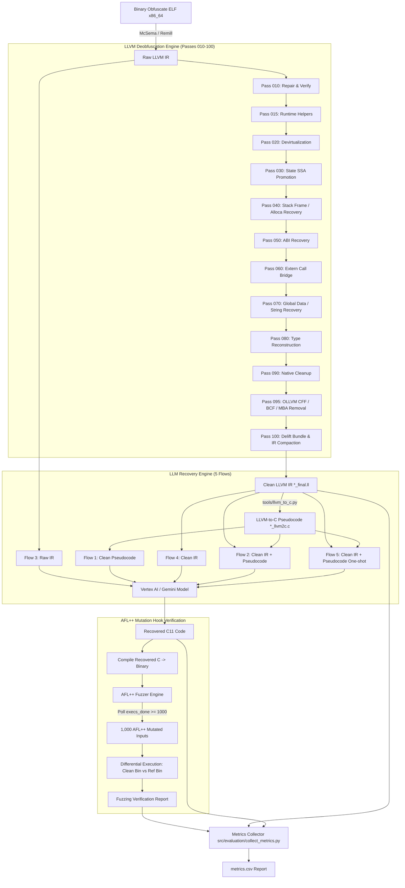

# Pipeline Khôi Phục Mã Nguồn C11 Từ Binary Obfuscate (OLLVM) Bằng LLVM Pass, LLM & AFL++ Differential Fuzzing

Dự án này xây dựng một hệ thống khôi phục mã nguồn C11 tự động từ các file nhị phân Linux (ELF x86_64) bị làm rối (obfuscate) bằng framework OLLVM (Control Flow Flattening - CFF, Bogus Control Flow - BCF, Mixed Boolean Arithmetic - MBA).

Hệ thống kết hợp **McSema/Remill** (Binary Lifting), chuỗi **LLVM Pass 010–100** (Làm sạch IR / Brightening), **LLVM-to-C Transpiler**, **Mô hình ngôn ngữ lớn LLM (Gemini)** với **5 Chế độ thực thi (5 Pipeline Flows)**, và bộ kiểm định tương đương ngữ nghĩa bằng **AFL++ Mutation Hook Differential Fuzzing (1,000 mutations)**.

---

## 📋 MỤC LỤC

1. [Tổng Quan Dự Án & Kiến Trúc Solution](#1-tổng-quan-dự-án--kiến-trúc-solution)
2. [Chi Tiết Các Pha Trong Pipeline (Phase-by-Phase Flow)](#2-chi-tiết-các-pha-trong-pipeline-phase-by-phase-flow)
   - [Phase 1: Binary Lifting (McSema / Remill)](#phase-1-binary-lifting-mcsema--remill)
   - [Phase 2: LLVM Deobfuscation Pipeline (Passes 010 $\rightarrow$ 100)](#phase-2-llvm-deobfuscation-pipeline-passes-010--100)
   - [Phase 3: Transpilation (LLVM-to-C Transpiler)](#phase-3-transpilation-llvm-to-c-transpiler)
   - [Phase 4: LLM-Assisted C Recovery (6 Evaluation Flows)](#phase-4-llm-assisted-c-recovery-6-evaluation-flows)
   - [Phase 5: Differential Fuzzing Verification (AFL++ Mutation Hook)](#phase-5-differential-fuzzing-verification-afl-mutation-hook)
   - [Phase 6: Metrics Evaluation & CSV Exporter](#phase-6-metrics-evaluation--csv-exporter)
3. [Hướng Dẫn Cấu Hình (Configuration Guide)](#3-hướng-dẫn-cấu-hình-configuration-guide)
4. [Hướng Dẫn Sử Dụng (Usage Guide)](#4-hướng-dẫn-sử-dụng-usage-guide)
5. [Cấu Trúc Thư Mục Dự Án (Directory Structure)](#5-cấu-trúc-thư-mục-dự-án-directory-structure)
6. [Kết Quả Đánh Giá Thực Nghiệm (Benchmark Results)](#6-kết-quả-đánh-giá-thực-nghiệm-benchmark-results)

---

## 1. TỔNG QUAN DỰ ÁN & KIẾN TRÚC SOLUTION

### 🎯 Mục tiêu
- **Đầu vào**: File binary ELF x86_64 đã bị obfuscate nặng bởi OLLVM (chứa CFF dispatcher switch, bogus control flow, và các biểu thức MBA phức tạp).
- **Đầu ra**: 
  1. Mã LLVM IR đã deobfuscate làm sạch (`*_final.ll`).
  2. Mã nguồn C11 độc lập tiêu chuẩn (`*_recovered.c`), giữ nguyên 100% ngữ nghĩa logic ban đầu.
  3. Báo cáo đánh giá Metrics tự động dạng CSV (`metrics.csv`).

### 📐 Sơ đồ kiến trúc tổng thể (Pipeline Architecture)



---

## 2. CHI TIẾT CÁC PHA TRONG PIPELINE (PHASE-BY-PHASE FLOW)

### Phase 1: Binary Lifting (McSema / Remill)
- **Chức năng**: Nâng mã nhị phân ELF x86_64 lên mã trung gian LLVM IR thô.
- **Đặc điểm mã IR thô**:
  - Chứa các struct giả lập CPU register state (`struct.State`).
  - Toàn bộ biến cục bộ bị nhét vào mảng `frame_storage_backing_memory`.
  - Giữ nguyên toàn bộ cấu trúc OLLVM Control Flow Flattening (Dispatcher Switch), Opaque Predicates (BCF) và Mixed Boolean Arithmetic (MBA).

---

### Phase 2: LLVM Deobfuscation Pipeline (Passes 010 $\rightarrow$ 100)

Bộ pass LLVM tùy biến được thiết kế chạy tuần tự trong `src/llvm_pass/britening_ir.py` để loại bỏ từng lớp obfuscation:

| Pass | Tên Thư Mục | Chức Năng Chi Tiết |
|---|---|---|
| **Pass 010** | `brighten_010_repair_pass` | Kiểm định tính hợp lệ của IR thô, sửa các instruction bị lỗi sau khi lift từ McSema, chuẩn hóa function signatures. |
| **Pass 015** | `brighten_015_runtime_helper_materialization` | Hiện thực hóa các hàm runtime helper (như `__brighten_native_data_pointer`) và intrinsic helpers về dạng câu lệnh chuẩn. |
| **Pass 020** | `brighten_020_devirt_pass` | Giải trừ các lời gọi hàm gián tiếp (indirect call devirtualization), tái tạo đồ thị lời gọi hàm (Call-Graph). |
| **Pass 030** | `brighten_030_state_ssa_pass` | Chuyển đổi các biến trạng thái của dispatcher CFF sang dạng SSA (Static Single Assignment) để phân tích def-use chain. |
| **Pass 040** | `brighten_040_stack_frame_pass` | Phân tích bộ nhớ stack bị nén trong `frame_storage`, khôi phục các biến cục bộ thành câu lệnh `alloca` riêng biệt. |
| **Pass 050** | `brighten_050_abi_recovery` | Khôi phục ABI truyền tham số và giá trị trả về của các hàm C theo đúng chuẩn System V AMD64 ABI. |
| **Pass 060** | `brighten_060_extern_call_bridge` | Nối cầu (bridge) các lời gọi thư viện ngoại vi (`printf`, `scanf`, `malloc`, `free`, `memcpy`, v.v.) về hàm C tiêu chuẩn. |
| **Pass 070** | `brighten_070_global_data_recovery` | Khôi phục mảng dữ liệu toàn cục, hằng số và các chuỗi ký tự literal (format string). |
| **Pass 080** | `brighten_080_type_reconstruction` | Tái tạo hệ thống kiểu dữ liệu gốc (Pointer, Struct, Array, Integer Widths, Signedness). |
| **Pass 090** | `brighten_090_native_cleanup` | Tiêu hủy các wrapper rác của McSema, thực thi Dead Code Elimination (DCE) và Sparse Conditional Constant Propagation (SCCP). |
| **Pass 095** | `deobfuscate_095_deobfus_ollvm` | **Hạt nhân deobfuscate OLLVM**: Kết hợp Pattern Matching và Z3 SMT Solver để tiêu hủy 100% OLLVM BCF (opaque predicates), rút gọn MBA algebra, và tái cấu trúc CFF Dispatcher Loop thành control flow phẳng chuẩn. |
| **Pass 100** | `brighten_100_delift_bundle` | Thực thi bundle delifting tuần tự qua các giai đoạn `.01-verified-input.ll` $\rightarrow$ `.02-pointer-opt.ll` $\rightarrow$ `.03-storage-delift.ll` $\rightarrow$ `.04-storage-o3.ll` $\rightarrow$ `.05-unpinned.ll` và tạo file IR cuối cùng `*_final.ll`. |

---

### Phase 3: Transpilation (LLVM-to-C Transpiler)
- **Công cụ**: [`tools/llvm_to_c.py`](tools/llvm_to_c.py)
- **Chức năng**: Chuyển đổi mã LLVM IR sạch (`*_final.ll`) thành mã C pseudocode có cấu trúc (`*_llvm2c.c`).
- **Vai trò**: Cung cấp C-like structural evidence cho LLM mà không đưa
  Original C vào prompt. Giá trị của pseudocode được đo bằng paired ablation,
  không suy ra semantic correctness từ độ ngắn của source.

---

### Phase 4: LLM-Assisted C Recovery (6 Evaluation Flows)

Production pseudocode được sinh bằng LLVM2C. Bốn representation mode của
`src/main.py` là `clean_ir_and_pseudocode`, `clean_pseudocode`, `clean_ir`
và `raw_ir`. Evaluation runner áp repair policy lên các representation đó để
tạo F1–F5; report generator tạo F6 derived:

| Flow | Evidence | Error context |
|---|---|---|
| F1 Full | Clean IR + LLVM2C pseudocode | Có, iterative |
| F2 No error context | Clean IR + LLVM2C pseudocode | Không, one-call |
| F3 No pseudocode | Clean IR | Có, iterative |
| F4 No direct Clean IR | LLVM2C pseudocode | Có, iterative |
| F5 Raw IR baseline | Raw IR | Có, iterative |
| F6 Raw IR no error context | Raw IR | Không, derived từ first provider call của F5 |

Compile repair và behavioral repair được log thành hai loại case/round riêng.
Behavioral feedback chỉ dùng counterexample đã replay tái hiện được. Original C
không bao giờ được đưa vào recovery prompt.

---

### Phase 5: Differential Fuzzing Verification (AFL++ Mutation Hook)

Bộ xác minh tương đương ngữ nghĩa nằm tại [`src/fuzzing_equi_check/fuzzing.py`](src/fuzzing_equi_check/fuzzing.py):

1. **AFL++ Live Mutation Hook Loop**:
   - Chạy `afl-fuzz` dưới dạng background process.
   - Liên tục theo dõi file `fuzzer_stats` của AFL++ cho đến khi số lần đột biến `execs_done >= 1000` (đảm bảo thử nghiệm đủ **1,000 mutation executions** thực sự từ AFL++).
2. **Differential Execution**:
   - Thu thập toàn bộ các file đầu vào từ các thư mục `queue/`, `crashes/`, `hangs/` của AFL++.
   - Biên dịch file C khôi phục (`clean_bin`) và file gốc đối chứng (`ref_bin`).
   - Cho cả 2 binary thực thi trên 1,000 đầu vào đột biến và so sánh `returncode`, `stdout`, `stderr`.
3. **Behavioral oracle**:
   - Reference là Obfuscated Binary; candidate là binary compile từ Candidate C.
   - Cả hai nhận đúng cùng một input.
   - Observation là `(stdout_bytes, stderr_bytes, exit_code,
     terminating_signal, timeout_status)`.
   - Chỉ match khi toàn bộ tuple giống nhau. Shared timeout hoặc shared crash
     không tự động match nếu các thành phần còn lại khác nhau.
   - Mismatch chỉ trở thành final behavioral failure sau khi counterexample
     replay tái hiện được.

---

### Phase 6: Evaluation Framework & Report Exporter

Framework trong `src/evaluation/` lưu raw record cho từng LLM attempt,
compilation attempt, fuzzing campaign, counterexample và repair case. Trước khi
aggregate, nó kiểm tra flow invariants, compile/fuzz relationships, status
semantics và xuất `data_validation_errors.csv`; dữ liệu sai không bị tự sửa.

Output gồm per-sample/per-attempt CSV, raw JSONL, metric tables, paired
ablation, statistical tests, Markdown, LaTeX, HTML/dashboard và 17 figure ở cả
PNG/SVG/PDF. `export_existing_metrics.py` có thể regenerate toàn bộ report từ
artifact cũ mà không gọi lại LLM hoặc fuzzing.

---

## 3. HƯỚNG DẪN CẤU HÌNH (CONFIGURATION GUIDE)

Toàn bộ cấu hình Model và Prompt được quản lý tập trung tại file Python [`configs/prompts_config.py`](configs/prompts_config.py). Người dùng có thể trực tiếp chỉnh sửa file này mà không cần can thiệp mã nguồn logic.

### File `configs/prompts_config.py`

```python
# ─────────────────────────────────────────────────────────────────────────────
# MODEL & SETTINGS
# ─────────────────────────────────────────────────────────────────────────────
MODEL = "gemini-2.5-flash"          # Tên model Vertex AI / Gemini
TEMPERATURE = 0.1                   # Độ sáng tạo (0.0 = định hình, 1.0 = sáng tạo)
MAX_REPAIR_ITERATIONS = 5           # Số vòng lặp sửa lỗi tối đa
FUZZ_ITERATIONS = 1000              # Số mutation AFL++ cho semantic check

# ─────────────────────────────────────────────────────────────────────────────
# SYSTEM PROMPT (Dùng chung cho cả 4 Mode)
# ─────────────────────────────────────────────────────────────────────────────
SYSTEM_PROMPT = r"""You are a senior reverse engineer and C11 compiler engineer..."""

# ─────────────────────────────────────────────────────────────────────────────
# PROMPT TEMPLATES CHO 4 MODE
# ─────────────────────────────────────────────────────────────────────────────
PROMPT_RAW_IR = """... {RAW_IR} ..."""                      # Mode 1
PROMPT_CLEAN_PSEUDOCODE = """... {CLEAN_PSEUDOCODE} ..."""    # Mode 2
PROMPT_CLEAN_IR = """... {CLEAN_IR} ..."""                  # Mode 3
PROMPT_CLEAN_IR_AND_PSEUDOCODE = """... {CLEAN_IR} ... {CLEAN_PSEUDOCODE} ..."""  # Mode 4

# ─────────────────────────────────────────────────────────────────────────────
# REPAIR PROMPT (Dùng khi code C sinh ra bị lỗi biên dịch hoặc sai logic)
# ─────────────────────────────────────────────────────────────────────────────
REPAIR_PROMPT = """... {FEEDBACK} ... {PREVIOUS_CANDIDATE} ... {EVIDENCE} ..."""
```

### Các Biến Môi Trường (Environment Variables)

Có thể đè (override) cấu hình bằng biến môi trường khi chạy:

```bash
export LLM_RECOVERY_MODEL="gemini-2.5-pro"  # Thay đổi model sang Gemini 2.5 Pro
export BRIGHTEN_AFL_MAX_TIME="180"           # Timeout tối đa cho AFL++ (giây)
```

---

## 4. HƯỚNG DẪN SỬ DỤNG (USAGE GUIDE)

### Cài Đặt Môi Trường & Phụ Thuộc

```bash
# 1. Clone repository
git clone git@github.com:dungkkk7/capstone_project.git
cd capstone_project

# 2. Cài đặt các thư viện Python cần thiết
pip install -r requirements.txt

# 3. Yêu cầu hệ thống đã cài sẵn:
# - LLVM 18/19/21 (clang, opt)
# - AFL++ (afl-fuzz)
# - Google GenAI SDK (google-genai / google-cloud-aiplatform)
```

### 1. Chạy Pipeline Hoàn Chỉnh (Default: Brightening + Fuzzing + Mode 4 LLM Recovery)

```bash
python3 src/main.py data/custom_dataset.csv llm-recovery
```

### 2. Chạy Chiến Dịch Đánh Giá Song Song — 6 Flows (`run_experiment.py`) ⭐ Khuyên Dùng

Đây là kịch bản thực nghiệm chính. Runner thực thi **5 flow độc lập
(F1 → F5)** cho toàn bộ tập dữ liệu; framework báo cáo bổ sung **F6** bằng
cách lấy checkpoint ở lần gọi provider đầu tiên của F5. Vì vậy, một chiến
dịch 40 mẫu thực hiện 200 flow-run độc lập và tạo 40 record F6 derived, không
phải 240 lần gọi pipeline độc lập. Runner hỗ trợ resume và tự động xoay vùng
Vertex AI:

```bash
# Chạy chiến dịch đầy đủ (40 cases × 5 independent flows = 200 tasks)
python3 src/evaluation/run_experiment.py data/custom_dataset.csv --max-workers=3

# Nếu bị gián đoạn, tiếp tục từ vị trí bị dừng:
python3 src/evaluation/run_experiment.py data/custom_dataset.csv --max-workers=3 --resume eval_20260728_124405

# Chạy thử nhanh N cases đầu tiên:
python3 src/evaluation/run_experiment.py data/custom_dataset.csv --pilot=3 --max-workers=3
```

#### Định Nghĩa 6 Flows (F1 → F6)

`Error context` là toàn bộ compiler feedback và behavioral
counterexample feedback dùng cho các vòng sửa tiếp theo.

| Flow | Evidence ban đầu gửi vào LLM | Error context / repair | Nguồn record | Mục đích |
|:---:|:---|:---:|:---:|:---|
| **F1 — FULL** | Clean IR + LLVM2C pseudocode | Có, iterative | Chạy độc lập | Cấu hình đầy đủ |
| **F2 — NO_ERROR_CONTEXT** | Clean IR + LLVM2C pseudocode | Không, đúng 1 provider call | Chạy độc lập | Đo tác dụng của error context so với F1 |
| **F3 — NO_PSEUDOCODE** | Clean IR | Có, iterative | Chạy độc lập | Đo tác dụng của LLVM2C pseudocode so với F1 |
| **F4 — NO_DIRECT_CLEAN_IR** | LLVM2C pseudocode | Có, iterative | Chạy độc lập | Đo tác dụng của Clean IR trực tiếp so với F1 |
| **F5 — RAW_IR_BASELINE** | Raw IR | Có, iterative | Chạy độc lập | Đo tác dụng của deobfuscation/representation |
| **F6 — RAW_IR_NO_ERROR_CONTEXT_DERIVED** | Raw IR | Không, đúng 1 provider call | Derived từ lần gọi provider đầu tiên của F5 | Đo tác dụng của error context trên Raw IR |

F6 không tính retry do `MAX_TOKENS`, không lấy compiler/counterexample
feedback và không lấy candidate ở vòng sau. Nếu artifact của checkpoint đầu
không đủ, record được đánh dấu `CANCELLED`; framework không tự đoán dữ liệu.
Do F6 dùng lại checkpoint của F5, F5–F6 là paired derived comparison, không
được mô tả như hai chiến dịch độc lập.

#### Kết Quả Canonical E2E Hiện Tại

Canonical E2E dùng toàn bộ mẫu eligible trong mẫu số, nên generation fail,
compile fail và `CANCELLED` không bị loại khỏi denominator.

| Flow | Accepted behavioral PASS / eligible | Canonical E2E |
|:---:|:---:|:---:|
| F1 (Full) | 31/40 | **77.5%** |
| F2 (No error context) | 21/31 | 67.7% |
| F3 (No pseudocode) | 32/40 | **80.0%** |
| F4 (No direct Clean IR) | 32/40 | **80.0%** |
| F5 (Raw IR iterative) | 25/40 | 62.5% |
| F6 (Raw IR one-call, derived) | 7/40 | 17.5% |

Không cộng sáu hàng thành một “overall pass rate”: chúng là các cấu hình
paired trên cùng dataset, và F6 còn là checkpoint derived từ F5.

### 3. Chạy Pipeline Đơn Tuần Tự theo Mode (`src/main.py`)

Dùng khi muốn chạy tuần tự từng binary với một mode cụ thể (không có parallel workers, không sinh HTML report):

```bash
# Chạy toàn bộ dataset với mode mặc định (Clean IR + LLVM2C pseudocode)
python3 src/main.py data/custom_dataset.csv llm-recovery

# Representation của F4 — LLVM2C pseudocode (không kèm Clean IR)
python3 src/main.py data/custom_dataset.csv llm-recovery --mode=clean_pseudocode

# Representation của F1/F2 — LLVM2C pseudocode + Clean IR
python3 src/main.py data/custom_dataset.csv llm-recovery --mode=clean_ir_and_pseudocode

# Representation của F5/F6 — Raw IR trực tiếp vào LLM
python3 src/main.py data/custom_dataset.csv llm-recovery --mode=raw_ir

# Representation của F3 — Clean IR trực tiếp vào LLM
python3 src/main.py data/custom_dataset.csv llm-recovery --mode=clean_ir
```

`--mode` chỉ chọn representation; nó không tự biến một lần chạy đơn thành
flow ablation đầy đủ với đúng repair policy và provenance của F1–F6.

### 4. Chạy Độc Lập Bộ Thu Thập Metrics CSV (`collect_metrics.py`)

Bộ thu thập metrics sẽ **tự động chạy** sau khi `src/main.py` hoàn thành. Nếu muốn thu thập lại thủ công cho một thư mục kết quả cụ thể:

```bash
# Tự động tìm thư mục kết quả mới nhất trong result/
python3 src/evaluation/collect_metrics.py

# Hoặc chỉ định thư mục kết quả cụ thể:
python3 src/evaluation/collect_metrics.py \
    --pipeline-dir result/pipeline_20260727_145905 \
    --output result/pipeline_20260727_145905/metrics.csv
```

### 5. Vẽ Biểu Đồ & Trực Quan Hóa Thực Nghiệm (`visualize_experiment.py`)

Sau khi chạy chiến dịch hoàn tất, framework xuất 17 figure
publication-ready ở cả PNG, SVG và PDF, cùng CSV/JSON, LaTeX, Markdown,
HTML và dashboard trong `reports/experiment_YYYYMMDD_HHMMSS/`. Có thể
regenerate hoàn toàn offline từ artifact đã có, không gọi lại LLM hay fuzzing:

```bash
python3 src/evaluation/export_existing_metrics.py \
    result/eval_20260728_124405
```

**Các tham số bổ sung hữu ích cho `run_experiment.py`:**
* `--resume <campaign_id>`: Tiếp tục chạy chiến dịch cũ bị gián đoạn. Hệ thống tự động quét, đọc kết quả đã lưu trong các tệp `flow_result.json` và chỉ lập lịch chạy tiếp những case còn thiếu.
* `--pilot <N>`: Chỉ chạy thử nghiệm trên N cases đầu tiên để kiểm chứng nhanh.
* `--no-rotate-regions`: Tắt tính năng tự động xoay vòng vùng (mặc định bật xoay vòng qua 6 Region để tăng hạn ngạch RPM/TPM lên gấp 6 lần).
* `--model <model_id>`: Chỉ định mô hình chạy (ví dụ: `gemini-2.5-pro` hoặc `ag/gemini-3-flash-agent`). Mặc định kế thừa biến `MODEL` từ file `configs/prompts_config.py`.

*Lưu ý về cơ chế tự vệ:* Script tích hợp sẵn **Automatic 404 Region Fallback** — nếu mô hình chưa khả dụng ở một region, client tự động chuyển hướng sang `us-central1`. Nhấn `Ctrl+C` sẽ kết thúc sạch sẽ toàn bộ tiến trình con ngay lập tức.

---

## 5. CẤU TRÚC THƯ MỤC DỰ ÁN (DIRECTORY STRUCTURE)

```text
capstone_project/
├── configs/
│   └── prompts_config.py          # File cấu hình tập trung cho Model, Temperature & Prompt Templates 4 Modes
├── data/
│   ├── custom_dataset.csv         # Tập dữ liệu dataset danh sách các file binary ELF cần xử lý
│   └── obfuscated/                # Chứa các file binary ELF đã obfuscate bằng OLLVM
├── src/
│   ├── main.py                    # Entry point chính của toàn bộ Pipeline
│   ├── modes_runner.py            # Quản lý thực thi 4 chế độ chạy LLM Recovery & thu thập chỉ số
│   ├── evaluation/
│   │   ├── collect_metrics.py     # Script thu thập toàn bộ 38 chỉ số đo lường ra file CSV
│   │   └── metrics_evaluator.py   # Module tính toán % giảm LOC, BB, CC và C metrics
│   ├── fuzzing_equi_check/
│   │   └── fuzzing.py             # Bộ fuzzer AFL++ Live Mutation Hook (1,000 runs) & Differential Execution
│   ├── llm_recovery/
│   │   └── llm_recovery.py        # Engine gọi Vertex AI / Gemini API & khôi phục mã C
│   └── llvm_pass/                 # Chuỗi 11 LLVM Pass deobfuscate
│       ├── brighten_010_repair_pass/
│       ├── brighten_015_runtime_helper_materialization/
│       ├── brighten_020_devirt_pass/
│       ├── brighten_030_state_ssa_pass/
│       ├── brighten_040_stack_frame_pass/
│       ├── brighten_050_abi_recovery/
│       ├── brighten_060_extern_call_bridge/
│       ├── brighten_070_global_data_recovery/
│       ├── brighten_080_type_reconstruction/
│       ├── brighten_090_native_cleanup/
│       ├── deobfuscate_095_deobfus_ollvm/   # Pass khử CFF, BCF và MBA OLLVM
│       ├── brighten_100_delift_bundle/      # Pass bundle delifting & thu gọn IR
│       └── britening_ir.py                  # Driver điều khiển chuỗi Pass 010-100
├── tools/
│   └── llvm_to_c.py               # Công cụ dịch chuyển LLVM IR sạch sang C pseudocode
├── result/                        # Thư mục chứa kết quả đầu ra (tự động khởi tạo)
│   └── eval_YYYYMMDD_HHMMSS/      # Artifact gốc theo sample/flow/attempt
├── reports/
│   └── experiment_YYYYMMDD_HHMMSS/
│       ├── dashboard.html
│       ├── report.{md,tex,html}
│       ├── raw_results.jsonl
│       ├── *.csv
│       └── figures/               # 17 figure × PNG/SVG/PDF
└── README.md                      # Tài liệu hướng dẫn chi tiết dự án
```

---

## 6. KẾT QUẢ ĐÁNH GIÁ THỰC NGHIỆM (BENCHMARK RESULTS)

Report `experiment_20260728_124405` được regenerate từ artifact của 40 bài
toán ELF x86_64 obfuscated. Metric correctness chính được phát biểu là “không
phát hiện reproducible behavioral divergence trong valid inputs và fuzzing
budget đã dùng”, không phải tương đương với mọi input.

| Flow | Program Behavioral Pass | Canonical E2E |
|---|---:|---:|
| F1 Full | 31/38 (81.6%) | 31/40 (77.5%) |
| F2 No error context | 21/30 (70.0%) | 21/31 (67.7%) |
| F3 No pseudocode | 32/40 (80.0%) | 32/40 (80.0%) |
| F4 No direct Clean IR | 32/40 (80.0%) | 32/40 (80.0%) |
| F5 Raw IR iterative | 25/37 (67.6%) | 25/40 (62.5%) |
| F6 Raw IR one-call, derived | 7/21 (33.3%) | 7/40 (17.5%) |

Program Behavioral Pass loại generation/compile failure khỏi mẫu số và chỉ
dùng run hoàn thành behavioral validation. Canonical E2E dùng toàn bộ eligible
samples. F6 là checkpoint derived từ F5, không phải run độc lập.

---
