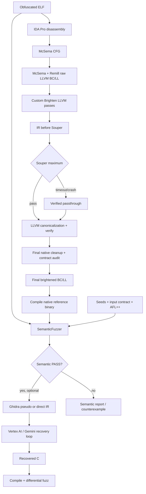

# Brighten — Binary Deobfuscation & Native LLVM IR Recovery

> Pipeline nghiên cứu khôi phục chương trình từ binary bị obfuscate: lift lên
> LLVM IR bằng McSema/Remill, phục hồi cấu trúc native bằng chuỗi LLVM pass tùy
> biến, superoptimization bằng Souper, kiểm chứng semantic bằng AFL++ và tùy
> chọn tái tạo mã C bằng LLM.

## Mục lục

- [Tổng quan](#tổng-quan)
- [Kiến trúc pipeline](#kiến-trúc-pipeline)
- [Các custom LLVM pass](#các-custom-llvm-pass)
- [Yêu cầu môi trường](#yêu-cầu-môi-trường)
- [Cài đặt và kiểm tra nhanh](#cài-đặt-và-kiểm-tra-nhanh)
- [Chuẩn bị dataset](#chuẩn-bị-dataset)
- [Cách chạy](#cách-chạy)
- [Souper superoptimization](#souper-superoptimization)
- [Semantic fuzzing và input contract](#semantic-fuzzing-và-input-contract)
- [LLM recovery](#llm-recovery)
- [Artifacts và cách đọc kết quả](#artifacts-và-cách-đọc-kết-quả)
- [Native contract](#native-contract)
- [Cấu hình nâng cao](#cấu-hình-nâng-cao)
- [Build và test](#build-và-test)
- [Troubleshooting](#troubleshooting)
- [Cấu trúc repository](#cấu-trúc-repository)

## Tổng quan

Brighten giải quyết bài toán biến một binary đã qua các kỹ thuật obfuscation
như control-flow flattening, bogus control flow và instruction substitution
thành biểu diễn dễ phân tích hơn nhưng vẫn giữ nguyên hành vi.

Project không chỉ chạy `opt -O3`. Phần chính là một chuỗi custom LLVM pass có
nhiệm vụ hiểu và loại bỏ các artifact do McSema/Remill tạo ra:

- CPU `State` và truy cập thanh ghi giả lập.
- Remill call/return/jump intrinsics.
- Guest stack dựa trên địa chỉ số.
- Lifted ABI và wrapper trung gian.
- Guest segments, global data và residual addresses.
- Flattened dispatcher CFG.
- Kiểu dữ liệu và external-call signature bị mất trong quá trình lifting.

Sau brightening, Souper tìm các biểu thức tương đương đơn giản hơn bằng SMT;
IR được compile lại và so sánh với binary gốc trên cùng tập input. LLM recovery
là bước tùy chọn, chỉ chạy sau khi baseline brightened đã vượt qua semantic
validation.

### Mục tiêu chất lượng

Pipeline theo dõi hai trục độc lập:

| Trục | Câu hỏi |
|---|---|
| Semantic equivalence | Binary compile từ IR có hành vi giống binary gốc trên miền input được kiểm tra không? |
| Native contract | IR còn phụ thuộc vào mô hình guest/lifter hay đã trở thành LLVM IR native hoàn toàn? |

Một IR có thể `semantic PASS` nhưng vẫn `native contract non_compliant`. Trường
hợp đó được phân loại là `compat_runnable`: chạy đúng trên corpus kiểm chứng,
nhưng vẫn còn artifact như `%struct.State`, flattened CFG, inline assembly hoặc
guest-stack backing.

## Kiến trúc pipeline



### Thứ tự thực thi thực tế

1. Đọc danh sách binary từ CSV.
2. Disassemble bằng IDA và lift bằng McSema/Remill, hoặc lấy raw lift từ cache.
3. Chạy toàn bộ custom brightening pipeline bằng LLVM 21.
4. Sinh report trung gian để chẩn đoán; report này không được xem là kết luận
   cho output cuối.
5. Lưu IR sau custom passes và trước Souper để so sánh.
6. Chạy Souper `maximum`; nếu timeout/crash/verifier fail thì chạy `safe`.
7. Canonicalize bằng `memcpyopt,dse,dce,instcombine,simplifycfg`, rồi `verify`.
8. Chạy lại final native cleanup/verifier trên chính output sau Souper và ghi
   đè native-contract report authoritative một cách atomic. Giai đoạn này chỉ
   thu gọn fake-stack khi mọi truy cập đã được chứng minh byte-range; các
   `llvm.memset` không-volatile có độ dài hằng được giữ như write có biên, còn
   intrinsic/call không chứng minh được vẫn làm toàn transaction fail-closed.
9. Compile final brightened bitcode thành binary native.
10. Differential fuzz binary brightened với binary gốc.
11. Nếu semantic baseline pass và bật `llm-recovery`, sinh C và fuzz lại C đó.
12. Ghi report từng case và `pipeline_summary.json` cho toàn batch.

## Các custom LLVM pass

Các plugin nằm trong [`src/llvm_pass`](src/llvm_pass) và được load theo thứ tự:

| Phase | Plugin | Vai trò chính |
|---:|---|---|
| 010 | `brighten_010_repair_pass` | Sửa lifted IR, normalize pattern và artifact ban đầu. |
| 015 | `brighten_015_runtime_helper_materialization` | Materialize/normalize Remill runtime helpers để các pass sau phân tích được. |
| 020 | `brighten_020_devirt_pass` | Devirtualize call/return/jump và hạ các control-transfer pattern của lifter. |
| 030 | `brighten_030_state_ssa_pass` | Chuyển register-state access sang dạng SSA dễ tối ưu. |
| 040 | `brighten_040_stack_frame_pass` | Phục hồi stack frame, local objects và guest-stack accesses. |
| 050 | `brighten_050_abi_recovery` | Phân tích live-in/live-out, phục hồi function signature và native ABI. |
| 060 | `brighten_060_extern_call_bridge` | Phục hồi signature/callsite cho libc và external functions. |
| 070 | `brighten_070_global_data_recovery` | Phục hồi guest segments, globals, arrays, strings và data references. |
| 080 | `brighten_080_type_reconstruction` | Suy luận array/struct/pointer layout từ access evidence. |
| 090 | `brighten_090_native_cleanup` | Cleanup cuối, local State SSA, region unflattening và native-contract verifier. |

Pipeline còn xen kẽ các LLVM pass chuẩn như `always-inline`, `sroa`,
`instcombine`, `simplifycfg`, `gvn`, `adce`, `globaldce`, `jump-threading`,
`dfa-jump-threading` và `default<O3>`.

Pipeline đầy đủ được định nghĩa bằng `PASS_PIPELINE` trong
[`src/llvm_pass/britening_ir.py`](src/llvm_pass/britening_ir.py).

## Yêu cầu môi trường

### Bắt buộc cho lifting và brightening

- Linux x86-64; dataset hiện tại mặc định dùng ELF AMD64/Linux.
- Python 3.10+; môi trường phát triển hiện tại dùng Python 3.12.
- LLVM/Clang 21:
  - `opt-21`
  - `llvm-dis-21`
  - `llvm-as-21`
  - `clang-21`
  - LLVM CMake development files.
- CMake 3.16+ và C++ build toolchain.
- IDA Pro tại `/opt/ida-pro-9.3/idat`, hoặc sửa default/path khi gọi lifter.
- McSema/Remill bundle trong `dependency/mcsema/`.
- Souper/Z3 bundle trong `dependency/souper/`.
- AFL++ bundle trong `dependency/AFLplusplus/` hoặc AFL++ có trong `PATH`.

### Tùy chọn cho LLM recovery

- Ghidra `analyzeHeadless`, mặc định dò tại:
  `/opt/ghidra_12.0.4_PUBLIC/support/analyzeHeadless`.
- Google Cloud project có Vertex AI và Application Default Credentials.
- Python packages `google-genai` và `requests`.

Ví dụ cài các package Python tùy chọn:

```bash
python3 -m pip install --user google-genai requests
```

Ví dụ đăng nhập Vertex AI bằng ADC:

```bash
gcloud auth application-default login
export GOOGLE_CLOUD_PROJECT="your-project-id"
export VERTEX_LOCATION="global"
```

Chỉ xử lý binary mà bạn có quyền phân tích.

## Cài đặt và kiểm tra nhanh

Clone/checkout project rồi vào root:

```bash
cd /home/dungbv/capstone_project
```

Kiểm tra toolchain:

```bash
python3 --version
opt-21 --version
llvm-dis-21 --version
clang-21 --version
cmake --version
test -x /opt/ida-pro-9.3/idat
test -f dependency/souper/build-llvm21/libsouperPass.so
test -x dependency/souper/bin/z3
test -x dependency/AFLplusplus/afl-fuzz
```

Build lại tất cả custom pass khi cần:

```bash
export LLVM_DIR=/usr/lib/llvm-21/lib/cmake/llvm
bash tools/rebuid_pass.sh
```

Smoke test Souper/native cleanup:

```bash
python3 src/llvm_pass/brighten_090_native_cleanup/tests/test_souper_pipeline.py
```

## Chuẩn bị dataset

### CSV đầu vào

`src/main.py` nhận một CSV. Cột bắt buộc có thể mang một trong các tên:

- `binary_path`
- `binary`
- `path`
- `file`
- `filepath`

Nếu không có header phù hợp, pipeline lấy cột đầu tiên.

Ví dụ tối thiểu:

```csv
binary
data/obfuscated/p00178/s505746898_fla_bcf_instsub.elf
data/obfuscated/p04029/s536667984_fla_bcf_instsub.elf
```

Dataset trong repository có thể có thêm `case_id`, `submission_id`,
`seed_file`, `difficulty` và `evidence`; main batch runner chỉ cần đường dẫn
binary, còn seed/contract được resolve từ cấu trúc dataset.

Các CSV đáng chú ý:

| File | Mục đích |
|---|---|
| `data/llm_test.csv` | Batch đang dùng để thử LLM/pipeline. |
| `data/pilot_mix3_50.csv` | Pilot 50 case có input contract. |
| `data/dataset.csv` | Dataset tổng. |
| `data/regression_*.csv` | Regression theo pass hoặc lỗi semantic cụ thể. |
| `data/one_*.csv` | Chạy cô lập một case. |

### Seed corpus

Seed theo case thường nằm ở:

```text
data/seeds/<case_id>/
```

Seed là executable example cho program. Input contract quyết định phần nào của
seed được phép mutate và kiểm tra payload trước khi chạy hai binary.

### Input contract

Manifest hiện tại:

```text
data/input_contracts/pilot_mix3_50.json
```

Contract được resolve bằng cặp `(case_id, submission_id)` lấy từ binary path.
Mỗi entry mô tả:

- `kind`: loại grammar, ví dụ `counted_batches`, `grid_batches`, `single_int`.
- `transport`: hiện chủ yếu là `stdin`.
- `format`: layout bản ghi.
- `termination`: EOF hoặc sentinel.
- `constraints`: count, dimension, alphabet, range và quan hệ dữ liệu.
- `mutation`: trường được phép thay đổi.

Ví dụ:

```json
{
  "case_id": "p00178",
  "submission_id": "s505746898",
  "kind": "counted_batches",
  "transport": "stdin",
  "termination": "n=0",
  "constraints": {
    "record_fields": 3,
    "n_min": 1,
    "n_max": 100
  },
  "mutation": "values_only_preserve_counts"
}
```

## Cách chạy

### Chạy batch brightening + Souper + semantic fuzz

```bash
python3 src/main.py data/pilot_mix3_50.csv
```

### Chạy thêm LLM recovery

```bash
python3 src/main.py data/pilot_mix3_50.csv llm-recovery
```

### Chạy batch thử nghiệm hiện tại

```bash
python3 src/main.py data/llm_test.csv llm-recovery
```

### Chạy pilot N case

```bash
python3 src/main.py data/dataset.csv --pilot=12
```

`--pilot` không đơn giản lấy N dòng đầu; main chọn pilot theo logic selection
của dataset để giữ tính đại diện.

### Cache lifting

Mặc định cache được bật. Cache key gồm hash nội dung binary, architecture, OS
và entrypoint. Index nằm tại:

```text
result/.lifting_cache/cache_index.json
```

Tái sử dụng raw lift nhưng vẫn chạy lại brightening/Souper:

```bash
python3 src/main.py data/pilot_mix3_50.csv
```

Bắt buộc disassemble và lift lại:

```bash
python3 src/main.py data/pilot_mix3_50.csv --force-relift
```

Tắt cache cho lần chạy này:

```bash
python3 src/main.py data/pilot_mix3_50.csv --no-cache
```

Quản lý cache trực tiếp bằng lifter:

```bash
python3 src/binary_lifting/lifting.py --list-cache -b /dev/null
python3 src/binary_lifting/lifting.py --clear-cache -b /dev/null
```

> `--force-relift` không cần thiết khi chỉ thay đổi custom pass hoặc Souper.
> Main luôn chạy lại brightening trên raw lifted IR lấy từ cache.

### Chạy riêng lifter

```bash
python3 src/binary_lifting/lifting.py \
  --binary data/obfuscated/p00178/s505746898_fla_bcf_instsub.elf \
  --output /tmp/p00178.bc \
  --arch amd64 \
  --os linux \
  --entrypoint main
```

### Lưu console log

Với Zsh/Bash:

```bash
set -o pipefail
python3 src/main.py data/pilot_mix3_50.csv 2>&1 | tee pipeline.log
```

## Souper superoptimization

Souper chạy sau toàn bộ custom brightening passes. Pipeline mặc định:

```text
function(souper),memcpyopt,dse,dce,instcombine<no-verify-fixpoint>,simplifycfg,verify
```

`memcpyopt` và `dse` rất quan trọng: Souper có thể scalarize một aggregate
zero-initialization thành hàng trăm `getelementptr + store`. Hai pass này gom
lại memory initialization để final IR giữ được simplification của Souper mà
không phình vì các tên `.repack`.

### Maximum/Safe → verified passthrough

Mặc định pipeline thử `maximum` trước:

- CEGIS instruction synthesis.
- Tối đa 4 component.
- Arithmetic, bitwise, shifts, comparisons, `select` và constants.
- Operand/use harvesting.
- Block path-condition exploitation.
- LHS tối đa 4096 byte.
- 100 constant-synthesis tries.

Nếu maximum abort hoặc timeout, pipeline verify rồi giữ nguyên input, không
chạy thêm safe fallback. Safe chỉ chạy khi được chọn tường minh bằng
`BRIGHTEN_SOUPER_MODE=safe`; nếu Safe cũng timeout thì nó cũng giữ nguyên IR.
Hai mode dùng thuật toán khác nhau nên maximum không phải superset toán học
đối của safe.

### Ngân sách thời gian mặc định

Ngân sách mặc định Souper cho mỗi case là 5 phút:

| Stage | Module timeout | Query timeout |
|---|---:|---:|
| Maximum | 300 giây / 5 phút | 15 giây |
| Safe | 300 giây / 5 phút | 15 giây |

Hết ngân sách thì case được đánh dấu `verified_passthrough`: giữ IR đã verify
và đi tiếp pipeline, không bị treo vì cố giải một module quá phức tạp.

### Souper artifacts và diagnostics

Mỗi case có thể sinh:

```text
<base>_brightened_souper_report.json
<base>_brightened_souper_maximum.log
<base>_brightened_souper_safe.log
```

Report chứa mode, timeout, input/output bytes, fallback reason và diagnostics:

| Field | Ý nghĩa |
|---|---|
| `lhs_attempts` | Số lượt LHS được xét trong detailed log. |
| `lhs_without_solution` | Không tìm được RHS trong search space hiện tại. |
| `replacements_found` | Rewrite đã được áp dụng. |
| `replacements_skipped` | Rewrite tìm thấy nhưng bị skip. |
| `replacement_failures` | Không materialize được replacement. |
| `query_errors` | Solver timeout/protocol/error cho query. |
| `too_expensive_guesses` | Guess bị pruning vì chi phí. |

Debug level 1 là mặc định để tránh log rất lớn. Bật level 2 khi điều tra một
vài case:

```bash
BRIGHTEN_SOUPER_DEBUG_LEVEL=2 \
python3 src/main.py data/one_p00200.csv
```

Detailed log có thể lên hàng chục hoặc hàng trăm MB mỗi case.

Tắt Souper để cô lập lỗi custom pass:

```bash
BRIGHTEN_SOUPER=0 python3 src/main.py data/regression_brightening_targeted.csv
```

Xem thêm [`dependency/souper.md`](dependency/souper.md).

## Semantic fuzzing và input contract

`SemanticFuzzer` compile/chạy hai chương trình trên cùng input và so sánh:

- return code / signal;
- stdout;
- stderr khi được yêu cầu;
- timeout;
- crash đối xứng và bất đối xứng.

### Với case có input contract

Pipeline tự dùng contract-aware AFL flow:

1. Seed hợp lệ được đưa vào AFL++.
2. AFL++ tạo coverage-guided candidates.
3. Contract validator loại payload phá count, record layout, terminator,
   dimensions hoặc alphabet.
4. Contract generator bổ sung structured inputs để phủ miền giá trị.
5. Chỉ input hợp lệ mới trở thành semantic evidence có thẩm quyền.

### Với case không có input contract

Raw mutation vẫn hữu ích để phát hiện robustness difference, nhưng payload sai
grammar không luôn thuộc valid input domain. Nếu raw fuzz báo non-pass, pipeline
có thể chạy valid-domain gate bằng structured/seed-shape execution trước khi
kết luận semantic recovery.

Các biến thường dùng:

| Biến | Mặc định | Ý nghĩa |
|---|---:|---|
| `BRIGHTEN_USE_AFL` | `1` | Bật AFL++ khi tool khả dụng. |
| `BRIGHTEN_MUTATE_SEEDS` | `raw` | Mutation mode cho case không có contract; case có contract tự dùng contract-aware flow. |
| `BRIGHTEN_VALID_DOMAIN_GATE` | `1` | Chạy structured valid-domain gate khi raw non-pass và không có contract. |

### Đọc semantic report

Các field quan trọng:

| Field | Ý nghĩa |
|---|---|
| `is_fully_equivalent` | Verdict tổng của lần fuzz. |
| `total_runs` / `confirmed_runs` | Tổng input và số run có evidence so sánh được. |
| `matches` / `mismatches` | Số hành vi giống/khác. |
| `timeouts` | Timeout riêng bin1/bin2 hoặc cả hai. |
| `crashes` | Crash riêng từng binary hoặc đối xứng. |
| `mismatch_examples` | Counterexample mẫu để replay/debug. |
| `tested_payloads` | Payload base64 đã dùng, phục vụ deterministic replay. |
| `fuzz_config` | Engine, mutation mode và thống kê corpus. |
| `afl_stats` | Coverage/path/exec metrics từ AFL++. |
| `afl_seed_filter` | Số AFL candidate được accept/reject bởi shape/contract gate. |

## LLM recovery

LLM recovery chỉ được gọi khi thêm `llm-recovery` vào command và semantic
baseline của brightened IR pass.

### Mode 1 — Ghidra pseudo → LLM, mặc định

```bash
LLM_RECOVERY_PSEUDO_BACKEND=1 \
python3 src/main.py data/llm_test.csv llm-recovery
```

Flow:

1. Compile final brightened BC thành `<base>_brightened_ref.bin`.
2. Ghidra headless decompile reference binary thành C-like pseudocode.
3. Gửi pseudocode làm evidence chính; không gửi lặp toàn bộ brightened IR mặc định.
4. Parse JSON response và lấy mã C.
5. Compile candidate.
6. Differential fuzz candidate với binary reference.
7. Nếu fail, đưa compile/semantic feedback vào vòng sửa tiếp theo.

Mode 1 không tự động chuyển sang direct-IR khi Ghidra fail; backend phải được
chọn rõ ràng để tránh âm thầm thay đổi prompt/input semantics.

### Mode 2 — Direct LLVM IR → LLM

```bash
LLM_RECOVERY_TWO_STAGE=0 \
LLM_RECOVERY_PSEUDO_BACKEND=2 \
python3 src/main.py data/llm_test.csv llm-recovery
```

### Cấu hình Vertex/LLM

| Biến | Mặc định | Ý nghĩa |
|---|---|---|
| `LLM_RECOVERY_MODEL` | `gemini-3.5-flash` | Model Vertex AI. |
| `VERTEX_PROJECT` / `GOOGLE_CLOUD_PROJECT` | — | Google Cloud project. |
| `VERTEX_LOCATION` | `global` | Vertex endpoint location. |
| `LLM_RECOVERY_PSEUDO_BACKEND` | auto/mode 1 | `1`/`ghidra` hoặc `2`/`ir`. |
| `LLM_RECOVERY_TWO_STAGE` | `1` | Bật Ghidra-first flow. |
| `LLM_RECOVERY_GHIDRA_ANALYZE_HEADLESS` | auto-detect | Override Ghidra executable. |
| `LLM_RECOVERY_GHIDRA_TIMEOUT` | `300` | Ghidra timeout. |
| `LLM_RECOVERY_FUZZ_ITERS` | `100` | Validation inputs mỗi iteration. |
| `LLM_RECOVERY_FUZZ_TIMEOUT` | `0.1` | Timeout mỗi execution. |
| `LLM_RECOVERY_TEMPERATURE` | `0.05` | Sampling temperature. |
| `LLM_RECOVERY_THINKING_LEVEL` | `HIGH` | Model reasoning effort. |
| `LLM_RECOVERY_TIMEOUT` | `900` | LLM operation timeout. |
| `LLM_RECOVERY_REQUEST_TIMEOUT` | `900` | HTTP/request timeout. |
| `LLM_RECOVERY_USE_FILE_API` | `1` | Cho phép file-backed request path. |
| `LLM_RECOVERY_REQUIRE_JSON` | `1` | Bắt model trả schema JSON parse được. |
| `LLM_RECOVERY_MAX_IR_CHARS` | `600000` | Giới hạn IR ở mode direct-IR. |
| `LLM_RECOVERY_MAX_REQUEST_INPUT_BYTES` | `900000` | Chặn request quá lớn tại local trước khi gọi Vertex. |
| `LLM_RECOVERY_MAX_CANDIDATE_CHARS` | `250000` | Giới hạn candidate được đưa lại vào repair prompt. |
| `LLM_RECOVERY_MAX_FEEDBACK_CHARS` | `40000` | Giới hạn validation feedback trong repair prompt. |
| `LLM_RECOVERY_ATTACH_IR_WITH_GHIDRA` | `0` | Opt-in gửi thêm IR cùng pseudocode; mặc định tắt để tránh evidence trùng. |

Chi tiết prompt và validation loop:

- [`src/llm_recovery/README.md`](src/llm_recovery/README.md)
- [`src/llm_recovery/PROMPT_FLOW.md`](src/llm_recovery/PROMPT_FLOW.md)

## Artifacts và cách đọc kết quả

Mỗi lần chạy tạo:

```text
result/pipeline_<YYYYMMDD_HHMMSS>/
├── pipeline_summary.json
└── <case_id>/
    ├── <base>.cfg
    ├── <base>.bc
    ├── <base>.ll
    ├── <base>_brightened_before_souper.ll
    ├── <base>_brightened.bc
    ├── <base>_brightened.ll
    ├── <base>_brightened_native_contract_report.json
    ├── <base>_brightened_souper_report.json
    ├── <base>_brightened_souper_maximum.log
    ├── <base>_brightened_souper_safe.log
    ├── <base>_brightened_ref.bin
    ├── <base>_semantic_report.json
    ├── <base>_valid_domain_semantic_report.json
    ├── ghidra_pseudocode.c
    ├── ghidra_analyze.log
    ├── recovered_iter<N>.c
    └── <base>_recovered.c
```

Không phải mọi file đều xuất hiện: log safe chỉ có khi safe chạy, valid-domain
report chỉ có khi gate được kích hoạt, và LLM artifacts chỉ có trong
`llm-recovery` mode.

### Quy ước tên IR — rất quan trọng

| Artifact | Stage thật sự |
|---|---|
| `<base>.bc` / `<base>.ll` | Raw lifted IR, chưa custom brightening. |
| `<base>_brightened_before_souper.ll` | Sau custom passes, trước Souper. |
| `<base>_brightened.bc` | **Final bitcode đã qua Souper/fallback và verify; đây là file được compile/fuzz.** |
| `<base>_brightened.ll` | **Textual final IR đã qua Souper; đây là canonical LLM input.** |

Souper tối ưu atomically: final `*_brightened.bc` chỉ bị thay thế khi output đã
được tạo thành công và qua verifier. Timeout/crash không để lại bitcode dở.

### Pipeline summary

`pipeline_summary.json` chứa:

- CSV đầu vào và pilot limit.
- Tổng requested/lift failures.
- Brightening outcomes.
- Deobf complete/partial/unchecked counts and per-case residual counts.
- Native contract pass/non-pass/unchecked.
- Semantic pass/non-pass/unchecked.
- Valid-domain pass/non-pass/unchecked.
- Record và đường dẫn artifacts của từng case.
- `all_verified`: chỉ true khi semantic và native-contract conditions đều đạt.

Đọc nhanh:

```bash
jq '.counts' result/pipeline_<timestamp>/pipeline_summary.json
jq '.cases[] | select(.semantic != "pass")' \
  result/pipeline_<timestamp>/pipeline_summary.json
```

## Native contract

Final native cleanup luôn sinh report. Contract kiểm tra các artifact như:

- `%struct.State` hoặc State-pointer ABI.
- `__mcsema_reg_state`, Remill/McSema calls và lifter metadata.
- Lifted functions, aliases, segments và guest address metadata.
- Guest stack integer carriers/backing globals.
- Flattened dispatcher/guest CFG.
- Inline assembly.
- `undef`/`poison`.
- External ABI mismatch.

### Status

| Status | Ý nghĩa |
|---|---|
| `pass` / fully native | Không còn violation theo contract hiện tại. |
| `non_compliant` | IR chạy được nhưng còn lifter/guest artifact. |
| `unchecked` | Không có report authoritative. |

Mặc định:

```text
strict_enforced = false
```

Do đó `non_compliant` không làm brightening fail. Bật strict mode khi muốn
native contract trở thành hard gate:

```bash
BRIGHTEN_NATIVE_STRICT=1 \
python3 src/main.py data/regression_brightening_targeted.csv
```

## Cấu hình nâng cao

### Lifting

| Biến | Mặc định | Ý nghĩa |
|---|---:|---|
| `LIFT_DISASS_TIMEOUT` | `600` | IDA/CFG recovery timeout. |
| `LIFT_STEP_TIMEOUT` | `180` | McSema lift và các bước lifting khác. |

### Custom brightening

| Biến | Mặc định | Ý nghĩa |
|---|---:|---|
| `BRIGHTEN_OPT_TIMEOUT` | `180` | Timeout cho custom `opt` pipeline. |
| `BRIGHTEN_NATIVE_STATE_SSA` | `1` | Bật native State SSA lowering. |
| `BRIGHTEN_NATIVE_STRICT` | `0` | Contract report là warning hay hard failure. |
| `BRIGHTEN_PASS_PIPELINE` | built-in | Override toàn custom pipeline. |
| `BRIGHTEN_SKIP_PASSES` | rỗng | Danh sách pass name phân cách bằng dấu phẩy cần bỏ. |
| `BRIGHTEN_DISABLE_STACK_FRAME` | off | Bỏ stack-frame pass khi import driver. |
| `BRIGHTEN_DISABLE_ABI_RECOVERY` | off | Bỏ ABI recovery pass. |
| `BRIGHTEN_DISABLE_EXTERN_BRIDGE` | off | Bỏ external-call bridge. |
| `BRIGHTEN_SAVE_CHECKPOINTS` | `0` | Bật `-print-after-all`. |
| `BRIGHTEN_PRINT_AFTER` | rỗng | Chỉ print sau pass được chọn. |
| `BRIGHTEN_DUMP_OPT_LOG` | rỗng | Ghi stdout/stderr của custom `opt`. |

### Souper

| Biến | Mặc định | Ý nghĩa |
|---|---:|---|
| `BRIGHTEN_SOUPER` | `1` | Bật/tắt Souper. |
| `BRIGHTEN_SOUPER_MODE` | `safe` | `maximum` hoặc `safe`; cả hai mode hết 300 giây sẽ skip tối ưu. |
| `BRIGHTEN_SOUPER_MAXIMUM_TIMEOUT` | `300` | Maximum module budget; hết giờ thì bỏ qua tối ưu và giữ IR đã verify. |
| `BRIGHTEN_SOUPER_SAFE_TIMEOUT` | `300` | Safe module budget khi bật thủ công; hết giờ thì skip tối ưu. |
| `BRIGHTEN_SOUPER_MAXIMUM_SOLVER_TIMEOUT` | `15` | Timeout mỗi CEGIS query trong Maximum. |
| `BRIGHTEN_SOUPER_SAFE_SOLVER_TIMEOUT` | `15` | Timeout mỗi safe query. |
| `BRIGHTEN_SOUPER_DEBUG_LEVEL` | `1` | `2` để ghi detailed candidates/replacements. |
| `BRIGHTEN_SOUPER_CONSOLE_LOG` | `1` | Tee log Souper trực tiếp ra terminal; đặt `0` nếu chỉ muốn ghi file. |
| `BRIGHTEN_SOUPER_PLUGIN` | bundled | Override `libsouperPass.so`. |
| `BRIGHTEN_SOUPER_PIPELINE` | built-in | Override post-brightening Souper pipeline. |
| `BRIGHTEN_SOUPER_PASSTHROUGH` | `1` | Khi Souper timeout/crash, giữ IR đầu vào đã verify thay vì chạy thêm fallback dài. |

Legacy `BRIGHTEN_SOUPER_TIMEOUT` và `BRIGHTEN_SOUPER_SOLVER_TIMEOUT` vẫn được
hỗ trợ cho cả hai mode; mode-specific variable có độ ưu tiên cao hơn.

## Build và test

### Rebuild toàn bộ custom pass

```bash
export LLVM_DIR=/usr/lib/llvm-21/lib/cmake/llvm
bash tools/rebuid_pass.sh
```

Script xóa từng `build/` của pass rồi cấu hình/build lại. Không chạy khi một
pipeline khác đang load plugin từ các thư mục đó.

### Chạy regression test của từng pass

```bash
for test_runner in src/llvm_pass/brighten_*/tests/run_tests.sh; do
  bash "$test_runner"
done
```

### Chạy Python tests

```bash
python3 -m unittest discover -s src/fuzzing_equi_check/tests -p 'test_*.py'
python3 -m unittest discover -s src/llm_recovery/tests -p 'test_*.py'
python3 src/llvm_pass/brighten_090_native_cleanup/tests/test_souper_pipeline.py
```

### Regression theo CSV

```bash
python3 src/main.py data/regression_brightening_targeted.csv
python3 src/main.py data/regression_semantic_24.csv
```

## Troubleshooting

### `Brightening: 0/N` dù native-contract report đã được tạo

Native report được sinh trước Souper. Nếu Souper cũ timeout và trả failure,
main từng tính cả case là brightening fail. Flow hiện tại tự fallback maximum
→ safe. Kiểm tra:

```bash
jq '.' result/pipeline_<timestamp>/<case>/<base>_brightened_souper_report.json
```

### Souper maximum timeout

Expected behavior:

```text
maximum timeout/fail
→ verify và giữ nguyên pre-Souper bitcode
→ tiếp tục compile/fuzz
```

Nếu muốn chạy safe ngay:

```bash
BRIGHTEN_SOUPER_MODE=safe python3 src/main.py data/llm_test.csv
```

### Souper làm IR tăng LOC

LOC không phải metric tối ưu duy nhất. So sánh thêm instruction count,
arithmetic, `icmp`, `select`, CFG và binary behavior. Post-Souper `memcpyopt`
và `dse` đã được thêm để loại `.repack`/store explosion.

So sánh hai textual artifacts:

```bash
git diff --no-index -- \
  result/pipeline_<timestamp>/<case>/<base>_brightened_before_souper.ll \
  result/pipeline_<timestamp>/<case>/<base>_brightened.ll
```

### `native contract: non_compliant`

Đọc `findings`, không suy luận đó là semantic fail:

```bash
jq '{status, output_class, metrics, findings}' \
  result/pipeline_<timestamp>/<case>/<base>_brightened_native_contract_report.json
```

Các finding thường gặp gồm State type, flattened dispatcher, inline assembly
và guest-stack backing.

### Semantic fail nhưng valid-domain pass

Raw AFL có thể tạo input ngoài grammar. `valid-domain PASS` cho thấy chưa có
divergence trên miền input hợp lệ được structured gate kiểm tra. Hãy bổ sung
input contract hoặc seed tốt hơn trước khi sửa LLVM pass dựa trên raw mismatch.

### Lifting rất chậm ở IDA

- Kiểm tra process thực sự còn dùng CPU trước khi kết luận deadlock.
- BCF/flattened CFG có thể cần gần hết `LIFT_DISASS_TIMEOUT`.
- Dùng cache cho các lần chỉ sửa LLVM pass.
- Chỉ dùng `--force-relift` khi thay lifter/disassembly hoặc raw lift đã sai.

### Không tìm thấy Souper/Z3

```bash
test -f dependency/souper/build-llvm21/libsouperPass.so
test -x dependency/souper/bin/z3
ldd dependency/souper/build-llvm21/libsouperPass.so
```

Runner tự thêm `dependency/souper/lib` vào `LD_LIBRARY_PATH` và chạy từ project
root để plugin tìm bundled Z3.

### AFL++ không chạy

Pipeline ưu tiên:

1. `dependency/AFLplusplus/afl-cc` và `afl-fuzz`.
2. AFL++ trong `PATH`.
3. Default local differential generator nếu AFL pipeline không khả dụng.

### Ghidra/LLM recovery fail

Kiểm tra:

```bash
test -x /opt/ghidra_12.0.4_PUBLIC/support/analyzeHeadless
gcloud auth application-default print-access-token >/dev/null
python3 -c 'from google import genai; import requests'
```

Mode 1 cần binary reference compile được và Ghidra pseudocode hợp lệ. Muốn bỏ
Ghidra, chọn mode 2 rõ ràng.

### Dọn result nhưng giữ lifting cache

```bash
bash tools/clean_result.sh
```

Script này xóa các pipeline result không được cache index bảo vệ. Hãy sao lưu
report cần giữ trước khi chạy.

## Cấu trúc repository

```text
capstone_project/
├── data/
│   ├── obfuscated/              # Input binaries
│   ├── seeds/                   # Per-case seed corpus
│   ├── input_contracts/         # Structured valid-domain manifests
│   └── *.csv                    # Dataset/pilot/regression lists
├── dependency/
│   ├── AFLplusplus/             # Bundled coverage-guided fuzzer
│   ├── mcsema/                  # McSema + Remill runtime/toolchain
│   ├── souper/                  # Souper plugin/tools + bundled Z3
│   ├── souper.md
│   └── LLM_api.md
├── src/
│   ├── main.py                  # Batch orchestrator
│   ├── binary_lifting/
│   │   └── lifting.py           # IDA → McSema CFG → LLVM lift + cache
│   ├── llvm_pass/
│   │   ├── britening_ir.py      # Custom pass + Souper driver
│   │   └── brighten_*/          # LLVM pass plugins and tests
│   ├── fuzzing_equi_check/
│   │   ├── fuzzing.py           # Compile, AFL++, differential execution
│   │   └── input_contracts.py   # Contract generation/validation
│   └── llm_recovery/
│       ├── llm_recovery.py      # Ghidra/Vertex recovery loop
│       └── PROMPT_FLOW.md
├── tools/
│   ├── rebuid_pass.sh           # Rebuild all LLVM plugins
│   └── clean_result.sh          # Clean result while protecting cache
├── result/
│   ├── .lifting_cache/
│   └── pipeline_<timestamp>/
└── README.md
```

---

Brighten ưu tiên bằng chứng: mỗi transformation phải qua LLVM verifier, mỗi
output executable phải được kiểm tra semantic, và mọi verdict batch phải truy
ngược được về report/corpus của chính case đó.
