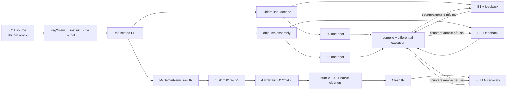

# Case study h00035 — hồ sơ trình bày trước hội đồng

> **Historical snapshot:** the measurements below were produced by the older
> F3-O1/O2/O3 experiment. They are retained for audit only. The active
> taxonomy is `B1` Ghidra pseudocode one-shot, `B2` assembly one-shot, `F1`
> Clean IR with loop, `F2` Raw IR with loop, and `F3` Clean IR one-shot; see
> [`docs/research-evaluation-protocol.md`](../../docs/research-evaluation-protocol.md).

## 0. Một câu để mở đầu

`h00035` nhận tối đa 64 đoạn số nguyên, sắp xếp rồi hợp nhất các đoạn kề nhau,
sau đó in số nhóm, tổng độ phủ và đoạn cuối. Đây là case tốt để bảo vệ đóng góp
vì cả Ghidra lẫn raw assembly one-shot đều sinh C **compile được nhưng sai**;
Clean-IR O1 sinh đúng ngay lần đầu; validation loop sửa được Ghidra, assembly và
Clean-IR O2 bằng counterexample thực thi.

Thông điệp cần nói rõ:

> Pipeline không “đoán lại source gốc”. Nó biến binary thành evidence ngày càng
> có cấu trúc, chỉ rewrite khi có rule/proof, rồi dùng execution feedback để
> phát hiện và sửa candidate C còn sai.

## 1. Artifact gốc và oracle

| Thành phần | Giá trị |
|---|---|
| Case | `h00035`, category `data_structures` |
| Source | `custom_dataset/clean_src/h00035/n26081535.c` |
| Source SHA-256 | `45c311707c49c82a0d8b0b850c6c501b9b5990f3fac1af54b717e3ccfe901797` |
| Obfuscated ELF | `custom_dataset/obfuscated/h00035/n26081535_fla_bcf_instsub.elf` |
| ELF SHA-256 | `0389fac14b9b17a15cd5b89747764dfec59fbcc1827e781d0b9351b1cf8c92bd` |
| Seed | `case_studies/h00035/seed.txt` |
| Expected | `groups=5 covered=27 tail=40:41` |
| F3-O1 recovered C | `case_studies/h00035/recovered_f3_o1.c` |
| Recovered SHA-256 | `a48992237ae580ee9446c303742114c08b77624da5db02b3c78e24a7bf1714d8` |

Source gốc chỉ được dùng để build binary, freeze hash và xây oracle. Nó không
được đưa vào Ghidra/assembly/Clean-IR prompt. Điều này giảm khả năng model nhớ
đúng source–binary pair, nhưng không chứng minh model chưa từng học thuật toán
merge interval.

## 2. Bài toán source-level

Logic thật có bốn invariant quan trọng:

1. `1 <= n <= 64`, nếu sai trả mã 2.
2. Mỗi đoạn thỏa `left <= right`, nếu sai trả mã 3.
3. Hai đoạn được nhập thành một nhóm khi `next.left <= right + 1`; dấu `+1`
   làm hai đoạn kề nhau cũng được hợp nhất.
4. Độ phủ inclusive là `right - left + 1` và format output phải khớp byte.

Đây chính là những chi tiết one-shot thường làm sai: return code, layout cặp
`long`, điều kiện kề nhau, `+1` trong độ phủ hoặc chuỗi format.

## 3. Toàn bộ đường biến đổi



## 4. Bước 1 — tự xây và làm rối binary

Lệnh đã freeze trong build manifest:

```text
clang-21 -std=c11 -O0 -Xclang -disable-O0-optnone ... -emit-llvm
opt-21 -passes=function(reg2mem,own-instsub,own-fla,own-bcf),verify
clang-21 -O0 -no-pie ... -o h00035.obf.elf
```

Marker riêng của `h00035`:

| Transform | Marker count |
|---|---:|
| instruction substitution | 88 |
| control-flow flattening | 96 |
| bogus control flow | 398 |

Assembly cho thấy opaque predicate dạng:

```asm
imul %eax,%eax
add  %ecx,%eax
and  $0x1,%eax
cmp  $0x0,%eax
je   ...
```

và dispatcher liên tục ghi các state như `0xea90ee15` rồi nhảy về cùng một
điểm. Đây là bằng chứng binary thực sự chứa transformation, không chỉ đổi tên
symbol.

Vai trò của own obfuscator ở đây là **test apparatus có kiểm soát**. Nó giúp
paired comparison công bằng; không nên gọi bản thân obfuscator là đóng góp
deobfuscation.

## 5. Bước 2 — hai baseline ngoài

### 5.1 Ghidra B0/B1

Ghidra export có 402 dòng/10,650 byte. Nó đã nhận ra `scanf`, `qsort`, `printf`
và format string, nhưng logic chính vẫn là dispatcher:

```c
local_c = -0x156f1cf6;
...
if (local_c == -0x156f1af4) { ... }
else if (local_c == -0x156f19f3) { ... }
```

Kết quả:

| Flow | Trajectory | Kết luận |
|---|---|---|
| B0 | `722 match / 278 mismatch` | compile được nhưng sai semantic |
| B1 | `728/272 → 1000/0` | một behavioral repair sửa được |

Counterexample B1 vòng đầu:

```text
stdin: 4 -307508 2 3 4 5 6 7 8
candidate: exit 3, không stdout
reference: exit 0, groups=1 covered=307517 tail=-307508:8
```

Counterexample này chỉ đưa input và observation khác nhau cho model; không đưa
source hay expected algorithm. Đóng góp của loop là biến một lỗi “72.8% có vẻ
gần đúng” thành lỗi tái hiện cụ thể rồi buộc model sửa.

### 5.2 Raw assembly B2/B3

Cleaned objdump có 690 dòng/14,802 byte. B2 nhận đúng template paper-derived,
không có system prompt và chỉ một call.

| Flow | Trajectory | Lỗi chính |
|---|---|---|
| B2 | `703/297` | bỏ điều kiện adjacency `+1`, tính length thiếu `+1`, sai format/return |
| B3 | `0/1000 → 157/843 → 1000/0` | vòng đầu đúng logic chính nhưng sai exact output; vòng 3 hội tụ |

Counterexample B3 đầu tiên chính là seed:

```text
candidate: 5 27 40 41
reference: groups=5 covered=27 tail=40:41
```

Điểm cần nhấn mạnh: candidate compile và tính ra đúng bốn con số nhưng vẫn bị
FAIL vì stdout không byte-identical. Evaluator không tự nới tiêu chí để làm đẹp
kết quả.

## 6. Bước 3 — binary lifting

McSema/Remill tạo raw LLVM IR gồm:

| Metric canonical | Raw lift |
|---|---:|
| Functions | 30 |
| Basic blocks | 138 |
| Instructions | 1,621 |
| Conditional branches | 51 |
| Calls | 44 |
| Load / store / GEP / PHI | 115 / 250 / 7 / 2 |

Raw IR còn `%struct.State`, alias `RAX/RSP/RIP/ZF/CF`, guest memory token và
`__remill_function_call`/`__remill_jump`. Lifting bảo toàn width, register và
memory semantics nhưng chưa phải source-like IR; nếu gửi thẳng cho LLM thì
model phải tự hiểu cả máy ảo Remill lẫn thuật toán.

## 7. Bước 4 — custom pass 010–090

| Pass | Việc nhóm cài đặt | Tác dụng đối với loại artifact của h00035 |
|---|---|---|
| 010 repair | bỏ LLVM flags có thể tạo poison sai; exact repair lifted pattern | ngăn optimizer xóa nhánh hợp lệ dựa trên UB giả |
| 015 runtime | materialize helper/runtime đã whitelist | biến helper thành call/load/store LLVM phân tích được |
| 020 devirt | resolve indirect target khi có proof | làm rõ call tới `scanf/qsort/printf` và callback compare |
| 030 State SSA | đưa register/state có ownership proof sang SSA | giảm phụ thuộc `%State`, tạo data-flow explicit |
| 040 stack | phục hồi frame slot có provenance | làm lộ mảng interval và local scalar |
| 050 ABI | phục hồi argument/return theo callsite | cho interprocedural propagation hoạt động |
| 060 extern bridge | nối external call về ABI C | giữ semantics thư viện thay vì đoán body |
| 070 globals | phục hồi global/string theo segment evidence | làm lộ `%d`, `%ld%ld` và output format |
| 080 types | reconstruct width/aggregate shape | giữ cặp hai trường 64-bit, chưa khôi phục tên gốc |
| 090 cleanup | hạ State/frame/native wrapper theo refusal boundary | chuẩn bị IR cho pass 095 và optimizer |

Sau toàn bộ main pipeline, O2/O3 còn 11 functions, 53 blocks, 1,189
instructions và 5 conditional branches. So với raw lift, function/CFG noise
giảm mạnh. Memory ops lại tăng từ 372 lên 806 vì State/guest access được làm lộ
thành load/store/GEP cụ thể. Đây không tự động là regression: IR explicit hơn
để optimizer chứng minh alias/dead store ở bước kế tiếp.

Không có per-pass snapshot cho riêng 010, 015, ..., 090 ở campaign này. Vì vậy
trước hội đồng chỉ được nói bảng trên là **implemented role**, còn delta
raw→brightened là **combined observation**; không gán accuracy gain riêng từng
pass nếu chưa chạy leave-one-pass-out.

## 8. Bước 5 — pass 095, phần deobfuscation đo được trực tiếp

Report 095 của `h00035`:

| Stage/rule | Candidates | Changes | Unresolved |
|---|---:|---:|---:|
| normalize | — | 7 | 0 |
| MBA comparisons | 9 | 9 | 0 |
| BCF opaque predicates | 22 | 16 | 0 |
| deflatten | 0 | 0 | 0 |
| CFG cleanup | — | 2 | 0 |
| register state | — | 289 | 0 |

Z3 thực hiện 28 query: 16 proved, 12 disproved, 0 unknown. `unknown` không được
coi là bằng chứng. Rule hit là 5 signed-greater-than, 4 signed-less-than và 16
opaque-set proof.

Thay đổi trên hai hàm trọng tâm ngay trong report:

| Function | Blocks trước→sau | Instructions trước→sau |
|---|---:|---:|
| lifted `main` | 55 → 31 | 1,988 → 1,063 |
| lifted `compare` | 13 → 5 | 353 → 254 |

Đây là evidence pass-specific mạnh nhất: candidate được match, proof/refusal
được ghi và before/after nằm trong cùng report. Với case này deflatten stage
không kích hoạt; việc CFG giảm đến từ opaque predicate/MBA/register-state và
cleanup, nên không được nói “deflatten đã cứu h00035”.

## 9. Bước 6 — O1/O2/O3 làm gì tại đúng từng biên

Số dưới đây lấy từ instrumentation `print` trước/sau `default<O*>` trong cùng
process production. Tất cả replay của `h00035` đều valid.

| Level | Boundary | Instr trước→sau | BB delta | Memory delta | Thành phần chính |
|---|---|---:|---:|---:|---|
| O1 | main-1 | 1,445 → 1,383 | -7 | -57 | -8 call, -33 store, -20 GEP, +13 PHI |
| O1 | main-2 | 1,388 → 1,378 | 0 | +4 | -2 call nhưng explicit thêm 2 load/2 store |
| O1 | bundle-3 | 1,176 → 1,062 | 0 | -114 | -27 load, -87 store |
| O1 | bundle-4 | 1,062 → 1,050 | 0 | -12 | -6 load, -6 store |
| O1 | custom final tail | 1,050 → 959 | 0 | -91 | -91 store |
| O2 | main-1 | 1,445 → 1,375 | -7 | -62 | -8 call, -38 store, -20 GEP, +13 PHI |
| O2 | main-2 | 1,380 → 1,370 | 0 | +4 | giống pattern O1 |
| O2 | bundle-3 | 1,173 → 966 | 0 | -207 | -33 load, -174 store |
| O2 | bundle-4 | 966 → 958 | 0 | -8 | -8 store |
| O2 | custom final tail | 958 → 958 | 0 | 0 | đã convergence |
| O3 | bốn biên + tail | giống O2 trên metric h00035 | — | — | không chứng minh O3 luôn giống O2 |

Insight của riêng case:

- main-1 inline/dọn wrapper, xóa call/GEP/store và tạo PHI: memory/state được
  chuyển thành SSA.
- bundle-3 là chỗ O2 hơn O1 rõ nhất: xóa thêm 93 instruction, chủ yếu dead
  store. O2 đã làm sớm việc mà O1 để custom tail làm sau.
- O1 final là 959 instruction; O2/O3 là 958. Chênh một instruction không giải
  thích được khác biệt LLM response.
- `delift_storage.py` và `strip_brighten_residuals.py` là byte-identical no-op
  ở h00035. Không được dùng chúng làm contribution cho case này.

## 10. Bước 7 — Clean IR và giới hạn native contract

Stage-size O1:

```text
raw lift            3,372 lines / 221,716 bytes
brightened main     1,450 lines /  93,512 bytes
final Clean IR      1,119 lines /  73,667 bytes
recovered C            60 lines /   1,319 bytes
```

Final IR không còn State global alias, segment global hay Remill/McSema call;
không còn poison/undef. Tuy vậy native contract vẫn là:

```text
status = non_compliant
output_class = compat_runnable
native_contract_violations = 17
```

Các residual chính gồm inline assembly, `compare_wrapper`/guest CFG, guest-stack
integer-to-pointer, qsort ABI mismatch và residual image/map globals. Vì vậy
claim đúng là “Clean IR đủ làm structured evidence và chạy qua compatibility
path”, không phải “đã phục hồi fully-native LLVM IR”.

## 11. Bước 8 — F3 LLM recovery

| Treatment | Clean IR size | LLM trajectory | Calls | Final |
|---|---:|---|---:|---|
| F3-O1 | 959 canonical instructions | `1000/0` | 1 | PASS |
| F3-O2 | 958 | `155/845 → 344/656 → 1000/0` | 3 | PASS |
| F3-O3 | 958 | `1000/0` | 1 | PASS |

O2 vòng đầu dùng sai `pairs[0]` thay vì `pairs[i]` và quên cộng nhóm cuối. Một
counterexample tối thiểu:

```text
stdin: 1 1 2
candidate: groups=0 covered=0 tail=1:2
reference: groups=1 covered=2 tail=1:2
```

Vòng 3 sửa đúng. O1/O3 pass ngay nhưng O2 cần loop dù O2/O3 IR gần như đồng
nhất. Đây là lời nhắc không được lấy một stochastic response để kết luận O2
gây lỗi; kết luận level phải dựa toàn bộ 40 paired cases và nhiều seed nếu muốn
tách sampling variance.

## 12. Bước 9 — semantic validation

Candidate được compile độc lập rồi chạy cùng reference ELF trên cùng input.
Observation so sánh toàn bộ:

```text
(stdout bytes, stderr bytes, exit code, terminating signal, timeout status)
```

F3-O1 đạt 1,000/1,000 valid-domain input, 0 mismatch, 0 inconclusive. Lệnh
`./replay.sh` chứng minh lại frozen seed trên máy hiện tại. Đây là “không tìm
thấy divergence trong budget đã đăng ký”, không phải formal equivalence proof.

## 13. Đóng góp nào là của nhóm

| Thành phần | Nguồn | Cách trình bày |
|---|---|---|
| Ghidra, objdump | công cụ ngoài | baseline representation |
| McSema/Remill | công cụ ngoài | binary lifting substrate |
| LLM | model ngoài, không fine-tune | code generator/reasoner dùng chung giữa treatment |
| AFL++ | engine ngoài | nguồn mutation; nhóm định nghĩa strict differential oracle và feedback contract |
| Own dataset/obfuscator | nhóm xây | contamination-resistant paired evaluation apparatus |
| Pass 010–095/100 | nhóm cài đặt/cấu hình | proof/refusal deobfuscation và delifting; 095 có report trực tiếp |
| Bốn optimizer boundary | nhóm cấu hình và instrument | đo O1/O2/O3 tại đúng IR boundary, không chỉ gọi `-O3` cuối pipeline |
| Validation loop | nhóm orchestration | parser/compiler/counterexample thành repair signal có budget |
| Seven-treatment protocol | nhóm thiết kế | tách representation effect khỏi feedback-policy effect |

Một câu contribution tốt:

> Nhóm xây một decompilation protocol có thể audit: custom LLVM transforms làm
> lộ và chứng minh các cấu trúc bị che, optimizer được đo tại từng boundary, và
> candidate C chỉ được chấp nhận sau strict differential validation. Trên
> h00035, pass 095 loại 16/22 opaque predicates có proof, O2 bundle xóa 207
> memory instructions, còn feedback biến candidate compile được nhưng sai thành
> 1,000/1,000 match.

Không nên nói:

> Nhóm ghép McSema, LLVM, LLM và AFL++ nên decompile chính xác 100%.

## 14. Kịch bản trình bày 8 phút

1. **45 giây — bài toán:** mở source và seed, chỉ ra bốn invariant.
2. **45 giây — contamination control:** chỉ source/hash/oracle được freeze;
   source không vào prompt.
3. **60 giây — obfuscation:** mở assembly/Ghidra, chỉ state constant và opaque
   predicate; nêu 88/96/398 marker.
4. **75 giây — lifting/custom pass:** raw IR có State/Remill; giải thích vai trò
   010–090, nhưng thừa nhận delta của chúng là combined.
5. **75 giây — đóng góp 095:** trình bày 28 query, 16 proof, 12 disproof; main
   55→31 block và compare 13→5.
6. **75 giây — optimization:** dùng bảng bốn boundary; so O1 bundle -114 memory
   với O2 -207; nhấn mạnh dead stage và work shifting.
7. **75 giây — LLM/loop:** B0 722/278, B2 703/297, B1/B3/F3 cuối PASS; chiếu
   counterexample `1 1 2`.
8. **30 giây — giới hạn:** 1,000 fuzz không phải proof; IR compat-runnable;
   chưa có per-pass leave-one-out.

## 15. Câu hỏi hội đồng dễ hỏi

### “Kết quả tốt là nhờ LLM đã biết bài merge interval?”

LLM có thể biết thuật toán, nên nhóm không claim zero knowledge. Điều được kiểm
soát là exact source/binary instance mới và cùng model trên mọi treatment.
One-shot Ghidra/assembly vẫn sai; loop và Clean-IR thay đổi khả năng khai thác
evidence. Kết luận dựa 40 paired case, không dựa riêng h00035.

### “Pass nào làm tăng accuracy bao nhiêu?”

Chưa thể chia phần trăm accuracy cho 010–090 vì chưa có leave-one-pass-out.
Riêng 095 có before/after và proof report; O-level có instrumentation boundary.
Đây là giới hạn được công khai, không gán nhầm combined effect cho từng pass.

### “Tại sao B1 toàn campaign còn cao hơn F3?”

Điều đó chứng minh feedback policy là effect quan sát lớn nhất, không làm F3
vô nghĩa. F3 đóng góp structured/auditable deobfuscation và đôi khi giúp pass
ngay vòng đầu như h00035 O1/O3; nhưng superiority accuracy so với iterative
Ghidra chưa được chứng minh.

### “O3 có phải tốt nhất?”

Không. Trên toàn bộ own dataset O1/O2 đạt 38/40, O3 37/40. Trên public IR, O3
còn có thể tạo thêm block/PHI/branch. Level cao hơn không đồng nghĩa dễ
decompile hơn.

### “1,000 input có chứng minh tương đương?”

Không. Nó là bounded empirical evidence với reproducible counterexample. Claim
đúng là `no divergence found`, không phải formal equivalence.

### “IR cuối đã native chưa?”

Chưa. h00035 là `compat_runnable`, còn 17 native-contract violations. Đây là
research limitation riêng, không bị che bằng recovered-C behavioral score.

## 16. File nên mở khi demo

1. `custom_dataset/clean_src/h00035/n26081535.c`
2. `custom_dataset/obfuscated/h00035/n26081535_fla_bcf_instsub.elf`
3. `result/twoflow_20260815_213257/h00035/B0/representation/ghidra_original_program.c`
4. `result/b23_final_20260816/h00035/B2/representation/objdump_original_program.s`
5. `result/f3_o1_final_20260815/h00035/h00035.ll`
6. `result/f3_o1_final_20260815/h00035/h00035_brightened.095.json`
7. `reports/ir_boundary_own_20260816/optimization_boundary_case_metrics.csv`
8. `result/f3_o2_final_20260815/h00035/F3/recovery_iter1.fuzz.json`
9. `case_studies/h00035/recovered_f3_o1.c`

Ba CSV trong thư mục này là bảng rút gọn, có thể đưa thẳng vào slide hoặc dùng
để đối chiếu số liệu khi trả lời hội đồng.
