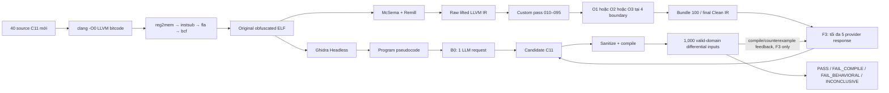

# Phân tích exhaustive từng khối của pipeline và toàn bộ 40 case

> **Trạng thái:** tài liệu này giữ chi tiết implementation/pass và snapshot
> bốn treatment ban đầu. Kết quả cuối sau khi thêm B1/B2/B3 nằm ở
> `docs/seven-treatment-analysis.md`; phép đo O1/O2/O3 tại đúng từng biên nằm ở
> `docs/optimization-ir-boundary-analysis.md`. Mọi attribution cũ trong tài
> liệu này phải được đọc theo hai báo cáo mới.

## 0. Cách đọc báo cáo

Báo cáo này tách ba loại phát biểu để không trộn implementation với bằng
chứng thực nghiệm:

- **Implemented:** source/pass thực sự làm gì và từ chối gì.
- **Observed:** artifact của bốn campaign frozen đo được gì.
- **Inference:** lời giải thích hợp lý từ observed data, nhưng chưa phải quan
  hệ nhân quả đã được ablation chứng minh.

Bốn campaign duy nhất được dùng là `twoflow_20260815_213257`,
`f3_o1_final_20260815`, `f3_o2_final_20260815` và
`f3_o3_final_20260815`. Các pilot, campaign protocol cũ và campaign bị
truncation không nằm trong mẫu số.

## 1. Toàn bộ topology của thí nghiệm



Điểm đối chứng quan trọng là cả B0 và F3 đều được so trực tiếp với **cùng ELF
obfuscated gốc**. Final Clean-IR executable chỉ là kiểm định phụ, không phải
oracle cho candidate C.

## 2. Khối xây dataset

### 2.1 Source construction

**Implemented:** 40 chương trình C11 được viết cho repository ngày 2026-08-15,
chia đều tám nhóm, mỗi nhóm năm ca. Mỗi ca có source, seed, input contract,
stdout oracle và SHA-256 frozen.

**Giúp gì:** làm việc model nhớ đúng cặp source–binary từ benchmark công khai
trở nên khó hơn. Các hằng số, format output, tổ hợp thuật toán và edge case là
instance mới.

**Không giúp gì:** model vẫn có thể biết BFS, Floyd–Warshall, heap, CRC-like
loop, parser hoặc idiom C. Vì vậy claim đúng là
`contamination-resistant`, không phải `contamination-free`.

### 2.2 Plain oracle gate

Mỗi source được compile plain bằng C11, `-O2 -Wall -Wextra -Werror`, chạy với
seed frozen và so stdout oracle trước khi tạo binary obfuscated. Cả 40/40 ca
có `oracle_verified=true`.

**Giúp gì:** loại lỗi dataset/source khỏi lỗi decompilation. Nếu plain source
đã sai oracle thì toàn bộ đánh giá sau đó vô nghĩa.

### 2.3 Obfuscation construction

Pipeline tạo binary:

```text
C11 -O0 LLVM bitcode
  → reg2mem
  → own-instsub
  → own-fla
  → own-bcf
  → LLVM verifier
  → clang -O0 -no-pie x86-64 ELF
```

Tổng marker trên 40 ca:

| Block | Tổng marker | Trung bình/ca | Mục tiêu gây khó |
|---|---:|---:|---|
| `instsub` | 2,596 | 64.90 | Thay biểu thức đơn giản bằng arithmetic/MBA dài hơn |
| `fla` | 3,716 | 92.90 | Biến control flow thành dispatcher/state transitions |
| `bcf` | 12,934 | 323.35 | Thêm opaque predicates và bogus edges |

ELF có kích thước trung bình 16,151 byte, min 15,976 và max 20,080 byte.

**Điểm tốt:** mọi ca dùng cùng recipe nên so sánh O1/O2/O3 là paired và công
bằng.

**Điểm xấu:** cùng recipe cũng làm external validity hẹp. Chưa biết kết quả có
giữ nguyên với virtualization khác, packer, self-modifying code, PIE, stripped
symbols mạnh hơn, ARM hoặc Windows ABI hay không.

### 2.4 Valid-input contracts

40 contract gồm 23 `encoded_line_stream`, 11 `counted_long_list`, ba
`fixed_tuple_block` và ba `single_int`.

**Giúp gì:** AFL++ mutation được lọc về miền input hợp lệ; khác biệt do input
sai format không bị nhầm thành lỗi semantic. Contract cũng bổ sung input hợp
lệ khi queue AFL++ không đủ 1,000 mẫu.

**Rủi ro:** contract do nhóm định nghĩa là một phần của oracle. Contract quá
hẹp có thể bỏ sót hành vi; contract quá rộng có thể đưa undefined/out-of-domain
input vào phép so sánh.

## 3. Baseline B0, từng khối

### 3.1 Original ELF → Ghidra Headless

Ghidra nhận trực tiếp ELF obfuscated gốc. Nó không được đọc Raw IR, Clean IR,
source, seed, oracle hoặc candidate của F3.

**Giúp gì:** đây là baseline ngoài hợp lý, gần flow Section 4.2.1 của
LLM4Decompile và dùng một decompiler phổ biến.

**Mặt xấu quan sát được:** pseudocode mang type như `undefined8`, import-thunk
pointer và synthetic constructs. 16/40 response B0 cuối cùng vẫn còn artifact
decompiler không compile được.

### 3.2 Ghidra export → prompt

Prompt là instruction frozen của LLM4Decompile, hai byte LF, rồi raw
program-level Ghidra export. Không system prompt, test, compiler diagnostic hay
counterexample được thêm vào B0.

**Giúp gì:** tránh tự thiết kế một baseline yếu rồi gọi đó là state of the art.

**Mặt xấu:** program export lớn và có CRT/import noise. Prompt không hướng dẫn
repair artifact riêng của dataset và không có cơ hội hỏi lại.

### 3.3 Một provider request

B0 dùng cùng model, temperature 0.05, location và output ceiling với F3 nhưng
chỉ đúng một request.

**Observed:** 40 request, 731,561 input token, 142,369 output token; trung bình
23.04 giây/ca. Tất cả response kết thúc `STOP`, nên lỗi B0 final không phải do
output ceiling.

### 3.4 Sanitize, compile và fuzz sau request

Validation sau request chỉ để chấm điểm; kết quả không quay lại LLM.

Kết quả 30 ca B0 không PASS:

- 7 incomplete C: h00001, h00003, h00011, h00018, h00028, h00032 và h00034.
  Trong đó h00032 có ngoặc không cân bằng; sáu ca còn lại thiếu `main` thật.
- 16 unsupported decompiler artifact: undefined-width type ở h00002, h00005,
  h00008, h00013, h00025, h00026 và h00036; import-thunk pointer ở h00006,
  h00015, h00016, h00017, h00024, h00027, h00030, h00031 và h00039.
- 4 compile/link failure: h00019, h00020, h00021 bị linker error; h00037 còn
  symbol chưa khai báo.
- 3 behavioral failure: h00022 đạt 4/1,000; h00035 đạt 722/1,000; h00040 đạt
  0/1,000.

**Đúc kết:** B0 thất bại ở hai lớp khác nhau. Representation gây artifact và
one-shot policy khiến artifact/sai semantic không được sửa. Kết quả B0 tự nó
không cho biết lớp nào đóng góp bao nhiêu phần trăm.

## 4. F3 trước LLM: lifting và custom transformations

### 4.1 ELF → McSema CFG → Remill LLVM IR

McSema lấy CFG và lift instruction x86-64 sang Remill IR. Raw IR biểu diễn
register trong `%State`, guest memory bằng memory token, PC/dispatcher bằng
helper call và stack bằng guest address.

**Giúp gì:** IR giữ width, signed operation, call và data-flow chính xác hơn
pseudocode đoán type.

**Mặt xấu:** đây chưa phải native LLVM thông thường. Nếu coi guest address là
host pointer, memory token là return value thật, hoặc xóa State tùy ý thì sẽ
đổi semantics.

Raw IR trung bình có 1,445.025 instruction, 136.275 basic block và 49.8 nhánh
điều kiện.

### 4.2 Pass 010 — repair lifted semantics

Các rule nhỏ:

1. Resolve alias register-State về pointer thật khi alias class được chứng
   minh; không thay alias `data_*` như register.
2. Bỏ `nsw`, `nuw`, `exact` và `inbounds` khi promise LLVM mạnh hơn semantics
   wraparound/address của x86 và có thể tạo poison.
3. Sửa guard cho x86 FP-to-int indefinite/NaN path theo exact matcher.
4. Giữ callback function pointer/guest PC khi thunk có nguy cơ bị DCE.

**Giúp gì:** ngăn optimizer suy ra UB giả rồi xóa nhánh hợp lệ.

**Refusal boundary:** không strip flag toàn module, không biến guest address
thành host pointer theo tên, không rewrite pattern gần giống nhưng khác exact
shape.

### 4.3 Pass 015 — materialize runtime semantics

Các rule:

1. Hạ McSema attach thunk từ inline assembly thành call LLVM có thể phân tích.
2. Giữ x86 divide fault; chỉ đổi abort khi chứng minh đúng #DE path.
3. Biến Remill control-flow declarations thành switch/call body có semantics.
4. Hạ memory read/write intrinsic thành load/store align 1 và giữ memory token.
5. Pure-value intrinsic chưa đủ evidence thì cố ý không định nghĩa.
6. Atomic/barrier chỉ materialize signature và width trong whitelist.
7. Verify/report helper còn unresolved.

**Giúp gì:** các pass SSA/CFG sau không còn nhìn thấy mọi hành vi như opaque
external call.

**Nguy cơ:** body runtime sai sẽ lan sang toàn callgraph; vì vậy whitelist và
verification quan trọng hơn số lượng helper được xóa.

### 4.4 Pass 020 — devirtualization và region-SSA unflattening

Các rule:

1. `LowerExternalCalls` chỉ tạo bridge tạm, chưa tuyên bố phục hồi đầy đủ libc.
2. Annotate return register để pass ABI 050 có evidence; không tự đổi mọi `ret`.
3. Xóa Remill dispatcher chỉ khi không còn consumer sống.
4. Hạ constant State switch khi state/target đã chứng minh.
5. Region-SSA unflattening bypass dispatcher header chỉ khi dựng lại được cả
   CFG edge và application value/PHI tương ứng.

**Giúp gì:** trực tiếp xử lý `fla` và làm loop/if trở lại gần cấu trúc gốc.

**Refusal boundary:** không nối edge theo hằng dispatcher đoán được nhưng bỏ
mất value đi qua PHI.

### 4.5 Pass 030 — State → SSA

Các rule:

1. Forward flag computation chỉ khi không có memory/call quan sát ở giữa.
2. Tách field của `%State` thành alloca trung gian rồi dùng SSA promotion.
3. Local State alloca chỉ split khi use graph đóng, không escape qua unknown
   pointer/call.
4. Chỉ hạ flag i8 thành i1 khi mọi incoming value thực sự boolean.

**Giúp gì:** register x86 trở thành scalar SSA; LLVM có thể constant-fold và
DCE arithmetic của obfuscator.

**Mặt xấu nếu làm quá tay:** unknown call có thể đọc State/memory. Promote qua
điểm đó làm candidate đẹp hơn nhưng sai hành vi.

### 4.6 Pass 040 — stack-frame recovery

Các rule:

1. Dùng phân tích affine RSP/RBP để nhận slot, không dựa vào tên biến.
2. Compact backing frame sau khi State đã được scalarize, nhưng chỉ khi toàn use
   graph đóng.
3. Retype pointer slot khi tất cả observation phù hợp; nếu slot còn bị quan sát
   như integer thì giữ representation cũ.

**Giúp gì:** biến guest-stack arithmetic thành alloca/GEP dễ đọc và giúp LLM
nhìn ra array/local variable.

**Refusal boundary:** unknown call, indirect call, boundary guest-memory,
read-before-write hoặc frame quá lớn đều có thể khiến rule bỏ qua.

### 4.7 Pass 050 — ABI recovery

Trình tự nhỏ:

1. Normalize register accesses.
2. Phân tích function live-ins từ register reads trước definition.
3. Phân tích live-outs từ register stores/return consumers.
4. Phân tích ABI tại từng callsite.
5. Giao các observation để infer signature.
6. Clone `.native` function và rewrite body/callsite theo transaction.
7. Chỉ xóa call lifted khi return và memory-token users đã được nối đúng.

**Giúp gì:** thay signature `(State*, pc, memory-token)` bằng tham số/return gần
C ABI, giảm lượng State phải đưa vào LLM.

**Boundary đặc biệt:** `scanf` destination và callback không được gán tùy tiện
`nocapture`, `readonly` hoặc type chỉ vì format string trông quen.

### 4.8 Pass 060 — external-call bridge

Các rule:

1. Đọc argument register tại callsite với dominance/memory boundary.
2. Phân loại pointer provenance: native object, guest address, resolver hay
   unknown.
3. Phục hồi signature thường và vararg theo imported ABI/format evidence.
4. Hạ `va_list` SysV đã materialize.
5. Rewrite transaction: tạo native call, nối return/memory token, verify toàn
   use rồi mới xóa call cũ.
6. `scanf` capture contract được kiểm riêng.

**Giúp gì:** literal `printf/scanf/qsort/getchar` trở thành semantic anchors rất
mạnh cho LLM.

**Mặt xấu nếu đoán:** một pointer guest bị truyền thẳng cho libc host có thể
crash hoặc đọc sai object.

### 4.9 Pass 070 — global-data recovery

Các rule:

1. Đối chiếu PT_LOAD map và page tail, không chỉ nội dung bytes.
2. Từ chối dynamic carrier khi object/address có thể thay đổi.
3. Giữ address identity: hai chuỗi cùng nội dung không mặc nhiên cùng pointer.
4. Tách candidate discovery, native global creation và late resolver/string
   recovery thành các lượt riêng.

**Giúp gì:** khôi phục format string, table và constant global để LLM hiểu I/O.

**Rủi ro:** tạo global host mới trong khi guest region cũ vẫn được quan sát sẽ
nhân đôi state và làm alias sai.

### 4.10 Pass 080 — type and native-pointer reconstruction

Các rule:

1. Chỉ collapse `ptrtoint/inttoptr` round-trip khi provenance và width khớp.
2. Cho phép offset affine trong miền đã giới hạn; không coi mọi `inttoptr` là
   pointer hợp lệ.
3. Use graph của pointer serialize qua stack/global phải đóng.
4. Chỉ retype raw-byte aggregate khi toàn access đồng thuận về layout.
5. `CanonicalizeAddresses` và heap-resolver collapse là proof-only simplifier.

**Giúp gì:** phục hồi array/struct/pointer-level evidence thay cho arithmetic
trên integer address.

**Refusal boundary:** integer observation, pointer escape hoặc nhiều object
candidate làm rule giữ raw representation.

### 4.11 Pass 090 — native cleanup và contract gate

090 có ba quyền khác nhau:

1. Broad cleanup tiếp tục State ABI lowering và dọn lifted artifacts.
2. Post-frame cleanup chỉ tiêu thụ sản phẩm frame/pointer đã chứng minh.
3. Final pass chủ yếu report/verify contract, không được “chữa đẹp” IR bằng
   heuristic ở phút cuối.

Các boundary quan trọng:

- State ABI lowering là transaction trên callgraph.
- `undef/poison` chỉ được định nghĩa khi mọi byte quan sát được bị overwrite.
- Frame/scanf không dùng giả định “call này chắc không ghi memory”.
- Resolver collapse dùng equality cấu trúc, không tin helper name.
- Scalar hóa residual storage không được tạo object alias mới.
- Final contract kiểm tra guest ABI, mapper, raw frame, inline assembly và
  pointer model mà LLVM verifier không kiểm.

### 4.12 Pass 095 — proof-oriented deobfuscation

Các block nhỏ:

1. Normalize arithmetic/CFG.
2. Resolve object/pointer candidates.
3. Exact proof-backed MBA identities.
4. Z3 proof cho opaque predicate; `unknown` không phải evidence.
5. Chỉ thay branch terminator sau proof.
6. Deflatten theo transaction; nếu không dựng đủ CFG/value thì giữ dispatcher.
7. Cleanup fake-stack/register-state đã có proof từ pass trước.

**Observed trên mỗi treatment:** 40 report, 984 Z3 query và 520 proof thành
công. O1 có 456 disproved + 8 unknown; O2/O3 có 458 disproved + 6 unknown.

| Substage 095 | Candidate | Rewrite | Unresolved |
|---|---:|---:|---:|
| normalize | 0 | 246 | 0 |
| resolve objects/pointers | 0 | 0 | 0 |
| MBA | 152 | 152 | 0 |
| BCF/opaque predicate | 763 | 536 | 0 |
| deflatten | 0 | 11 | 10 |
| CFG cleanup | 0 | 80 | 0 |
| fake stack | 0 | 0 | 0 |
| register state | 0 | 9,954 | 0 |

**Insight:** 095 không “xóa mọi obfuscation”. 227 opaque/BCF candidate không
được rewrite vì không có proof hoặc bị disproved; 10 deflatten path unresolved
được giữ lại. Fail-closed làm output có thể xấu hơn nhưng tránh tạo semantic
equivalence giả.

### 4.13 Bundle 100 — delift và artifact giao cho LLM

Trình tự chính xác:

1. Verify brightened input.
2. Chạy exact pointer passes.
3. Chạy registered `default<O1|O2|O3>`.
4. Delift storage.
5. Strip brighten residuals.
6. Chạy cùng registered optimizer lần hai.
7. Deduplicate pointer selects.
8. Chạy 095 lần cuối nhưng khóa Z3 candidate bằng 0: chỉ deterministic MBA.
9. Chạy scalar cleanup, post-frame cleanup, internalize/IPSCCP/deadargelim và
   final native-contract pass.
10. Compact text, LLVM verify, compile object bằng clang `-O2`.
11. Chỉ link runtime McSema audited nếu object còn unresolved
    `__mcsema_attach_call`.

**Giúp gì:** tách optimization dùng để làm sạch IR khỏi `-O2` code generation,
giữ độc lập biến O1/O2/O3.

**Failure nhỏ nhưng quan trọng:** h00038 bị cleanup/finalization xóa cả public
`main`; linker báo `undefined reference to main` ở cả ba treatment.

## 5. Optimization O1/O2/O3 tại từng boundary

### 5.1 Bốn điểm áp dụng

`BRIGHTEN_OPT_LEVEL` không bật/tắt custom pass. Nó chỉ thay bốn
`default<O*>` treatment:

| Boundary | Input | Optimizer giúp gì | Consumer kế tiếp |
|---|---|---|---|
| Main-1 | Sau 095 + late devirt/ABI/type | Expose constant, scalarize storage, dọn dispatcher residue | native cleanup + ABI/extern/global recovery |
| Main-2 | Sau local-State SSA + region unflatten | Converge CFG/loop, xóa dead lifted State | frame/address/heap cleanup + final contract |
| Bundle-1 | Verified input + exact pointer pass | Canonicalize storage access | storage delift |
| Bundle-2 | Sau delift + residual strip | Dọn artifact do delift tạo ra | deterministic 095 + final native cleanup |

Vectorization, SLP và loop unrolling bị tắt ở presentation boundary vì chúng
có thể tăng code/PHI và làm source recovery khó đọc dù machine code nhanh hơn.

### 5.2 Checkpoint measurement

Số trong ngoặc là chênh lệch instruction so với checkpoint ngay trước:

| Checkpoint | O1 instruction | O2 instruction | O3 instruction | Ý nghĩa |
|---|---:|---:|---:|---|
| Raw lift | 1,445.025 | 1,445.025 | 1,445.025 | Cùng input paired |
| Brightened 010–095 | 856.175 (-588.850) | 825.675 (-619.350) | 825.675 (-619.350) | Custom pass + hai main optimizer treatment |
| Verified bundle input | 856.175 (0) | 825.675 (0) | 825.675 (0) | Verify không đổi IR |
| Exact pointer opt | 847.350 (-8.825) | 816.425 (-9.250) | 816.425 (-9.250) | Lợi ích nhỏ nhưng trực tiếp cho pointer spelling |
| Bundle optimizer-1 | 785.250 (-62.100) | 705.150 (-111.275) | 705.150 (-111.275) | O2/O3 dọn scalar mạnh hơn O1 |
| Storage delift | 785.250 (0) | 705.150 (0) | 705.150 (0) | Đổi representation nhưng không đổi số instruction trung bình |
| Residual strip | 785.250 (0) | 705.150 (0) | 705.150 (0) | Chủ yếu bỏ metadata/textual residual |
| Final clean | 675.100 (-110.150) | 667.800 (-37.350) | 667.800 (-37.350) | Optimizer-2 + post095/native cleanup |

Basic block đi từ 136.275 xuống 44.775 ở O1 và 44.700 ở O2/O3. Conditional
branch đi từ 49.8 xuống 4.025 ở cả ba mức. Tổng reduction:

| Treatment | Instruction | Basic block | Conditional branch |
|---|---:|---:|---:|
| O1 | 53.28% | 67.14% | 91.92% |
| O2 | 53.79% | 67.20% | 91.92% |
| O3 | 53.79% | 67.20% | 91.92% |

### 5.3 Điều có thể và không thể quy cho từng pass

Repository hiện chỉ lưu snapshot `raw`, `brightened_010_095` và các checkpoint
bundle 100. Nó không lưu IR sau riêng 010, 015, 020, ..., 090 cho campaign này.

Do đó:

- Có thể nói cả khối 010–095 + main optimizer làm mất 588.85–619.35
  instruction trung bình.
- Có thể dùng report 095 để đếm chính xác MBA/BCF/Z3/deflatten rewrite.
- Không thể nói riêng pass 030 giảm X instruction hay pass 060 tăng Y% pass
  rate từ artifact hiện có.
- Muốn attribution nhỏ hơn phải thêm per-pass snapshot/metric và ablation bật
  tắt từng pass trong campaign mới.

Đây là ranh giới rất quan trọng: mô tả chức năng từng pass là source-grounded;
gán phần trăm hiệu quả cho từng pass thì chưa có dữ liệu.

### 5.4 O2 và O3 thực sự khác nhau bao nhiêu?

- Final structural mean của O2 và O3 giống hệt.
- 30/40 final IR giống byte-for-byte; 10/40 khác nội dung.
- O1 và O2 khác final IR ở 33/40 ca.
- O1/O2 cùng 38 PASS nhưng đổi chỗ h00022 và h00028.
- O3 chỉ 37 PASS, mất h00012 và vẫn mất h00028.

**Inference có giới hạn:** O3 không tạo thêm simplification hữu ích sau khi
custom pass đã dọn phần lớn dispatcher. Khác biệt từng case còn bị trộn với
stochastic LLM sampling; một campaign/treatment chưa đủ kết luận causal.

## 6. Final Clean IR và native-contract gate

### 6.1 Independent executable validation

Compile final Clean IR rồi so trực tiếp với ELF gốc trên 100 input/ca cho kết
quả giống hệt ở O1/O2/O3:

- 15 PASS: h00002, h00003, h00004, h00009, h00011, h00012, h00013, h00015,
  h00017, h00021, h00022, h00023, h00033, h00036 và h00039.
- 24 FAIL: h00001, h00005, h00006, h00007, h00008, h00010, h00014, h00016,
  h00018, h00019, h00020, h00024, h00025, h00026, h00027, h00028, h00029,
  h00030, h00031, h00032, h00034, h00035, h00037 và h00040.
- 1 INCONCLUSIVE: h00038 không có executable do mất `main`.

Nhiều FAIL dừng ngay input đầu vì clean executable crash trong khi ELF gốc
chạy thành công. Điều này chứng minh Clean IR chưa thể được gọi là deobfuscated
executable tương đương tổng quát.

### 6.2 Native contract

Có 39 report/treatment; h00038 không tạo được report final hợp lệ. Cả 117
report đều `non_compliant`, output class `compat_runnable`. Trung bình 8.62
violation/report, min 1, max 20.

Loại finding trên O1:

| Finding prefix | Số lần |
|---|---:|
| lifted function/ABI | 68 |
| residual image/map global | 50 |
| State-pointer native ABI | 49 |
| inline assembly | 46 |
| transitional entry guest stack | 39 |
| guest stack integer-to-pointer | 23 |
| guest CFG/flattened dispatcher | 17 |
| surviving mapper/select fallback chain | 13 |
| semantic-risk pointer model | 10 |
| semantic-risk memory model | 7 |
| generated raw pointer fallback | 7 |
| raw segment type / lifted global / external ABI mismatch | 2 mỗi loại |
| undef/poison | 1 |

**Đúc kết:** pass chain giảm noise đủ để LLM recovery tốt, nhưng chưa đạt mục
tiêu fully-native. Đây là contribution về evidence transformation, không phải
proof rằng output pass tự nó chạy đúng.

## 7. Khối LLM của F3

### 7.1 Initial request

Model nhận trực tiếp final Clean LLVM IR, không nhận pseudocode, source, seed,
oracle hay test. System prompt yêu cầu một translation unit C11, giữ parsing,
stdout/stderr/newline/exit code và không transliterate SSA từng dòng.

Một synthetic LLVM-to-C demonstration cố định được dùng để chỉ format nhiệm
vụ; nó không chứa hằng số hay logic của 40 case.

**Giúp gì:** model thấy exact width, call và control/data flow đã bớt runtime
noise.

**Chi phí:** Clean IR prompt lớn. Input token trung bình/ca của F3 cao hơn B0
khoảng 5.3–6.0 lần.

### 7.2 Response schema, sanitize và pre-compile rejection

Candidate phải có một `main` thật, ngoặc cân bằng, không còn decompiler helper
unsupported và phải là full C source. Candidate incomplete bị reject trước
compiler; nếu còn budget, F3 regenerate.

**Giúp gì:** compiler không bị dùng như parser cho output rõ ràng bị cắt.

**Observed:** `MAX_TOKENS` response là 5 ở O1, 5 ở O2 và 10 ở O3. Retry
`thinking_level=LOW` vẫn tính vào giới hạn năm provider response, nên output
ceiling có thể lấy mất một vòng semantic repair.

### 7.3 Compiler feedback

Candidate được compile độc lập. Diagnostic được bounded và đưa cùng previous
candidate + original Clean IR vào repair prompt. Repair prompt yêu cầu truy
ngược từ observable failure và sửa semantic rule, không patch riêng một input.

**Case evidence:** h00032-O3 cần một compile repair; candidate đầu chứa invalid
preprocessor directive, candidate tiếp theo bị `MAX_TOKENS`, sau đó source mới
compile và đạt 1,000/1,000.

### 7.4 Behavioral feedback

Khi compile thành công nhưng khác ELF, prompt nhận reproducible counterexample,
observable difference và candidate trước. Source/seed/oracle gốc vẫn không
được lộ.

Số PASS thực sự cần compiler hoặc behavioral feedback:

| Treatment | Feedback-assisted PASS | PASS có >1 response | `MAX_TOKENS` |
|---|---:|---:|---:|
| O1 | 11 | 13 | 5 |
| O2 | 14 | 16 | 5 |
| O3 | 14 | 17 | 10 |

Hai cột đầu khác nhau vì extra response do `MAX_TOKENS`/incomplete output
không chứng minh counterexample feedback đã giúp.

### 7.5 Budget và cost

| Flow | Tổng request | Input token | Output token | Runtime trung bình/ca |
|---|---:|---:|---:|---:|
| B0 | 40 | 731,561 | 142,369 | 23.04 s |
| F3-O1 | 60 | 3,851,372 | 42,172 | 56.66 s |
| F3-O2 | 65 | 3,994,570 | 45,719 | 58.23 s |
| F3-O3 | 72 | 4,390,944 | 61,638 | 65.66 s |

F3 output token thấp hơn B0 dù input token cao hơn vì Clean IR dẫn model tới
source ngắn hơn, trong khi Ghidra one-shot thường sinh output dài nhưng còn
artifact. O1 có Pareto trade-off tốt nhất trong ba F3 treatment: cùng 95% với
O2 nhưng ít request/token hơn.

## 8. Compile–AFL++–oracle, từng bước

### 8.1 Candidate compilation

Candidate C và ELF gốc được chuẩn bị thành hai executable cho differential
execution. Compile failure được phân loại riêng khỏi semantic mismatch.

### 8.2 AFL++ live mutation

Candidate được instrument bằng AFL++. Fuzzer chạy đến ít nhất 1,000 mutation
execution; queue/crash/hang payload được thu thập. Valid-input contract lọc
mutation malformed và generator bổ sung để đủ 1,000 input hợp lệ.

### 8.3 Observation tuple

Mỗi executable được quan sát theo tuple gồm stdout bytes, stderr bytes, return
code/status, terminating signal và timeout status. Chỉ khi toàn tuple giống
nhau mới tính match.

### 8.4 Mismatch và inconclusive

- Asymmetric output/exit/crash/timeout là mismatch.
- One-sided timeout được recheck sequentially với budget lớn hơn trước khi gọi
  mismatch.
- Shared/không-phân-định timeout hoặc execution không có verdict chắc chắn là
  inconclusive, không bị xóa khỏi mẫu số.

h00028 cho thấy boundary này cần thiết: O1 cuối có 997 match, 0 mismatch và 3
inconclusive; O3 có 998/0/2. Recovery loop thấy không còn mismatch và dừng,
nhưng campaign evaluator vẫn gán FAIL_BEHAVIORAL bảo thủ.

### 8.5 Điều fuzzing chứng minh

1,000/1,000 nghĩa là không tìm thấy divergence trong registered domain/budget.
Nó không phải formal equivalence trên mọi input. PASS trong luận văn phải được
gọi là empirical/canonical E2E pass.

## 9. Phân tích theo tám nhóm chương trình

Trong bảng dưới, mỗi ô F3 có dạng `PASS/5; FB=n; calls=x`, với `FB` là số ca
PASS cần compiler/behavioral feedback và `calls` là request trung bình/ca.

| Category | B0 | O1 | O2 | O3 | Đúc kết |
|---|---|---|---|---|---|
| arrays/windows | 2/5 | 5/5; FB=2; 1.4 | 5/5; FB=2; 1.4 | 5/5; FB=2; 1.6 | Sliding window/state-array được Clean IR biểu diễn đủ; h19/h20 vẫn cần counterexample |
| checksums/formats | 1/5 | 4/5; FB=2; 1.2 | 4/5; FB=1; 1.0 | 4/5; FB=1; 1.2 | 4/5 ceiling do h38 mất main ở pass 100, không phải LLM |
| data structures | 1/5 | 5/5; FB=2; 2.2 | 5/5; FB=3; 2.0 | 5/5; FB=2; 2.2 | Đều recovery được nhưng tốn token/call cao nhất do heap/cache/dictionary/control state |
| graph algorithms | 1/5 | 4/5; FB=3; 2.4 | 5/5; FB=3; 1.8 | 4/5; FB=3; 2.2 | Nhóm nhạy nhất với rare edge và inconclusive; O2 thắng h28 trong đúng campaign này |
| numeric/bitwise | 1/5 | 5/5; FB=1; 1.4 | 4/5; FB=0; 1.8 | 4/5; FB=1; 2.4 | h22 stochastic giữa O-level; h12 chỉ hỏng ở O3 |
| parsing/state machine | 3/5 | 5/5; FB=0; 1.0 | 5/5; FB=2; 2.0 | 5/5; FB=1; 1.2 | O1 cho toàn bộ one-shot; higher O không tạo thêm pass nhưng tăng repair |
| strings/encodings | 1/5 | 5/5; FB=0; 1.0 | 5/5; FB=1; 1.2 | 5/5; FB=1; 2.0 | O1 one-shot hoàn toàn; Ghidra thất bại chủ yếu do type/thunk/incomplete source |
| structural control flow | 0/5 | 5/5; FB=1; 1.4 | 5/5; FB=2; 1.8 | 5/5; FB=3; 1.6 | Đây là gain rõ nhất của devirtualization/State cleanup; B0 không pass ca nào |

### 9.1 Nhóm dễ với F3-O1

`strings_encodings` và `parsing_state_machine` đạt 10/10 ngay request đầu ở
O1. Literal format strings, bounded loops và direct libc calls là anchors đủ
mạnh sau brightening.

### 9.2 Nhóm khó

`graph_algorithms` và `data_structures` có nested loop, matrix/queue/heap và
edge-case state. O1 cần feedback ở 5 successful case thuộc hai nhóm, trong đó
h00030/h00031 ban đầu đã trên 99% nhưng vẫn sai rare outputs.

### 9.3 Không được suy luận category quá mạnh

Mỗi category chỉ có năm ca. Một case đổi trạng thái làm tỷ lệ đổi 20 điểm phần
trăm. Category analysis dùng để tìm failure pattern, không đủ làm population
claim về mọi graph/string program.

## 10. Toàn bộ 40 case

Ký hiệu trajectory là `M/X/I = matches/mismatches/inconclusive` trên 1,000
input. `P`, `F`, `I` lần lượt là PASS, FAIL_BEHAVIORAL và INCONCLUSIVE; số ngay
sau là provider request đã tính. Khi có nhiều trajectory, chúng là các
candidate đã thực sự được fuzz theo thứ tự. Request do `MAX_TOKENS`, incomplete
source hoặc compile failure có thể không tạo trajectory.

### 10.1 Strings and encodings

| Case | Chương trình | B0 | O1 | O2 | O3 | Phân tích nhỏ nhất |
|---|---|---|---|---|---|---|
| h00001 | Hai rolling hash theo vị trí + đếm chữ | I: thiếu main | P1 `1000/0/0` | P1 `1000/0/0` | P1 `1000/0/0` | Clean IR giải quyết completeness; final Clean executable lại crash, nên LLM recovery tốt hơn executable trung gian |
| h00005 | Run-length statistics | I: undefined-width type | P1 `1000/0/0` | P1 `1000/0/0` | P2 `1000/0/0` | O3 có một MAX_TOKENS trước source hoàn chỉnh; không có behavioral gain so với O1 |
| h00007 | Base36 filter + FNV-like hash | P `1000/0/0` | P1 `1000/0/0` | P1 `1000/0/0` | P1 `1000/0/0` | Cả representation đều đủ; đây là case không cần F3 complexity |
| h00008 | Word/alnum classifier | I: undefined-width type | P1 `1000/0/0` | P2 `0/1000/0 → 1000/0/0` | P4 `302/698/0 → 1000/0/0` | Cùng IR-level family nhưng sampling tạo candidate rất khác; feedback cứu O2/O3, O3 còn tốn MAX_TOKENS |
| h00024 | Hex run-length encoding + checksum | I: import thunk | P1 `1000/0/0` | P1 `1000/0/0` | P2 `1000/0/0` | O3 extra pre-fuzz response không tạo semantic improvement |

### 10.2 Numeric and bitwise

| Case | Chương trình | B0 | O1 | O2 | O3 | Phân tích nhỏ nhất |
|---|---|---|---|---|---|---|
| h00002 | Modular accumulator + min/max | I: undefined-width type | P1 `1000/0/0` | P1 `1000/0/0` | P1 `1000/0/0` | Width/sign evidence của LLVM trực tiếp loại lỗi type của Ghidra |
| h00011 | Popcount, bit transition, longest run, Gray code | I: thiếu main | P1 `1000/0/0` | P1 `1000/0/0` | P1 `1000/0/0` | Bitwise loop được phục hồi ổn định ở cả ba treatment |
| h00012 | Gray-sequence state/parity loop | P `1000/0/0` | P1 `1000/0/0` | P1 `1000/0/0` | F5 `0/1000/0 → 9/991/0 → 11/989/0` | O3 là regression duy nhất so với cả B0/O1/O2; một MAX_TOKENS làm chỉ còn ba candidate fuzz được |
| h00013 | Modular PRNG-like recurrence | I: undefined-width type | P1 `1000/0/0` | P1 `1000/0/0` | P1 `1000/0/0` | Unsigned 64-bit recurrence là nơi LLVM width semantics giúp rõ rệt |
| h00022 | Hai 64-bit mixers/twist | FB `4/996/0` | P3 `0/1000/0 → 1000/0/0` | F5 bốn lần `0/1000/0` | P4 `0/1000/0 → 1000/0/0` | Case stochastic mạnh nhất: cùng final structural family nhưng O2 không hội tụ; MAX_TOKENS xuất hiện ở cả ba treatment |

### 10.3 Arrays and windows

| Case | Chương trình | B0 | O1 | O2 | O3 | Phân tích nhỏ nhất |
|---|---|---|---|---|---|---|
| h00003 | Weighted adjacent-delta/turn statistics | I: thiếu main | P1 `1000/0/0` | P1 `1000/0/0` | P1 `1000/0/0` | F3 phục hồi array scan ổn định; B0 output incomplete |
| h00010 | Sort + merge spans | P `1000/0/0` | P1 `1000/0/0` | P1 `1000/0/0` | P1 `1000/0/0` | `qsort` callback/import evidence đủ cho cả B0 và F3 |
| h00019 | Fixed-width sliding-window extrema | FC: linker | P2 `672/328/0 → 1000/0/0` | P2 `460/540/0 → 1000/0/0` | P2 `309/691/0 → 1000/0/0` | Initial candidate xấu dần O1→O3 nhưng một feedback đều sửa được; higher O không giúp first attempt |
| h00020 | 8-state visit histogram | FC: linker | P2 `0/1000/0 → 1000/0/0` | P2 `0/1000/0 → 1000/0/0` | P3 `0/1000/0 → 1000/0/0` | Counterexample là thành phần quyết định; O3 thêm MAX_TOKENS nhưng final vẫn pass |
| h00023 | Parity zigzag + 3-window peak | P `1000/0/0` | P1 `1000/0/0` | P1 `1000/0/0` | P1 `1000/0/0` | Case dễ, không cho thấy lợi ích loop |

### 10.4 Parsing and state machines

| Case | Chương trình | B0 | O1 | O2 | O3 | Phân tích nhỏ nhất |
|---|---|---|---|---|---|---|
| h00004 | Command parser `mix/add/mask` | P `1000/0/0` | P1 `1000/0/0` | P3 `864/136/0 → 755/245/0 → 1000/0/0` | P2 `942/58/0 → 1000/0/0` | Repair đầu O2 làm regression 136→245 mismatch trước khi hội tụ; loop không monotonic |
| h00009 | Matrix border/checker/diagonal sums | P `1000/0/0` | P1 `1000/0/0` | P1 `1000/0/0` | P1 `1000/0/0` | Stable ở mọi flow |
| h00014 | Date ordinal + leap-year code | P `1000/0/0` | P1 `1000/0/0` | P1 `1000/0/0` | P1 `1000/0/0` | Stable; không cần pipeline phức tạp để pass case này |
| h00017 | Bounded queue command machine | I: import thunk | P1 `1000/0/0` | P1 `1000/0/0` | P1 `1000/0/0` | Clean IR làm rõ circular queue và imported parsing calls |
| h00021 | Stateful command stream + emit/reset | FC: linker | P1 `1000/0/0` | P4 `930/70/0 → 1000/0/0` | P1 `1000/0/0` | O2 có MAX_TOKENS và cần feedback; O1/O3 one-shot, chứng tỏ per-run variance lớn hơn structural difference đơn giản |

### 10.5 Structural control flow

| Case | Chương trình | B0 | O1 | O2 | O3 | Phân tích nhỏ nhất |
|---|---|---|---|---|---|---|
| h00006 | Bracket depth/fault state | I: import thunk | P2 `1000/0/0` | P1 `1000/0/0` | P1 `1000/0/0` | O1 extra request là MAX_TOKENS, không phải behavioral repair |
| h00015 | Horner polynomial tại 2 và -3 | I: import thunk | P1 `1000/0/0` | P1 `1000/0/0` | P1 `1000/0/0` | Loop/dataflow trở nên đơn giản sau unflatten/SSA |
| h00016 | Two-phase sign partition signature | I: import thunk | P1 `1000/0/0` | P3 `0/1000/0 → 1000/0/0` | P2 `31/969/0 → 1000/0/0` | Higher level không cải thiện first attempt; O2 còn có MAX_TOKENS |
| h00018 | Grid walk + revisit state | I: thiếu main | P1 `1000/0/0` | P1 `1000/0/0` | P2 `863/137/0 → 1000/0/0` | O3 cần sửa edge/state update mà O1/O2 hiểu ngay |
| h00025 | Bounded Collatz-step buckets | I: undefined-width type | P2 `124/876/0 → 1000/0/0` | P3 `490/510/0 → 1000/0/0` | P2 `121/879/0 → 1000/0/0` | Cả ba cần semantic feedback; O2 extra request do MAX_TOKENS |

### 10.6 Graph algorithms

| Case | Chương trình | B0 | O1 | O2 | O3 | Phân tích nhỏ nhất |
|---|---|---|---|---|---|---|
| h00026 | BFS distance + signature | I: undefined-width type | P2 `978/22/0 → 1000/0/0` | P2 `991/9/0 → 1000/0/0` | P2 `966/34/0 → 1000/0/0` | Initial source gần đúng nhưng rare graph/input vẫn sai; counterexample cần thiết |
| h00027 | Kahn topological sort/cycle | I: import thunk | P2 `986/14/0 → 1000/0/0` | P2 `1000/0/0` | P2 `908/92/0 → 1000/0/0` | O2 completed candidate pass ngay nhưng đã tốn một MAX_TOKENS response trước đó |
| h00028 | Grid BFS route/visited count | I: thiếu main | F2 `987/13/0 → 997/0/3` | P2 `917/83/0 → 1000/0/0` | F3 `902/97/1 → 998/0/2` | Chỉ O2 có verdict sạch; O1/O3 không mismatch nhưng asymmetric/inconclusive execution nên không được PASS |
| h00029 | Union-find join/ask | P `1000/0/0` | P1 `1000/0/0` | P1 `1000/0/0` | P1 `1000/0/0` | Stable, representation nào cũng đủ |
| h00030 | Floyd–Warshall + query total/diag | I: import thunk | P5 `997/3/0 → 983/17/0 → 1000/0/0` | P2 `958/42/0 → 1000/0/0` | P3 `991/9/0 → 1000/0/0` | O1 repair đầu regression, có MAX_TOKENS; exact counterexample giữ hệ thống không chấp nhận 99.7% |

### 10.7 Data structures

| Case | Chương trình | B0 | O1 | O2 | O3 | Phân tích nhỏ nhất |
|---|---|---|---|---|---|---|
| h00031 | LRU-like bounded cache | I: import thunk | P5 `996/4/0 → 923/77/0 → 1000/0/0` | P2 `995/5/0 → 1000/0/0` | P2 `964/36/0 → 1000/0/0` | Rare replacement-order bug; O1 có MAX_TOKENS và repair regression trước khi pass |
| h00032 | Four-bracket stack validator | I: syntax không cân bằng | P2 `1000/0/0` | P2 `1000/0/0` | P5 `1000/0/0` | Khó ở output completeness/compilation, không ở candidate cuối; O3 có hai MAX_TOKENS và một compile repair |
| h00033 | Min-heap add/pop | P `1000/0/0` | P1 `1000/0/0` | P1 `1000/0/0` | P1 `1000/0/0` | Stable ở mọi flow |
| h00034 | Word-frequency dictionary | I: thiếu main | P2 `284/716/0 → 1000/0/0` | P2 `669/331/0 → 1000/0/0` | P2 `1000/0/0` | O1/O2 cần behavior repair; O3 completed candidate pass nhưng đã có MAX_TOKENS trước đó |
| h00035 | Interval sort/merge | FB `722/278/0` | P1 `1000/0/0` | P3 `155/845/0 → 344/656/0 → 1000/0/0` | P1 `1000/0/0` | O2 loop cải thiện dần nhưng tốn ba candidate; O1/O3 one-shot, không có monotonic relation theo level |

### 10.8 Checksums and structured formats

| Case | Chương trình | B0 | O1 | O2 | O3 | Phân tích nhỏ nhất |
|---|---|---|---|---|---|---|
| h00036 | CRC-like byte stream | I: undefined-width type | P2 `0/1000/0 → 1000/0/0` | P2 `0/1000/0 → 1000/0/0` | P3 `0/1000/0 → 0/1000/0 → 1000/0/0` | Feedback tìm đúng bitwise rule; O3 cần thêm một vòng không cải thiện |
| h00037 | Custom base32 + checksum | FC: undeclared symbol | P1 `1000/0/0` | P1 `1000/0/0` | P1 `1000/0/0` | Clean IR loại compile artifact của Ghidra one-shot |
| h00038 | Ba ngày → ordinal span/pivot/code | P `1000/0/0` | I0: pass 100 mất main | I0: pass 100 mất main | I0: pass 100 mất main | Case duy nhất B0 thắng toàn bộ F3; failure nằm trước LLM và độc lập O-level |
| h00039 | Packet field/checksum stream | I: import thunk | P1 `1000/0/0` | P1 `1000/0/0` | P1 `1000/0/0` | Clean IR one-shot ổn định |
| h00040 | Key=value map + replacement hash | FB `0/1000/0` | P2 `0/1000/0 → 1000/0/0` | P1 `1000/0/0` | P1 `1000/0/0` | Feedback cứu O1; O2/O3 sampling tạo source đúng ngay |

## 11. Attribution theo từng khối: cái gì giúp, cái gì làm hại

| Khối | Cái khối này giúp | Evidence trực tiếp | Cái xấu/failure mode | Mức chắc chắn |
|---|---|---|---|---|
| Own dataset | Giảm exact source memorization | Hash/source/seed/oracle frozen, 40 instance mới | Không loại knowledge về thuật toán | Cao về provenance, thấp về zero-contamination |
| Obfuscator | Tạo paired controlled challenge | Marker instsub/fla/bcf trên đủ 40 ca | Chỉ một recipe/architecture | Cao trong dataset, thấp ngoài dataset |
| Ghidra B0 | Baseline ngoài có ý nghĩa | 10/40 PASS | Type/thunk/incomplete output chiếm 23 inconclusive | Cao |
| McSema/Remill | Giữ machine-level width/data-flow | F3 input có exact IR semantics | Raw IR rất noisy, guest/native khác nhau | Implemented; chưa ablate riêng |
| 010 | Ngăn UB/poison giả | Rule/test source | Không có per-pass campaign snapshot | Chức năng cao, effect size chưa biết |
| 015 | Làm runtime helper có body phân tích được | Rule/test source | Sai runtime body sẽ lan toàn module | Chức năng cao, effect size chưa biết |
| 020 | Bóc dispatcher/flattened CFG có proof | Branch giảm mạnh trong khối 010–095 | Deflatten còn 10 unresolved | Khối cao, riêng pass chưa định lượng |
| 030 | Scalarize register State | 9,954 register-state changes trong report 095 sau pipeline | Escape/unknown call buộc fail closed | Khối cao, riêng pass chưa định lượng |
| 040 | Phục hồi stack slot/frame | Final IR dễ hơn cho array/local | Integer observation/guest boundary làm rule từ chối | Source-grounded |
| 050 | Phục hồi function ABI | Native clone/signature xuất hiện trong artifacts | Residual lifted ABI còn 68 findings ở O1 | Report trực tiếp |
| 060 | Phục hồi libc/import call | Strings/parsers thường one-shot ở O1 | Pointer provenance sai có thể crash | Inference mạnh, chưa ablate |
| 070 | Phục hồi string/global anchors | Literal I/O giúp source reconstruction | Còn 50 residual image/map findings | Report trực tiếp cho residual |
| 080 | Canonicalize pointer/type | Bundle exact pointer stage giảm 8.8–9.25 instruction/ca | Pointer model vẫn có 17 semantic-risk/raw fallback findings | Trực tiếp cho stage, không cho pass rate |
| 090 | Dọn và công khai contract violation | 117 report, không che compatibility artifact | 0/117 fully native | Rất cao |
| 095 | Xóa MBA/BCF khi có proof | 152/152 MBA, 536 BCF rewrite, 520 Z3 proof | Disproved/unknown giữ nguyên; 10 deflatten unresolved | Rất cao |
| Standard optimizer | Dọn pattern custom pass vừa expose | Bundle-1 giảm 62.1 instr O1, 111.275 O2/O3 | O3 không tăng pass, tăng cost quan sát được | Cao cho structure, causal pass rate thấp |
| Bundle 100 | Tạo artifact thống nhất cho LLM | 39/40 artifact hoàn tất | h38 mất main; executable chỉ 15/40 pass | Rất cao |
| Initial LLM | Tái dựng abstraction C từ IR | Nhiều ca P1, đặc biệt strings/parsing O1 | Output stochastic, MAX_TOKENS/incomplete source | Cao |
| Candidate validator/compiler | Bắt source incomplete/syntax/type | h32-O3 được compile feedback sửa | Không bắt semantic bug | Cao |
| AFL++ + contracts | Tìm rare semantic divergence trong valid domain | h26/h30/h31 trên 99% vẫn bị bắt lỗi | Bounded 1,000 input; phụ thuộc contract | Cao trong registered domain |
| Feedback loop | Sửa compiler/behavioral root cause | 11/14/14 feedback-assisted PASS | Không monotonic; h22-O2/h12-O3 không hội tụ | Cao cho observed cases |
| Conservative evaluator | Không biến inconclusive thành pass | h28 O1/O3 bị giữ FAIL | Làm tỷ lệ thấp hơn nhưng đáng tin hơn | Cao |

### 11.1 Khối tạo gain lớn nhất theo bằng chứng hiện có

Không thể xếp hạng riêng 010, 020, 030... vì thiếu ablation. Ở cấp khối, hai
tín hiệu mạnh nhất là:

1. **Representation + brightening:** 23 B0 inconclusive do source/artifact giảm
   còn một F3 pre-LLM failure là h38; branch noise giảm khoảng 92%.
2. **Feedback:** ít nhất 11 O1 pass sẽ không pass ở candidate đầu. Một số ca từ
   0/1,000 lên 1,000/1,000, nên đây không phải cải thiện cosmetic.

### 11.2 Khối đang làm yếu claim

1. Bundle/Clean-IR executable chỉ 15/40 pass và không fully native.
2. B0→F3 đổi đồng thời representation và loop, nên chưa tách causal effect.
3. O-level chỉ chạy một campaign; h22/h28 cho thấy stochasticity có thể đổi
   trạng thái từng case.
4. Fuzzing bounded không phải proof.

## 12. Kết quả paired và statistical boundary

### 12.1 B0 so với F3-O1

- B0 10/40; O1 38/40; absolute gain +70 điểm phần trăm.
- 29 ca B0 fail/non-verdict chuyển thành O1 PASS.
- Một ca B0 PASS chuyển thành O1 INCONCLUSIVE: h00038.
- Chín ca PASS ở cả hai.
- Paired bootstrap 95% CI của delta: +52.5 đến +85.0 điểm phần trăm.
- Exact McNemar `p=5.77e-8`.

Đây là primary end-to-end result đáng tin. Nó không phải effect size riêng của
LLVM optimization.

### 12.2 O1 so với O2

- Cùng 38/40.
- h00022: O1 PASS → O2 FAIL.
- h00028: O1 FAIL → O2 PASS.
- Paired delta 0; 95% bootstrap CI -7.5 đến +7.5 điểm; McNemar `p=1`.

Không có evidence O2 tốt hơn O1. O1 ít request/token hơn nên được chọn theo
efficiency, không phải vì statistically superior accuracy.

### 12.3 O1 so với O3

- O1 38/40; O3 37/40.
- h00012: O1 PASS → O3 FAIL.
- h00028 fail ở cả hai; h00038 inconclusive ở cả hai.
- O3-minus-O1 delta -2.5 điểm; 95% bootstrap CI -7.5 đến 0; McNemar `p=1`.

Không đủ power để nói O3 thật sự xấu hơn population-wide. Có đủ evidence để
nói O3 **không cho lợi ích quan sát được** và tốn chi phí hơn trong campaign
này.

## 13. Trả lời trực tiếp từng nhận xét phản biện

### 13.1 “Cần chỉ rõ cách sử dụng optimizations”

Đã chỉ rõ bốn `default<O*>` boundary ở Section 5.1, custom pass order ở
Section 4 và artifact checkpoint ở Section 5.2. Standard optimizer không thay
custom pass và final code generation luôn `-O2`.

Điều chưa có là per-pass snapshot sau từng 010/015/...; vì vậy tài liệu phải
tránh gán effect size riêng cho mỗi pass.

### 13.2 “Chỉ ghép công nghệ, contribution chưa rõ”

Không có fine-tuning LLM. Ghidra, McSema, Remill, LLVM standard optimizer và
AFL++ không được claim là novelty.

Contribution có thể bảo vệ:

1. Custom pass 010–100 với transaction/proof/refusal boundaries.
2. Clean-IR recovery orchestration có compiler và reproducible-counterexample
   feedback.
3. Empirical analysis cho thấy O3 không mặc nhiên tốt hơn O1/O2.
4. Contamination-resistant dataset/protocol với paired artifacts và frozen
   manifest.

### 13.3 “Không có baseline”

B0 là original ELF → Ghidra → exact paper-derived prompt → một request. Cùng
model/budget/domain, không loop. Primary paired result là 10/40 vs 38/40.

### 13.4 “Dataset có thể đã nằm trong training”

Exact 40 source instance được tạo sau cutoff phổ biến, không copy benchmark,
hash frozen, và source/oracle không vào prompt. Điều này giảm exact-answer
leakage. Nó không chứng minh model chưa học component algorithms; wording phải
giữ boundary đó.

### 13.5 “Phân tích O1/O2/O3 thay vì chỉ build pipeline”

Observed conclusion:

- O1: 38/40, 60 request, 3.85M input token.
- O2: 38/40, 65 request, 3.99M input token.
- O3: 37/40, 72 request, 4.39M input token.
- O2/O3 có cùng structural mean; O3 không tạo gain final.
- Case transitions h12, h22, h28 cho thấy higher optimization không có quan hệ
  monotonic với recovery.

## 14. Đóng góp nên được viết ở cấp nào

### Claim mạnh và có dữ liệu

> Trên 40 chương trình C11 tự xây, F3-O1 đạt 38/40 canonical E2E pass so với
> 10/40 của Ghidra one-shot. Gain paired +70 điểm phần trăm có ý nghĩa theo
> exact McNemar. 11/38 O1 pass cần validation feedback, và custom/standard IR
> pipeline giảm 53.28% instruction, 67.14% block và 91.92% branch.

### Claim vừa phải

> O1 là operating point tốt nhất trong experiment vì cùng pass rate O2 nhưng
> ít request/token hơn; O3 không tạo thêm structural/pass-rate gain.

### Claim không được viết

- “Mỗi pass 010–100 đều tăng accuracy” — chưa có ablation.
- “O1 tốt hơn O3 một cách statistically significant” — McNemar p=1.
- “Clean IR bảo toàn ngữ nghĩa” — executable validation chỉ 15/40.
- “Dataset chắc chắn chưa nằm trong kiến thức model” — chỉ giảm contamination.
- “1,000/1,000 chứng minh formal equivalence” — chỉ empirical evidence.

## 15. Công việc còn thiếu, xếp theo mức ưu tiên

### P0 — cần nếu muốn tách contribution

1. `Ghidra + iterative feedback` đã hoàn tất dưới tên B1: 39/40 PASS.
2. `Clean IR + one-shot` vẫn thiếu: giữ representation F3, bỏ loop.

B1 hoàn thành ba trong bốn corner của thiết kế 2×2. Corner còn thiếu là điều
kiện bắt buộc để tách đầy đủ effect của representation, feedback và
interaction giữa chúng.

### P0 — cần nếu muốn kết luận O-level

Chạy ít nhất 3–5 replicate/treatment với seed/provider sampling được ghi lại.
Report probability một case PASS, không chỉ một trạng thái duy nhất. h22 và
h28 là bằng chứng rõ vì status đổi theo treatment dù structural IR rất gần.

### P1 — cần để phân tích “từng pass” thật sự

Thêm checkpoint + metrics sau 010, 015, 020, 030, 040, 050, 060, 070, 080,
090 và 095. Sau đó chạy leave-one-pass-out hoặc grouped ablation. Không dùng
final campaign hiện tại để suy ngược effect size riêng.

### P1 — sửa weakness của transformation

1. Sửa h00038 nhưng mở campaign ID mới.
2. Điều tra 24 clean executable crash/fail.
3. Giảm residual ABI/guest stack/mapper violations.
4. Đặt target rõ: fully-native deobfuscation hay LLM evidence production. Hai
   target cần metric khác nhau.

### P2 — external validity

Mở rộng compiler version, OLLVM recipe, architecture, PIE/stripped binary,
program size và model family. Dataset hiện chứng minh trong phạm vi x86-64,
một obfuscator recipe, một model.

## 16. Kết luận exhaustive

F3 tốt không phải vì “O3 tối ưu mạnh”. Nó tốt vì lifted IR được sửa semantic,
materialize runtime, bóc State/dispatcher, phục hồi ABI/pointer/global và cung
cấp evidence ít noise hơn; sau đó compiler/fuzzer không tin candidate đầu mà
đưa counterexample trở lại model. Standard O-level chỉ là một thành phần làm
converge pattern đã được custom pass expose.

Mặt xấu cũng rõ: transformation chưa tạo executable tương đương ổn định,
không fully native, loop có thể regression/không hội tụ và O3 tốn hơn mà không
tốt hơn. Vì vậy contribution mạnh nhất hiện tại là **verified empirical source
recovery orchestration trên Clean-IR evidence**, không phải fully correct
binary deobfuscator hay một LLM đã fine-tune.

## 17. Artifact để audit lại từng con số

- `reports/final_own_dataset_20260815/final_analysis.json`: summary, paired
  tests, checkpoint metrics, 095 và native-contract aggregate.
- `reports/final_own_dataset_20260815/per_case_diagnostics.csv`: 160 dòng
  treatment–case, token/call/repair/reduction/fuzz trajectory/native status.
- `reports/final_own_dataset_20260815/category_diagnostics.csv`: cost và
  feedback theo tám category.
- `reports/final_own_dataset_20260815/stage_metrics_f3-o*.csv`: metric từng
  case tại từng checkpoint.
- `result/<campaign>/<case>/<flow>/`: prompt, response, compiler diagnostic,
  fuzz report và counterexample gốc.
