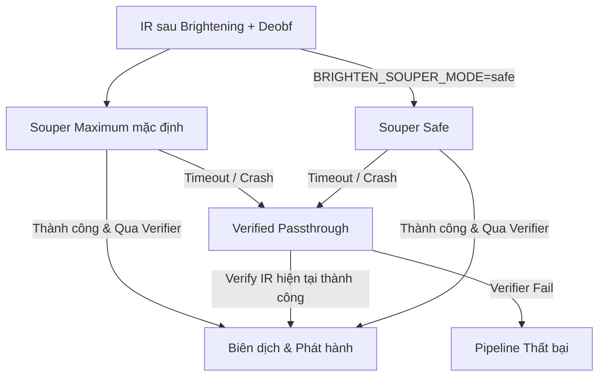

# Báo cáo Chiến lược Recovery hiện tại: Brightening, Deobfuscation & Optimization

Tài liệu này tổng hợp và giải thích chi tiết về chiến lược hiện tại của dự án **Brighten** nhằm khôi phục và làm sạch mã nguồn từ các file binary bị obfuscate (sử dụng OLLVM), thông qua ba trụ cột chính: **Brightening (Làm sạch IR)**, **Deobfuscation (Khử obfuscation)**, và **Optimization (Tối ưu hóa/Superoptimization)**.

---

## 1. Chiến lược Brightening (Làm sạch IR)
Mã nguồn sau khi được nâng dạng (lift) từ binary bằng McSema/Remill chứa rất nhiều tàn dư của quá trình giả lập CPU (chẳng hạn như việc mô phỏng các thanh ghi thông qua một struct `State` khổng lồ và giả lập bộ nhớ thông qua các memory helper). 

Brightening là quá trình chuyển đổi biểu diễn giả lập này về dạng LLVM IR native, giúp mã nguồn trở nên trực quan, dễ tối ưu hóa và có cấu trúc sạch sẽ nhất. Quy trình này được chia thành các Phase thực thi tuần tự trong `PASS_PIPELINE` định nghĩa tại [britening_ir.py](file:///home/dungbv/capstone_project/src/llvm_pass/britening_ir.py#L89):

| Phase | Plugin / Pass chính | Vai trò & Giải thích chiến lược |
| :--- | :--- | :--- |
| **Phase 010: Repair** | `brighten-repair-pass` | **Structural Repair / IR Hygiene**: Loại bỏ các attribute dễ gây Undefined Behavior (UB) hoặc poison giả do lifter tự chèn (`nsw`, `nuw`, `noalias`, `dereferenceable`, v.v.). Loại bỏ các chỉ thị assembly rác nhúng trong inline asm (`.cfi_*`, `.loc`, v.v.). |
| **Phase 015: Remill Runtime** | `brighten-remill-runtime-pass` | **Remill Runtime Compatibility Layer**: Hiện thực hóa (materialize) các intrinsics của Remill (`__remill_*` như read/write memory, FPU, barrier, control-flow helpers) thành code LLVM tương thích để có thể compile, link, và fuzz được trong chế độ tương thích (compatibility mode). |
| **Phase 020: Devirtualization** | `brighten-devirt-pass` | **Call / Return Devirtualization**: Nhận diện các lệnh call/jmp gián tiếp thông qua PC giả lập và hạ (lower) chúng về dạng gọi hàm trực tiếp (`call @sub_xxx`) hoặc branch trực tiếp của LLVM. |
| **Phase 030: State SSA** | `brighten-state-ssa-pass` <br> `brighten-flag-lower` | **Register State SSA Recovery**: Chuyển các phép truy cập/ghi nhận thanh ghi CPU giả lập từ struct `State` thành các biến SSA cục bộ của LLVM. Lower các phép tính cờ CPU phức tạp (ZF, CF, SF, OF) thành các biểu thức logic `i1` đơn giản để LLVM có thể tối giản hóa các nhánh nhảy điều kiện. |
| **Phase 040: Stack Frame** | `brighten-stack-frame-pass` | **Stack Frame Recovery**: Lập bản đồ guest stack bằng cách trace toán hạng RSP, thay thế các truy cập bộ nhớ kiểu `inttoptr(RSP + offset)` thành các biến local sử dụng `alloca` native của LLVM. |
| **Phase 050: ABI Recovery** | `brighten-abi-recovery-pass` | **ABI Recovery & Function Signature Rewrite**: Phân tích live-in/live-out registers của từng hàm để khôi phục signature của hàm (ví dụ: chuyển từ dạng nhận tham số `State` và trả về `Memory` thành nhận các tham số gốc và trả về RAX). Xóa bỏ State/Memory/PC pointer rác ở signature. |
| **Phase 060: Extern Call** | `brighten-extern-call-bridge` | **External Call / Libc ABI Recovery**: Khôi phục các wrapper gọi hàm thư viện bên ngoài (libc) thành các lệnh gọi hàm native với signature chuẩn (ví dụ: `printf`, `scanf`). |
| **Phase 070: Global Data** | `brighten-global-data-recovery-pass` | **Global / Data Recovery**: Phục hồi các biến global, chuỗi ký tự (string literal) bị gộp trong các segment lớn (`@seg_...`, `@data_...`), khôi phục jump table thành lệnh `switch` hoặc CFG sạch. |
| **Phase 080: Type Reconstruct**| `brighten-type-reconstruct` | **Type Reconstruction**: Suy luận kiểu dữ liệu cấu trúc (struct, array) cấp cao dựa trên pattern truy cập GEP/Load/Store. |
| **Phase 090: Native Cleanup**| `brighten-native-cleanup-pass` | **Final Native Cleanup & Audit**: Dọn dẹp triệt để các kiểu dữ liệu, declaration và metadata tàn dư của lifter. Thực hiện unflattening cục bộ (`brighten-region-ssa-unflatten-pass`) trước khi kiểm định chất lượng cuối cùng. |

---

## 2. Chiến lược Deobfuscation (Khử obfuscation OLLVM)
Chiến lược deobfuscation được thiết kế theo mô hình **Proof-guided (dẫn dắt bởi bằng chứng)** nhằm đảm bảo an toàn tuyệt đối về ngữ nghĩa chương trình.

### Các kỹ thuật xử lý chính
* **OLLVM Control Flow Flattening (CFF/FLA)**: Nhận diện biến trạng thái (state variable), các switch dispatcher loop, và cấu trúc funnel chuyển tiếp để dựng lại CFG gốc một cách tự nhiên.
* **Opaque Predicates (BCF)**: Nhận diện các biểu thức opaque predicate luôn đúng/luôn sai (chẳng hạn như các biểu thức toán học liên quan đến chẵn lẻ hoặc các đẳng thức lý thuyết số), từ đó cắt tỉa các bogus block/edge không thể chạm tới.
* **Instruction Substitution (InstSub/MBA)**: Nhận diện và quy đổi các biểu thức Mixed Boolean-Arithmetic (MBA) phức tạp về các phép tính số học tối giản thông qua các đẳng thức chuẩn.

### Quy trình chạy hai vòng độc lập
1. **Pre-O3 Deobf Normalization (`run_deobf_normalization_round`)**:
   Chạy trước khi trình tối ưu hóa `O3` của LLVM làm biến dạng hoặc xáo trộn cấu trúc CFG. Mục tiêu là chuẩn hóa các dispatcher dạng lưu trữ bộ nhớ về dạng SSA, giúp các thuật toán phân tích sau đó dễ dàng phát hiện hơn.
2. **Fixed-Point Deobfuscation (`run_deobf_fixed_point`)**:
   * Chạy lặp lại (tối đa `DEOBF_FIXED_POINT_MAX_ROUNDS = 8` vòng) cho đến khi mã băm ngữ nghĩa của file IR (`_semantic_ir_hash`) đạt trạng thái **hội tụ hoàn toàn** (byte-stable convergence).
   * Xen kẽ giữa pass `brighten-ollvm-deobf-pass` và các pass chuẩn (`jump-threading`, `simplifycfg`, `adce`) để tối giản hóa đồ thị điều khiển sau mỗi đợt gỡ.

### Cơ chế Proof-Gated & Fail-Closed
* **Z3 Validation**: Mỗi phép biến đổi/khử obfuscation được commit chỉ khi Z3 SMT solver chứng minh được tính tương đương logic tuyệt đối của biểu thức mới so với biểu thức cũ ở đúng bit-width và bảo đảm không tạo thêm poison/UB.
* **Proof Ledger**: Kết quả chứng minh của từng dispatcher hoặc biểu thức được ghi lại trong file JSON ledger (`*_deobf_proof_ledger.json`).
* **Strict Gate**:
  * Nếu có dispatcher không thể giải quyết được (unresolved residuals), mặc định (`BRIGHTEN_DEOBF_STRICT_GATE=0`), hệ thống sẽ bỏ qua để chạy tiếp Souper (chấp nhận trạng thái `partial_with_residuals`).
  * Nếu bật `BRIGHTEN_DEOBF_STRICT_GATE=1`, bất kỳ residual nào cũng sẽ làm toàn bộ tiến trình deobfuscate thất bại ngay lập tức để đảm bảo tính an toàn.

---

## 3. Chiến lược Optimization (Tối ưu hóa / Superoptimization)
Sau khi IR đã được làm sạch và khử obfuscation, hệ thống sử dụng **Souper Superoptimizer** phối hợp cùng trình tối ưu hóa LLVM chuẩn để tối giản hóa mã nguồn tối đa.

### Thuật toán tối ưu hóa của Souper
Souper không chỉ sử dụng các rule so khớp mẫu thông thường, nó trích xuất các biểu thức SSA (LHS) thành các câu hỏi SMT gửi tới Z3 để tìm kiếm cấu trúc mã tối giản nhất có thể thay thế (RHS).

Hệ thống triển khai cấu hình và cơ chế timeout thực tế trong [britening_ir.py](file:///home/dungbv/capstone_project/src/llvm_pass/britening_ir.py#L126) như sau:



1. **Chế độ mặc định: Safe Mode (bounded)**
   * Được kích hoạt mặc định; đặt `BRIGHTEN_SOUPER_MODE=maximum` nếu cần CEGIS mạnh hơn.
   * Ngân sách module là **5 phút** (`300 giây`); solver query timeout là **15 giây**.
   * Nếu module phức tạp không giải được trong ngân sách, pipeline verify IR hiện tại rồi bỏ qua tối ưu.

2. **Chế độ tùy chọn: Maximum Mode (CEGIS)**
   * Kích hoạt tường minh bằng `BRIGHTEN_SOUPER_MODE=maximum`.
   * Sử dụng CEGIS với các component toán tử mở rộng.
   * Ngân sách module: **5 phút** (`300 giây`); solver query timeout: **15 giây**.
   * Nếu Maximum mode timeout, pipeline cũng giữ nguyên IR đầu vào sau khi verify.

### Post-Souper Cleanup Pipeline
Souper hoạt động trên từng scalar độc lập, có thể biến đổi các phép gán aggregate thành hàng trăm lệnh `getelementptr` và `store` nhỏ lẻ. Vì vậy, ngay sau Souper, hệ thống bắt buộc chạy:
```text
memcpyopt, dse, dce, instcombine, simplifycfg, verify
```
Pass `memcpyopt` và `dse` (Dead Store Elimination) đóng vai trò cực kỳ quan trọng giúp gom các khối khởi tạo này lại, thu gọn kích thước file IR và ngăn ngừa hiện tượng phình to dòng lệnh (LOC).

---

## 4. Kiểm định & Fuzzing (Validation & Fuzzing)

### Native Contract Audit
Trước khi công bố file bitcode cuối cùng, hệ thống thực hiện một đợt audit cuối cùng bằng `BrightenNativeCleanupPass` ở chế độ post-souper để phát hiện các dấu hiệu vi phạm **Native Contract** (như `%struct.State` chưa được giải phóng, tàn dư metadata Remill, hay inline assembly mô phỏng CPU). Kết quả được ghi nhận một cách authoritative tại file `*_brightened_native_contract_report.json`.

### Semantic Differential Fuzzing
* Sử dụng AFL++ tiến hành differential fuzzing giữa binary native được biên dịch từ final brightened IR với binary gốc ban đầu.
* **Input Contract**: Hệ thống giải quyết bài toán mutation ngẫu nhiên dễ làm crash chương trình do sai định dạng đầu vào bằng cách tích hợp **Input Contract JSON** (như định nghĩa ngữ pháp, giới hạn độ dài mảng, alphabet, các điều kiện dừng). AFL++ sẽ chỉ mutate và kiểm chứng các payload thỏa mãn hợp đồng này, giúp tăng tính chính xác và độ phủ của quá trình fuzzing ngữ nghĩa.
